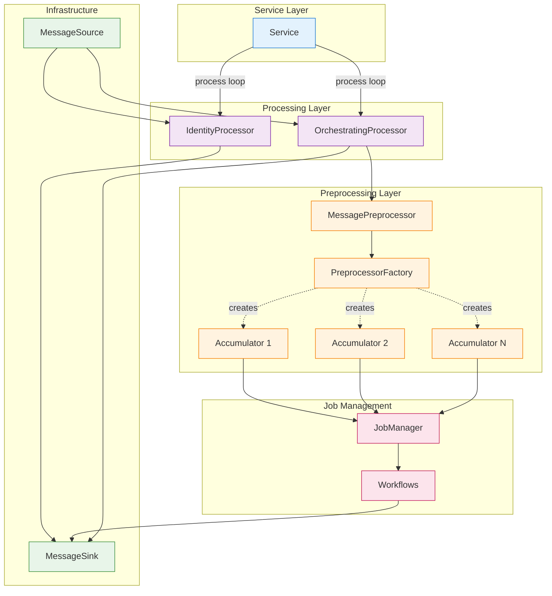
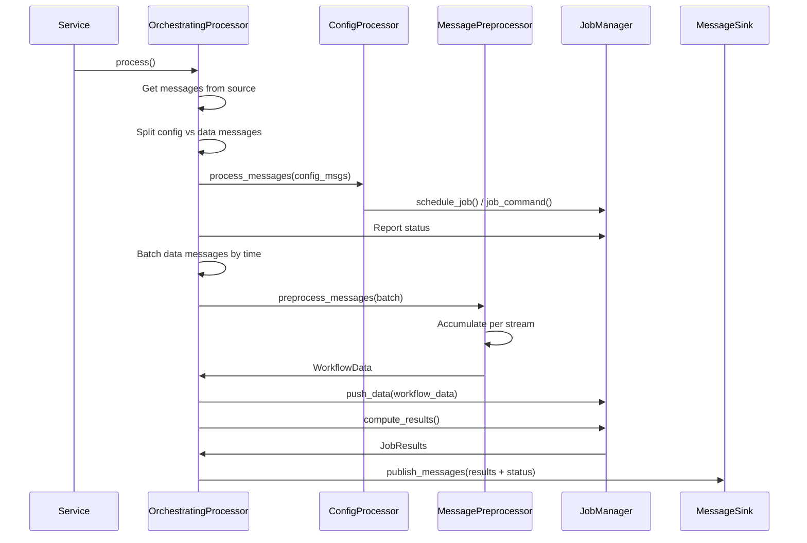
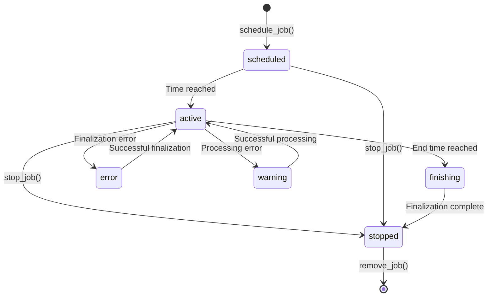

# Backend Service Architecture

## Overview

ESSlivedata backend services follow a consistent **message-driven architecture** with clear separation of concerns:

- **Service**: Manages lifecycle and processing loop
- **Processor**: Routes and batches messages (IdentityProcessor or OrchestratingProcessor)
- **Preprocessor/Accumulator**: Accumulates and transforms messages before workflow execution
- **JobManager**: Orchestrates job lifecycle and workflow execution
- **Workflow**: Implements scientific reduction logic using sciline workflows

All backend services follow this pattern, differing only in preprocessor implementations.

## Service-Processor-Workflow Pattern

This architecture provides clear separation with distinct responsibilities:

1. **Service**: Lifecycle management and processing loop
2. **Processor**: Message batching and pipeline coordination
3. **MessagePreprocessor**: Routes messages to appropriate accumulators
4. **Accumulator**: Accumulates and transforms messages per stream
5. **JobManager**: Job lifecycle and workflow execution coordination
6. **Workflow**: Scientific reduction logic on accumulated data

### Two Processor Types

**IdentityProcessor**: Simple pass-through for fake data producers (no preprocessing or job management).

**OrchestratingProcessor**: Full job-based processing for all backend services:

- Configuration message handling
- Time-based message batching
- Preprocessing via accumulators
- Job lifecycle management
- Workflow execution
- Periodic status reporting (every 2 seconds)

**Processing Flow**: Source → Split config/data → Route config to jobs → Batch data by time → Preprocess/accumulate → Push to JobManager → Compute workflows → Publish results

### Service Layer

Manages lifecycle, signal handling (SIGTERM/SIGINT), background threading, and resource cleanup via `ExitStack`. Supports step-by-step execution for testing.

### Preprocessor Layer

**PreprocessorFactory** creates stream-specific accumulators on-demand. Common preprocessors: `GroupIntoPixels`, `CollectTOA`, `Cumulative`, `ToNXevent_data`, `ToNXlog`. Implement `Accumulator` protocol with `add()`, `get()`, `clear()`.

## Job-Based Processing Architecture

All backend services (monitor_data, detector_data, data_reduction, timeseries) use the same job-based architecture:

Key features: Configuration message handling, time-based batching, preprocessing accumulation, job lifecycle management, periodic status reporting.

## Message Flow in Backend Services

### End-to-End Message Journey

### Message Source Chain

Services chain: **KafkaConsumer** → **BackgroundMessageSource** (non-blocking, background polling with queue buffering) → **AdaptingMessageSource** (applies adapters to convert Kafka messages to domain types).

### Message Adaptation

Adapters convert raw Kafka messages to typed domain messages. Available adapters: `KafkaToEv44Adapter`, `KafkaToDa00Adapter`, `KafkaToF144Adapter`, `ChainedAdapter`, `RouteByTopicAdapter`, `RouteBySchemaAdapter`.

## Job-Based Processing System

`OrchestratingProcessor` uses job management for multiple concurrent data reduction workflows.

### Job Lifecycle

**Note** _Drawing this state machine highlights an issue: In practice we have a transition error<-->warning as well, because we can actually be in both states at once.
We should fix the implementation so we have a proper state machine._

**Job States**: `scheduled` (waiting for start time) → `active` (processing) → `finishing` (end time reached) → `stopped` (complete). Error states: `error` (finalization failure), `warning` (processing error).

### JobManager

Orchestrates job operations: `schedule_job()`, `push_data()` (activates/processes jobs), `compute_results()` (only for jobs with primary data), `stop_job()`, `reset_job()`, `remove_job()`, `get_job_status()`.

**Key Features**: Time-based activation, primary data triggering, auxiliary data handling, error isolation, status tracking.

### Primary vs Auxiliary Data

**Primary Data** (triggers job activation and computation): Detector/monitor events specified in `WorkflowSpec.source_names`.

**Auxiliary Data** (non-triggering metadata): Sample environment, geometry, etc. specified in `WorkflowSpec.aux_source_names`.

Prevents unnecessary computations when only metadata updates; enables efficient slow/fast-changing data handling.

### Job Scheduling

Jobs process specific time ranges via `JobSchedule(start_time, end_time)`. All times in nanoseconds since Unix epoch (UTC), based on data timestamps not wall-clock time.

## Service Lifecycle Management

### Graceful Shutdown

Services handle SIGTERM/SIGINT gracefully: Signal received → Set `_running = False` → Exit processing loop → Join background threads → Cleanup resources (consumers, producers) → Exit.

### Resource Management

Services use `ExitStack` for automatic resource cleanup on service exit or errors.

### Error Handling

**Service Loop**: Processor exceptions logged, service stops and signals main thread (prevents running with broken processor).

**Preprocessor Errors**: Per-stream exceptions caught, logged, other streams continue. PreprocessorFactory may return None for unknown streams (skipped silently).

**Job Errors**: Processing errors → `warning` state; Finalization errors → `error` state. Job continues, errors in status messages, other jobs unaffected.

## Building Services with DataServiceBuilder

`DataServiceBuilder` constructs services consistently with `OrchestratingProcessor` by default. For command-line services, use `DataServiceRunner` (adds `--instrument`, `--dev`, `--log-level`, `--sink-type` arguments). Services can publish initialization messages on startup for workflow specifications or configuration values.

## Summary

Backend service architecture provides:

- Consistent Service-Processor-Workflow structure
- Clear separation of concerns (lifecycle, routing, business logic)
- Protocol-based design for testability and flexibility
- Two processing tiers (simple routing vs job orchestration)
- Robust error handling with per-job isolation
- Graceful lifecycle management with signal handling
- Builder pattern for service construction

This enables real-time neutron data stream handling with complex workflow orchestration while maintaining code clarity and testability.
