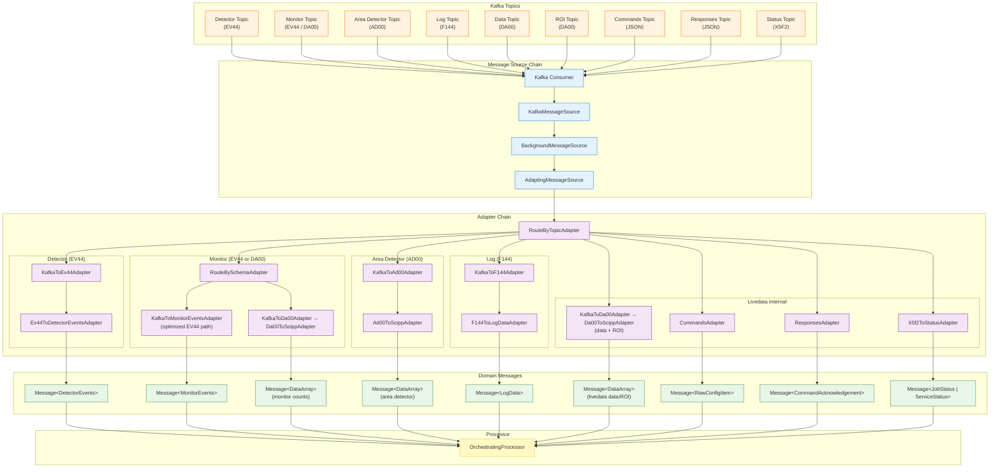

# Message Flow and Transformation

## Overview

ESSlivedata processes neutron detector data flowing through Kafka topics. Messages transform from raw Kafka messages to typed domain objects ready for processing.

**Key Principles**: Isolation from Kafka details, composable transformations, type safety, performance optimization.

## End-to-End Message Journey

**Stages**: Kafka Topics (FlatBuffers: EV44, AD00, F144, DA00, X5F2; JSON for commands/responses) → Message Source Chain (consumption, background polling, adaptation) → Adapter Chain (routing, deserialization, domain conversion) → Domain Messages (typed) → Processor (routes by StreamId).

## Message Abstraction

### The Message Type

`Message[T]` is an immutable (frozen) dataclass with `timestamp` (nanoseconds since Unix epoch UTC), `stream` (StreamId), and `value` (generic type T). Generic over value type, timestamp-based ordering, stream identification.

### StreamId: Identifying Message Streams

`StreamId` contains `kind` (StreamKind enum) and `name` (specific identifier). Isolates internal code from Kafka topic names.

StreamKind values: `UNKNOWN`, `MONITOR_COUNTS`, `MONITOR_EVENTS`, `DETECTOR_EVENTS`, `AREA_DETECTOR`, `LOG`, `LIVEDATA_COMMANDS`, `LIVEDATA_RESPONSES`, `LIVEDATA_DATA`, `LIVEDATA_ROI`, `LIVEDATA_STATUS`.

## Stream Mapping

Isolates ESSlivedata from Kafka topic structure: Kafka uses `(topic, source_name)` tuples, ESSlivedata uses `StreamId(kind, name)`. Enables topic renaming, split/merged topics, simplified testing.

### StreamMapping and StreamLUT

`InputStreamKey` = `(topic, source_name)`. `StreamLUT` = dict mapping InputStreamKey to internal name. `StreamMapping` holds LUTs for detectors, monitors, area_detectors, and logs, plus dedicated topic names for each livedata-internal stream (commands, responses, data, ROI, status). Adapters use stream_lut to convert Kafka identifiers to StreamId.

## Message Adapters

### Adapter Pattern

`MessageAdapter` protocol: `adapt(message: T) -> U`. Benefits: composable, type-safe, testable, reusable.

### Core Adapters

**Detector events (EV44)**: `KafkaToEv44Adapter` → `Ev44ToDetectorEventsAdapter`. Option: `merge_detectors=True` merges all detector banks into a single stream.

**Monitor events (EV44)**: `KafkaToMonitorEventsAdapter` directly extracts time-of-flight arrays from FlatBuffers, skipping unused fields for better performance. Monitor topics use `RouteBySchemaAdapter` to also accept DA00-encoded monitor counts via the `KafkaToDa00Adapter` → `Da00ToScippAdapter` chain.

**Area detectors (AD00)**: `KafkaToAd00Adapter` → `Ad00ToScippAdapter`. Produces `Message[DataArray]` with `StreamKind.AREA_DETECTOR`.

**Log data (F144)**: `KafkaToF144Adapter` → `F144ToLogDataAdapter`. Two-step chain decouples from upstream schema changes.

**Livedata data and ROI (DA00)**: `KafkaToDa00Adapter` → `Da00ToScippAdapter`. Both use the same adapter chain but with different `StreamKind` (`LIVEDATA_DATA` vs `LIVEDATA_ROI`).

**Commands and Responses (JSON)**: `CommandsAdapter` extracts key/value from compacted Kafka topic. `ResponsesAdapter` deserializes JSON `CommandAcknowledgement`.

**Status (X5F2)**: `X5f2ToStatusAdapter` produces `Message[JobStatus | ServiceStatus]`, discriminating on the `message_type` field.

### Adapter Composition

**ChainedAdapter**: Chains two adapters sequentially (`second.adapt(first.adapt(message))`).

**RouteByTopicAdapter**: Routes by Kafka topic to different adapters. Provides `.topics` list for subscription.

**RouteBySchemaAdapter**: Routes by FlatBuffers schema identifier. Used when a single topic carries multiple schemas (e.g., monitor topics accepting both EV44 and DA00).

### Route Assembly

`RoutingAdapterBuilder` (see `kafka/routes.py`) provides a fluent API for composing a `RouteByTopicAdapter` from a `StreamMapping`. Each `with_*_route()` method wires up the correct adapter chain for a stream type.

### Error Handling

`AdaptingMessageSource` with `raise_on_error=False` (default) logs errors and skips messages. `raise_on_error=True` re-raises exceptions. Unknown schema exceptions logged as warnings.

## Message Batching

Groups messages into time-aligned windows for time-aligned processing, job scheduling, efficient accumulation, predictable latency.

### MessageBatch Structure

`MessageBatch` = `(start_time, end_time, messages)`. Times in nanoseconds, `[start_time, end_time)` (inclusive, exclusive).

### SimpleMessageBatcher

Time-aligned batching used by `OrchestratingProcessor`. Initial batch contains all messages; subsequent batches aligned to `batch_length_s` intervals. Late messages included in next batch. Empty batches returned when next batch starts. Batch completion triggered by first message for next batch.

**Important**: Relies on message timestamps (not wall-clock time). If messages stop arriving, current batch may never complete.

### NaiveMessageBatcher

Simple batcher for testing—all messages in one batch. Use for testing without time-based logic or services not needing time alignment.

## Message Source Chain

### MessageSource Protocol

Protocol: `get_messages() -> Sequence[T]`. Called by processor each iteration, returns available messages (may be empty).

### KafkaMessageSource

Basic Kafka consumer wrapper. Blocking: polls Kafka for up to `timeout` seconds, processor blocked during poll.

### BackgroundMessageSource

Non-blocking Kafka consumer. Background thread polls continuously, messages queued in memory, `get_messages()` drains queue without blocking, automatic overflow handling (drops oldest batches). Benefits: processor never blocked on Kafka I/O, handles bursts, reduces risk of falling behind. Context manager: start/stop background thread.

### AdaptingMessageSource

Wraps source to apply adapters. Returns `list[Message[DomainType]]`. Error handling: catches exceptions during adaptation, logs/skips messages (if `raise_on_error=False`).

## Serialization and Schema

### FlatBuffers Schemas

ESSlivedata uses FlatBuffers schemas from `streaming_data_types`:

**EV44 (Event Data)**: Fields: `source_name`, `reference_time` (pulse times), `time_of_flight`, `detector_id`.

**F144 (Log Data)**: Fields: `source_name`, `value` (scalar/array), `timestamp_unix_ns`.

**DA00 (DataArray)**: Compatibility layer via `scipp_da00_compat`: `scipp_to_da00`, `da00_to_scipp`.

**AD00 (Area Detector)**: Image frames from area detectors. Compatibility layer via `scipp_ad00_compat`: `ad00_to_scipp`.

**X5F2 (Status)**: Used for job and service status messages. Compatibility layer via `x5f2_compat`: `x5f2_to_status`.

### Kafka Sink Serialization

`KafkaSink` publishes messages using built-in serializers: `serialize_dataarray_to_da00` (default), `serialize_dataarray_to_f144` (logs). Stream-specific: config (JSON), status (X5f2), data (DA00).

### UnrollingSinkAdapter

Handles DataGroup results: splits `Message[DataGroup]` with multiple outputs into separate DA00 messages per output. Stream name includes output: `workflow_id/job_id/output_name`.

## Summary

Message transformation pipeline: Kafka Messages (FlatBuffers, JSON, X5F2) → Source Chain (consumption, polling, adaptation) → Adapters (routing, deserialization, domain conversion) → Stream Mapping (Kafka isolation) → Batching (time-aligned windows) → Domain Messages (type-safe).

**Key Abstractions**: `Message[T]`, `StreamId`, `MessageAdapter`, `StreamMapping`, `MessageBatcher`, `BackgroundMessageSource`.

Enables high-rate data stream processing with type safety, testability, and Kafka isolation.
