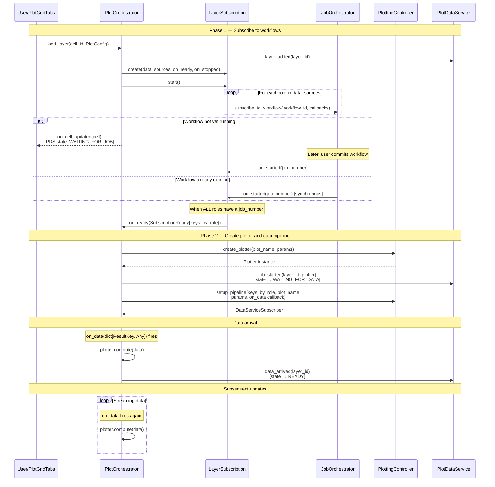
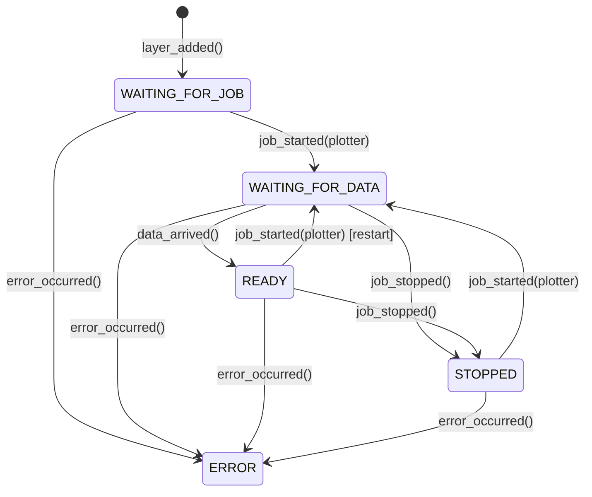

# Orchestrator Flow: Plot Creation Lifecycle

This document describes the interaction between PlotOrchestrator, LayerSubscription, JobOrchestrator, PlottingController, and PlotDataService when a plot layer is created.

## Overview

The plot creation follows a **two-phase subscription model**:

1. **Phase 1**: LayerSubscription subscribes to JobOrchestrator for each data source role. When *all* workflows are running, it fires an `on_ready` callback with `SubscriptionReady` (containing `keys_by_role`).
2. **Phase 2**: PlotOrchestrator creates a plotter, sets up the data pipeline via PlottingController, and waits for data. When data arrives, `plotter.compute(data)` is called and PlotDataService transitions the layer to READY.

## Sequence Diagram

## Key Components

| Component | Responsibility |
|-----------|----------------|
| **PlotGridTabs** | UI widget; subscribes to PlotOrchestrator lifecycle events, polls PlotDataService for layer state |
| **PlotOrchestrator** | Manages plot lifecycle: layer subscription, plotter creation, data pipeline setup. See `dashboard/plot_orchestrator.py` |
| **LayerSubscription** | Subscribes to one or more workflows for a layer. Fires `on_ready` when *all* workflows are running, `on_stopped` when *any* stops. See `dashboard/layer_subscription.py` |
| **JobOrchestrator** | Manages workflow jobs; notifies subscribers on start/stop via `WorkflowCallbacks`. See `dashboard/job_orchestrator.py` |
| **PlottingController** | Two-phase plot creation: `create_plotter()` and `setup_pipeline()`. See `dashboard/plotting_controller.py` |
| **PlotDataService** | Layer state machine (WAITING_FOR_JOB → WAITING_FOR_DATA → READY / STOPPED / ERROR). Version-based polling for UI. See `dashboard/plot_data_service.py` |
| **DataService** | Holds job result data; manages subscriber lifecycle |

## Layer States

Each layer transitions through explicit states managed by `PlotDataService`:

Each transition increments a version counter. UI components poll for version changes to detect when rebuilds are needed.

## Multi-Source Layers (Correlation Plots)

`PlotConfig.data_sources` maps role names to `DataSourceConfig`:

- **"primary"**: Main data source (required for all layers)
- **"x_axis"**, **"y_axis"**: Correlation axes (optional, for correlation histograms)

`LayerSubscription` subscribes to *each* role's workflow independently. The `on_ready` callback only fires when all roles have running jobs. If any workflow stops, `on_stopped` fires immediately (a correlation plot cannot function with partial data).

The resulting `keys_by_role` dict flows through to `setup_pipeline()`, preserving role structure so plotters receive data grouped by role.

## Lifecycle Callbacks

PlotGridTabs subscribes to PlotOrchestrator lifecycle events (grid created/removed/updated, cell updated/removed). The `on_cell_updated` callback signals that a cell's layer configuration changed. Actual layer state (waiting, ready, error) is read from `PlotDataService` by the UI during periodic polling.
