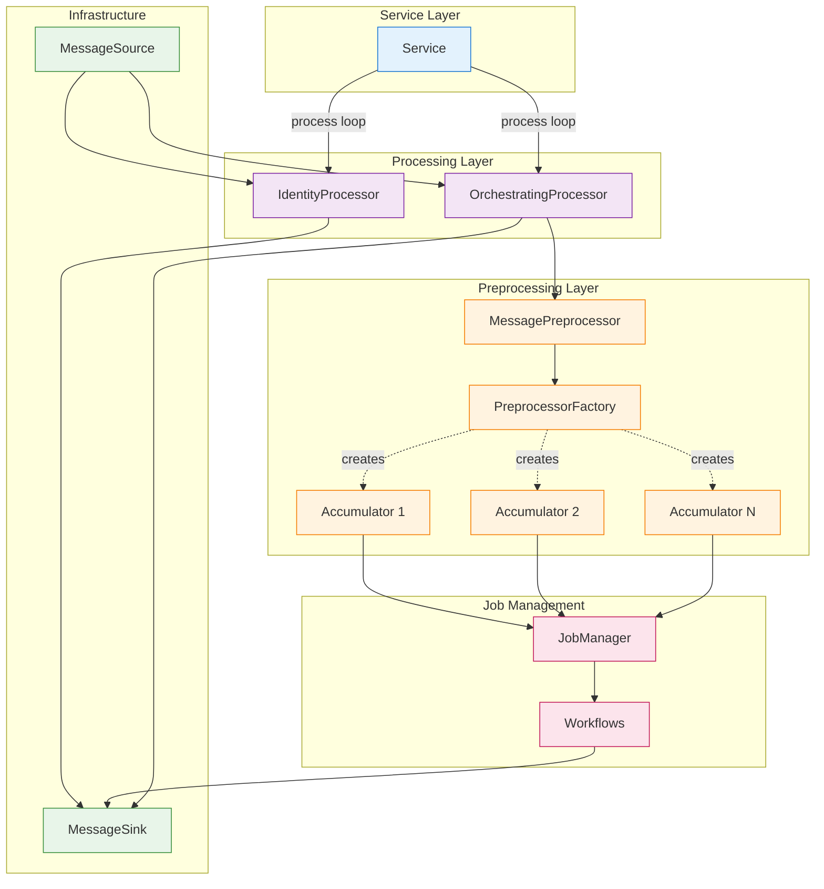
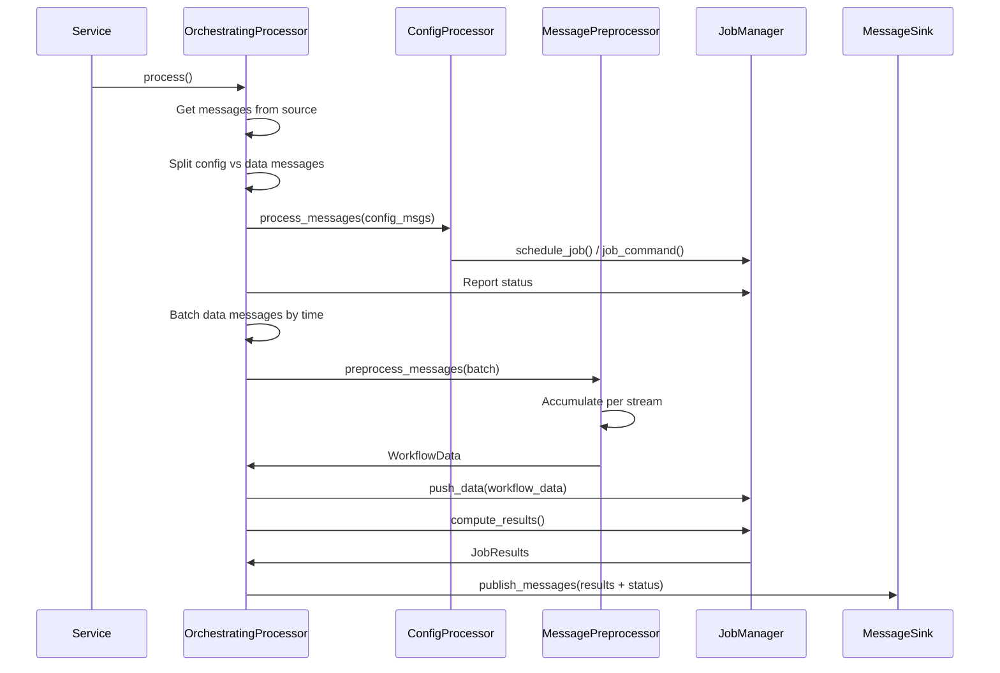
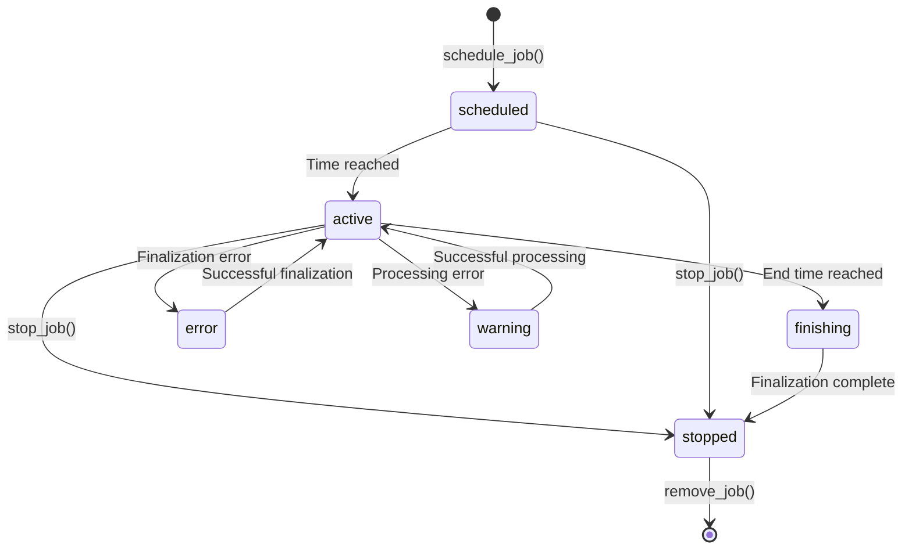

# Backend Service Architecture

## Table of Contents

1. [Overview](#overview)
2. [Service-Processor-Workflow Pattern](#service-processor-workflow-pattern)
3. [Two-Tier Processing Architecture](#two-tier-processing-architecture)
4. [Message Flow in Backend Services](#message-flow-in-backend-services)
5. [Job-Based Processing System](#job-based-processing-system)
6. [Service Lifecycle Management](#service-lifecycle-management)
7. [Building Services with DataServiceBuilder](#building-services-with-dataservicebuilder)

## Overview

ESSlivedata backend services follow a consistent **message-driven architecture** with clear separation of concerns. The architecture is built around these core abstractions:

- **Service**: Manages lifecycle and runs the processing loop
- **Processor**: Routes and batches messages (IdentityProcessor or OrchestratingProcessor)
- **Preprocessor/Accumulator**: Accumulates and transforms messages before workflow execution
- **JobManager**: Orchestrates job lifecycle and workflow execution
- **Workflow**: Implements scientific reduction logic using sciline workflows

All backend services (monitor_data, detector_data, data_reduction, timeseries) follow this same pattern, differing only in their preprocessor implementations.



## Service-Processor-Workflow Pattern

### The Pattern

This architecture provides clear separation of concerns:

1. **Service**: Orchestrates the lifecycle and main processing loop
2. **Processor**: Batches messages and coordinates the processing pipeline
3. **MessagePreprocessor**: Routes messages to appropriate accumulators
4. **Accumulator**: Accumulates and transforms messages per stream
5. **JobManager**: Manages job lifecycle and coordinates workflow execution
6. **Workflow**: Executes scientific reduction logic on accumulated data

### Two Processor Types

**IdentityProcessor**: Simple pass-through processor used by fake data producers.
- No preprocessing or job management
- Messages flow directly from source to sink
- Used by fake_monitors, fake_detectors, fake_logdata

**OrchestratingProcessor**: Full job-based processing used by all backend services.
- Configuration message handling
- Time-based message batching
- Preprocessing via accumulators
- Job lifecycle management
- Workflow execution

### Why This Pattern?

- **Testability**: Each layer can be tested independently using fakes
- **Flexibility**: Processors, preprocessors, and workflows are injected, not hardcoded
- **Reusability**: The same service infrastructure works for all backend services
- **Clarity**: Each component has a single, well-defined responsibility

### Service Layer

The `Service` class manages:
- **Lifecycle**: Start, stop, and graceful shutdown
- **Signal handling**: SIGTERM and SIGINT for clean shutdown
- **Main loop**: Calls processor at configured intervals (default 10ms)
- **Threading**: Runs processor in background thread
- **Resource management**: Uses `ExitStack` for cleanup

```python
from ess.livedata.core.service import Service

service = Service(
    processor=processor,
    name='my_service',
    log_level=logging.INFO,
    poll_interval=0.01,  # 10ms between processor calls
)

# Context manager handles resource cleanup
with service:
    service.start()  # Blocks until shutdown signal
```

**Key Features:**
- Non-blocking startup via background thread
- Graceful shutdown on signals (SIGTERM, SIGINT)
- Exception handling with signal propagation to main thread
- Step-by-step execution for testing (`service.step()`)

### Processor Layer

Backend services use either **IdentityProcessor** (fake data producers) or **OrchestratingProcessor** (all real backend services).

#### OrchestratingProcessor

**Processing Flow:**
1. Get batch of messages from source
2. Split messages into config vs data messages
3. Route configuration messages to ConfigProcessor (job commands)
4. Batch data messages by time window
5. Pass messages through MessagePreprocessor → Accumulators
6. Push accumulated data to JobManager
7. Compute workflow results from jobs that received primary data
8. Publish results and status to sink

**Key Capabilities:**
- Job scheduling and lifecycle management
- Message batching by time windows
- Preprocessing/accumulation layer
- Configuration message handling
- Periodic status reporting (every 2 seconds)

See [Job-Based Processing System](#job-based-processing-system) for details.

#### IdentityProcessor

Simple pass-through processor for fake data producers:
- No preprocessing or job management
- Messages flow directly: source → sink
- Used by services that generate test data

### Preprocessor Layer

Preprocessors accumulate and transform raw messages before they reach workflows.

**PreprocessorFactory** creates accumulators on-demand based on stream type. Each backend service provides a factory that knows which preprocessors to create for different message streams.

**Common Preprocessors:**
- `GroupIntoPixels`: Groups detector events by pixel ID
- `CollectTOA`: Collects time-of-arrival values
- `Cumulative`: Accumulates histograms
- `ToNXevent_data`: Converts to NeXus event format
- `ToNXlog`: Converts to NeXus log format

Preprocessors implement the `Accumulator` protocol with `add()`, `get()`, and `clear()` methods.

## Job-Based Processing Architecture

All backend services (monitor_data, detector_data, data_reduction, timeseries) use the same job-based architecture:



**Key Differences:**
- Configuration message handling (job creation/control)
- Time-based message batching
- Preprocessing accumulation step
- Job lifecycle management
- Periodic status reporting (every 2 seconds)

## Message Flow in Backend Services

### End-to-End Message Journey


### Message Source Chain

Services typically use a chain of message sources:

1. **KafkaConsumer**: Confluent Kafka consumer, polls Kafka topics
2. **BackgroundMessageSource**: Wraps consumer, polls in background thread
3. **AdaptingMessageSource**: Applies adapters to convert Kafka messages to domain types

```python
# Example from DataServiceBuilder
consumer = MultiConsumer([config_consumer, data_consumer])
source = BackgroundMessageSource(consumer=consumer)  # Background polling
adapted_source = AdaptingMessageSource(
    source=source,
    adapter=adapter,  # KafkaMessage -> Message[DomainType]
)
```

**Background Polling Benefits:**
- Non-blocking: Processor can work while messages are consumed
- Queue buffering: Handles bursts of messages
- Automatic overflow: Drops oldest batches if queue fills

### Message Adaptation

Adapters convert raw Kafka messages to typed domain messages:

```python
from ess.livedata.kafka.message_adapter import (
    RouteByTopicAdapter,
    KafkaToEv44Adapter,
    Ev44ToDetectorEventsAdapter,
    ChainedAdapter,
)

# Route by topic to different adapters
adapter = RouteByTopicAdapter({
    detector_topic: ChainedAdapter(
        KafkaToEv44Adapter(stream_lut=stream_mapping.detectors),
        Ev44ToDetectorEventsAdapter(merge_detectors=True),
    ),
    monitor_topic: KafkaToMonitorEventsAdapter(
        stream_lut=stream_mapping.monitors
    ),
})
```

**Adapter Types:**
- `KafkaToEv44Adapter`: Deserialize EV44 event data
- `KafkaToDa00Adapter`: Deserialize DA00 data arrays
- `KafkaToF144Adapter`: Deserialize F144 log data
- `ChainedAdapter`: Compose two adapters
- `RouteByTopicAdapter`: Route by Kafka topic
- `RouteBySchemaAdapter`: Route by FlatBuffers schema

## Job-Based Processing System

The `OrchestratingProcessor` uses a sophisticated job management system for running multiple concurrent data reduction workflows.

### Job Lifecycle



### Job States

- **scheduled**: Job created but not yet active (waiting for start time)
- **active**: Job is running and processing data
- **finishing**: End time reached, will stop after next result computation
- **stopped**: Job has finished or been manually stopped
- **error**: Job encountered error during finalization (cannot compute results)
- **warning**: Job encountered error during data processing (can still finalize)

### JobManager

The `JobManager` orchestrates all job operations:

```python
from ess.livedata.core.job_manager import JobManager, JobFactory

job_manager = JobManager(job_factory=job_factory)

# Schedule a new job
job_id = job_manager.schedule_job(
    source_name='detector_1',
    config=workflow_config,  # Includes start/end times, parameters
)

# Push data (activates scheduled jobs, processes active jobs)
errors = job_manager.push_data(workflow_data)

# Compute results (only for jobs that received primary data)
results = job_manager.compute_results()

# Get job status
status = job_manager.get_job_status(job_id)

# Control jobs
job_manager.stop_job(job_id)
job_manager.reset_job(job_id)
job_manager.remove_job(job_id)
```

**Key Features:**
- **Time-based activation**: Jobs activate automatically when data timestamps reach start_time
- **Primary data triggering**: Results only computed for jobs that received primary data
- **Auxiliary data handling**: Non-triggering data sources (e.g., sample logs, geometry)
- **Error isolation**: Job errors don't affect other jobs
- **Status tracking**: Per-job error/warning messages

### Primary vs Auxiliary Data

Jobs distinguish between two types of data:

**Primary Data:**
- Triggers job activation and result computation
- Typically detector or monitor events
- Specified in `WorkflowSpec.source_names`

**Auxiliary Data:**
- Does not trigger result computation
- Used for metadata, sample environment, geometry, etc.
- Specified in `WorkflowSpec.aux_source_names`

```python
# Example workflow specification
workflow_spec = WorkflowSpec(
    instrument='dream',
    namespace='data_reduction',
    name='powder_reduction',
    source_names=['high_flux_detector'],  # Primary: triggers computation
    aux_source_names=['sample_temperature', 'geometry'],  # Auxiliary: metadata
)
```

**Why This Distinction?**
- Prevents unnecessary computations when only metadata updates
- Allows workflows to accumulate auxiliary data before primary data arrives
- Enables efficient handling of slow-changing vs fast-changing data streams

### Job Scheduling

Jobs can be scheduled to process specific time ranges:

```python
from ess.livedata.config.workflow_spec import JobSchedule

# Process all data from now on (most common)
schedule = JobSchedule()  # start_time=None, end_time=None

# Process specific time range (historical analysis)
schedule = JobSchedule(
    start_time=1704067200_000_000_000,  # 2024-01-01 00:00:00 UTC
    end_time=1704153600_000_000_000,    # 2024-01-02 00:00:00 UTC
)

# Process from specific time onwards
schedule = JobSchedule(
    start_time=1704067200_000_000_000,
    end_time=None,
)
```

**Timestamp Notes:**
- All times in nanoseconds since Unix epoch (UTC)
- Times refer to data timestamps, not wall-clock time
- Jobs activate when `workflow_data.start_time >= schedule.start_time`
- Jobs finish when `workflow_data.end_time >= schedule.end_time`

## Service Lifecycle Management

### Graceful Shutdown

Services handle shutdown signals gracefully:

```python
# Service registers handlers for SIGTERM and SIGINT
def _setup_signal_handlers(self):
    signal.signal(signal.SIGTERM, self._handle_shutdown)
    signal.signal(signal.SIGINT, self._handle_shutdown)

def _handle_shutdown(self, signum, frame):
    self._logger.info("Received signal %d, initiating shutdown...", signum)
    self.stop()
    sys.exit(0)
```

**Shutdown Sequence:**
1. Signal received (SIGTERM, SIGINT, or Ctrl+C)
2. Service sets `_running = False`
3. Processing loop exits
4. Background threads joined (with timeout)
5. Resources cleaned up (consumers, producers closed)
6. Process exits

### Resource Management

Services use `ExitStack` for automatic resource cleanup:

```python
resources = ExitStack()
try:
    # Register resources
    consumer = resources.enter_context(kafka_consumer)
    producer = resources.enter_context(kafka_producer)
    source = resources.enter_context(BackgroundMessageSource(consumer))

    # Build service with resources
    service = Service(processor=processor, resources=resources.pop_all())

    # Resources cleaned up on service exit
    with service:
        service.start()
except Exception:
    resources.close()  # Cleanup on error
```

### Error Handling

**Service Loop:**
- Exceptions in processor are logged
- Service stops and signals main thread (via `os.kill(os.getpid(), SIGINT)`)
- Prevents service from running with broken processor

**Preprocessor Errors:**
- Exceptions caught per-stream in MessagePreprocessor
- Error logged, other streams continue processing
- PreprocessorFactory may return None for unknown streams (skipped silently)

**Job Errors:**
- Processing errors set job to `warning` state
- Finalization errors set job to `error` state
- Job continues running, errors reported in status messages
- Other jobs unaffected

## Building Services with DataServiceBuilder

The `DataServiceBuilder` provides a consistent way to construct services:

```python
from ess.livedata.service_factory import DataServiceBuilder

builder = DataServiceBuilder(
    instrument='dream',
    name='detector_data',
    preprocessor_factory=DetectorDataPreprocessorFactory(instrument),
    adapter=detector_adapter,
)

# Build from consumer config
service = builder.from_consumer_config(
    kafka_config=kafka_config,
    sink=KafkaSink(instrument='dream', kafka_config=kafka_downstream_config),
    use_background_source=True,
)

# Run service
with service:
    service.start()
```

**Note**: All backend services use `OrchestratingProcessor` by default. For simple pass-through services (fake data producers), use `IdentityProcessor` directly instead of `DataServiceBuilder`.

### DataServiceRunner

For command-line services, use `DataServiceRunner`:

```python
from ess.livedata.service_factory import DataServiceRunner

def make_builder(instrument: str, log_level: int, dev: bool) -> DataServiceBuilder:
    # Create stream mapping and adapters
    stream_mapping = create_stream_mapping(instrument, dev=dev)
    adapter = create_adapter(stream_mapping)
    preprocessor_factory = MyPreprocessorFactory(instrument)

    return DataServiceBuilder(
        instrument=instrument,
        name='my_service',
        log_level=log_level,
        adapter=adapter,
        preprocessor_factory=preprocessor_factory,
    )

# Standard service runner
runner = DataServiceRunner(
    pretty_name='My Service',
    make_builder=make_builder,
)

# Adds --instrument, --dev, --log-level, --sink-type arguments
runner.run()  # Parses args, builds service, runs until shutdown
```

### Startup Messages

Services can publish initialization messages on startup:

```python
# Example: Publish workflow specifications
startup_messages = [
    Message(
        stream=CONFIG_STREAM_ID,
        value=RawConfigItem(
            key=workflow_spec_key,
            value=workflow_spec_json,
        ),
    )
]

builder = DataServiceBuilder(
    ...,
    startup_messages=startup_messages,
)
```

**Use Cases:**
- Publish available workflow specifications (data_reduction service)
- Initialize configuration values
- Announce service capabilities

---

## Summary

The backend service architecture provides:

- **Consistent structure** across all services (Service-Processor-Workflow)
- **Clear separation of concerns** (lifecycle, routing, business logic)
- **Protocol-based design** for testability and flexibility
- **Two processing tiers** (simple routing vs job orchestration)
- **Robust error handling** with per-job isolation
- **Graceful lifecycle management** with signal handling
- **Builder pattern** for service construction

This architecture enables ESSlivedata to handle real-time neutron detector data streams with complex workflow orchestration while maintaining code clarity and testability.
