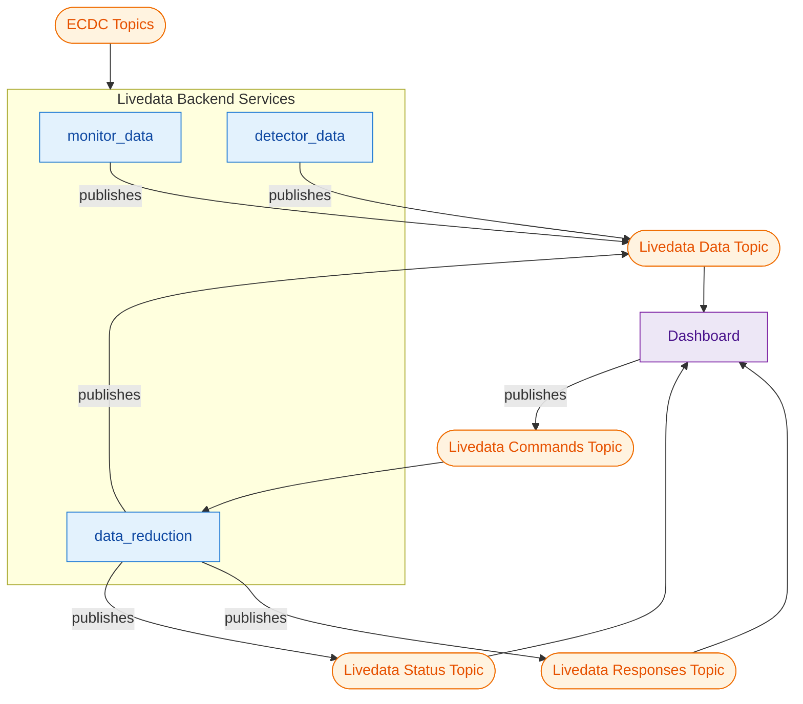
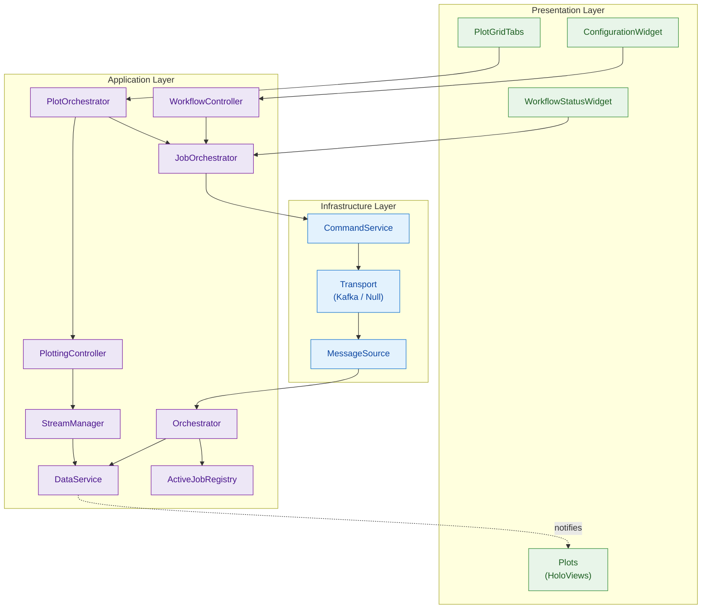
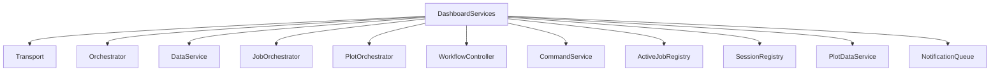
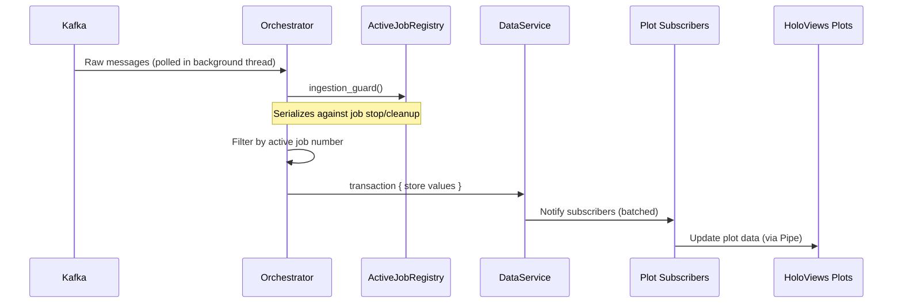
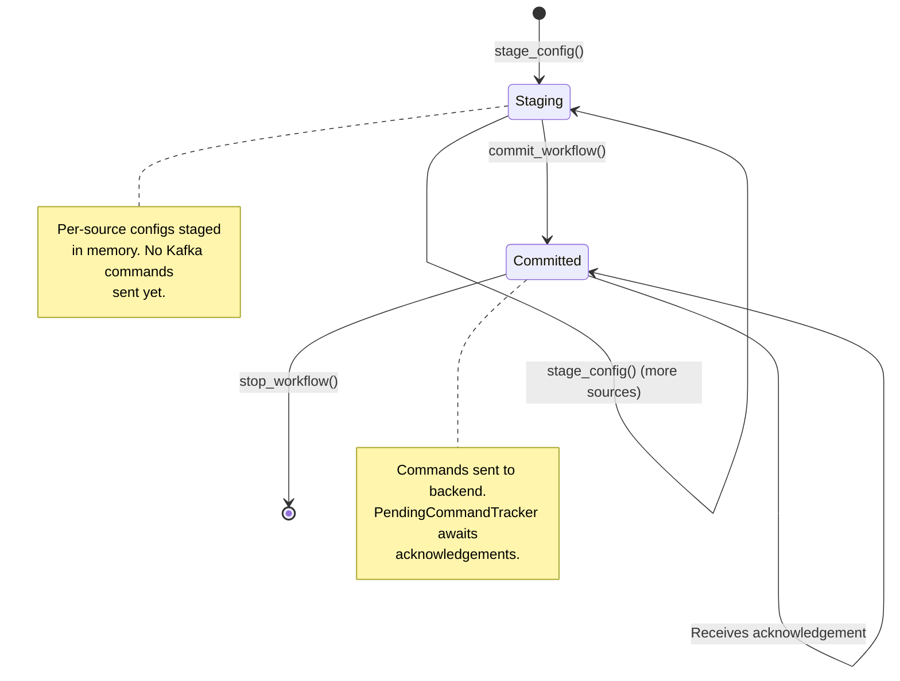
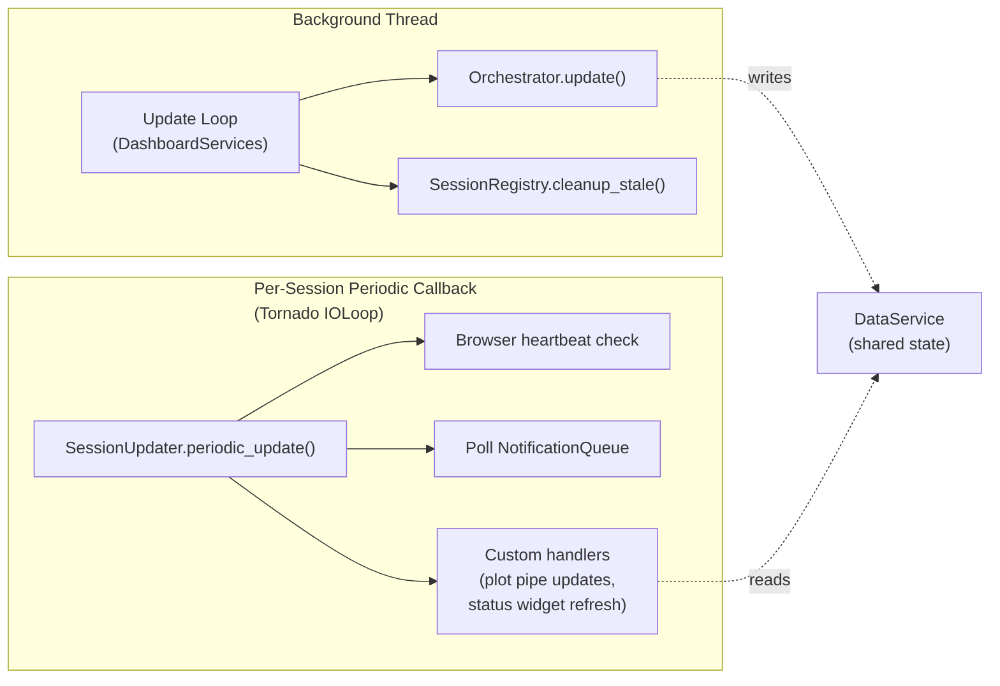
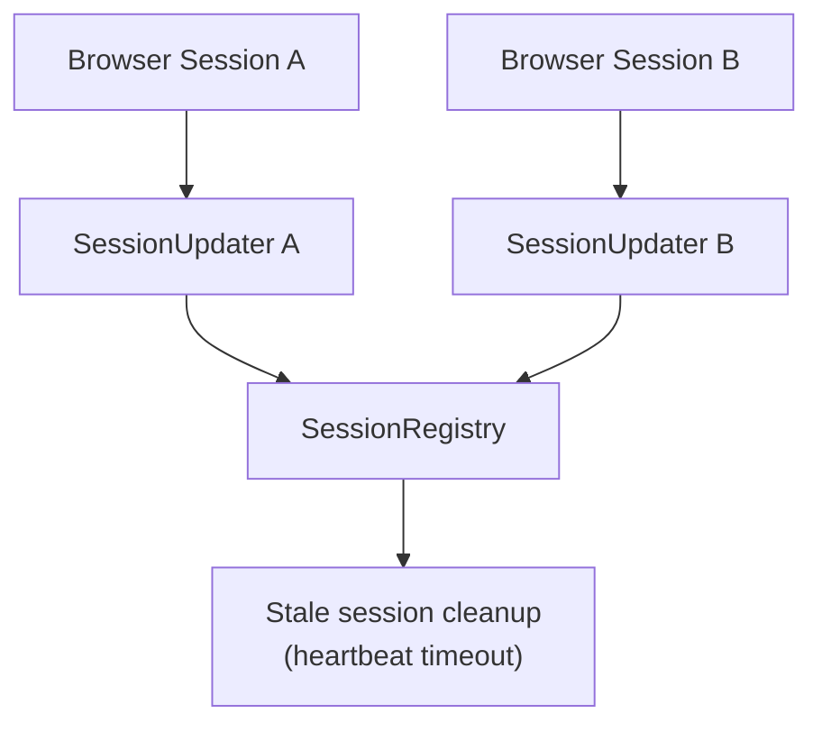

# Livedata Dashboard Architecture

## Overview

The Livedata dashboard is a real-time data visualization system built on Panel/HoloViews. It consumes processed detector data from Kafka, displays it as interactive plots, and publishes user commands back to backend services. The architecture supports multiple concurrent browser sessions with shared state and per-session rendering.

Data updates arrive at ~1 Hz. User controls (workflow start/stop, plot configuration) result in commands published to Kafka for backend consumption.

## System Context

The dashboard publishes job commands (start/stop workflows) to the Commands topic and receives acknowledgements via the Responses topic. Job and service status updates arrive via the Status topic.

## Layered Architecture

- **Infrastructure**: Transport abstraction (Kafka or Null for testing), message sources and sinks
- **Application**: Data management, workflow lifecycle, plot orchestration
- **Presentation**: Panel widgets and HoloViews plots

## Service Composition

`DashboardServices` (see `dashboard/dashboard_services.py`) wires all components together. It is the central composition root, created once per dashboard process, and shared across all browser sessions.

`DashboardBase` (see `dashboard/dashboard.py`) is the entry point. It creates `DashboardServices`, starts the Panel server, and creates per-session layouts via `create_layout()`.

## Data Flow

The `Orchestrator` (see `dashboard/orchestrator.py`) is the message pump. It consumes from the `MessageSource`, filters messages by active job numbers, and stores data in `DataService`. Status messages and command acknowledgements are routed to `JobOrchestrator`.

`DataService` (see `dashboard/data_service.py`) is a dict-like store keyed by `ResultKey`. Subscribers register interest in specific keys and receive batched notifications via a transaction mechanism.

## Workflow Lifecycle

`JobOrchestrator` (see `dashboard/job_orchestrator.py`) manages the full lifecycle of workflow jobs using a two-phase commit pattern:

Key responsibilities:
- **Staging**: Collects per-source configurations before committing. Subscribers are notified of staging changes for UI preview.
- **Commit**: Sends `JobCommand` messages via `CommandService`, assigns job numbers, activates jobs in `ActiveJobRegistry`.
- **Stop**: Sends stop commands, deactivates jobs (which cleans up `DataService` buffers via `ActiveJobRegistry`).
- **Acknowledgement processing**: Tracks pending commands and processes backend responses.

`WorkflowController` (see `dashboard/workflow_controller.py`) is the interface between widgets and `JobOrchestrator`. It translates Pydantic model parameters into orchestrator calls and creates `WorkflowConfigurationAdapter` instances for the configuration UI.

## Plot Orchestration

`PlotOrchestrator` (see `dashboard/plot_orchestrator.py`) manages the plot grid lifecycle:

- Creates and removes plot grids (tab-level containers)
- Manages plot cells within grids (add, remove, configure)
- Subscribes to `JobOrchestrator` workflow events to create plots when jobs start
- Persists grid configurations via `ConfigStore`
- Loads grid templates for instrument-specific default layouts

`PlottingController` (see `dashboard/plotting_controller.py`) handles the mechanics of plot creation: finding compatible plotters for a given data shape, setting up data pipelines via `StreamManager`, and creating plotter instances.

`PlotDataService` holds per-plot shared state (Presenters with dirty flags) that is read by per-session `SessionPlotManager` instances during periodic updates.

## Threading Model

Two threading contexts exist:

1. **Background thread** (`orchestrator-update`): Runs `Orchestrator.update()` in a loop at ~5 Hz. Consumes Kafka messages and writes to `DataService`. Uses `ActiveJobRegistry.ingestion_guard()` to serialize against UI-thread job cleanup.

2. **Per-session Tornado callbacks**: Each browser session has a `SessionUpdater` that runs in the Tornado IOLoop at ~1 Hz. It batches all UI mutations inside `pn.io.hold()` + `doc.models.freeze()` to minimize Bokeh model recomputation.

## Session Management

Each browser session creates a `SessionUpdater` (see `dashboard/session_updater.py`) which:
- Registers with `SessionRegistry` for lifecycle tracking
- Embeds an invisible `HeartbeatWidget` that sends browser-side heartbeats via JavaScript
- Runs custom handlers (plot updates, status widgets) in the correct session/document context
- Batches all UI operations using `pn.io.hold()` + `doc.models.freeze()`

`SessionRegistry` (see `dashboard/session_registry.py`) tracks active sessions with heartbeat-based stale detection. Sessions are cleaned up when `pn.state.on_session_destroyed()` fires, or after a heartbeat timeout (defense-in-depth for browser crashes).

## Configuration Adapters

Configuration widgets use the `ConfigurationAdapter` pattern (see `dashboard/configuration_adapter.py`):

- `ConfigurationAdapter` is an abstract base providing: title, description, model class for parameters, available source names, aux source definitions, and a start action
- `WorkflowConfigurationAdapter` implements this for workflow start dialogs
- `PlotConfigurationAdapter` implements this for plot configuration modals
- `ConfigurationState` persists parameter choices across sessions via `ConfigStore`

The generic `ConfigurationWidget` (see `widgets/configuration_widget.py`) renders any adapter into a Panel form with source selection, parameter inputs, and a start button.

## Transport Abstraction

The `Transport` protocol (see `dashboard/transport.py`) abstracts message infrastructure:

- `DashboardKafkaTransport` (see `dashboard/kafka_transport.py`): Connects to Kafka, provides `MessageSource` (consumer) and `MessageSink` instances (for commands and ROI updates)
- `NullTransport`: No-op implementation for testing

Both return `DashboardResources` containing a `MessageSource`, a command `MessageSink`, and an ROI `MessageSink`.

## Key Widget Components

Widgets live in `dashboard/widgets/` and follow a pattern of receiving shared services in their constructor and registering periodic refresh handlers with `SessionUpdater`:

- `PlotGridTabs`: Tab container managing multiple plot grids, workflow configuration, and system status
- `WorkflowStatusListWidget`: Displays active workflow jobs and their status
- `SystemStatusWidget`: Shows session count, backend worker status, heartbeat info
- `ConfigurationWidget`: Generic form builder driven by `ConfigurationAdapter`
- `PlotConfigModal`: Modal dialog for configuring individual plot cells
