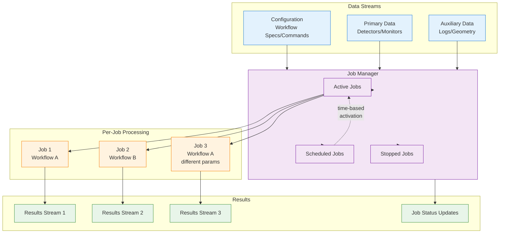
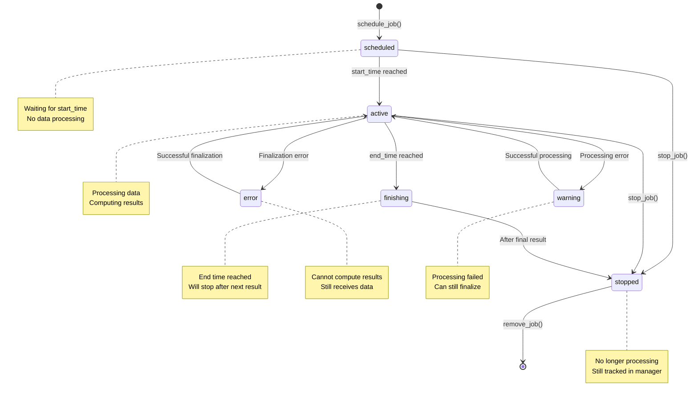

# Job-Based Processing Guide

## Table of Contents

1. [Overview](#overview)
2. [Why Job-Based Processing?](#why-job-based-processing)
3. [Job Lifecycle](#job-lifecycle)
4. [Primary vs Auxiliary Data](#primary-vs-auxiliary-data)
5. [Job Scheduling](#job-scheduling)
6. [Workflow Protocol](#workflow-protocol)
7. [JobManager Deep Dive](#jobmanager-deep-dive)
8. [Error and Warning Handling](#error-and-warning-handling)
9. [Performance Considerations](#performance-considerations)

## Overview

Job-based processing is the mechanism used by the `data_reduction` service to manage multiple concurrent data reduction workflows. Unlike simple stream processing (used by monitor_data, detector_data, timeseries), job-based processing provides:

- **Multiple concurrent workflows** on the same data stream
- **Time-based scheduling** for historical data analysis
- **Per-job error isolation** without affecting other jobs
- **Primary vs auxiliary data** distinction for efficient triggering
- **State tracking** with error and warning management



## Why Job-Based Processing?

### Use Cases

**1. Multiple Concurrent Workflows**
```python
# Same detector, different reduction workflows
job1 = JobManager.schedule_job(
    source_name='high_flux_detector',
    config=WorkflowConfig(
        identifier=powder_diffraction_workflow,
        params={'d_spacing_range': (1.0, 10.0)},
    ),
)

job2 = JobManager.schedule_job(
    source_name='high_flux_detector',
    config=WorkflowConfig(
        identifier=single_crystal_workflow,
        params={'lattice_constants': [5.0, 5.0, 5.0]},
    ),
)
```

**2. Parameter Sweeps**
```python
# Same workflow, different parameters
for binning in [100, 200, 500, 1000]:
    JobManager.schedule_job(
        source_name='detector_1',
        config=WorkflowConfig(
            identifier=histogram_workflow,
            params={'num_bins': binning},
        ),
    )
```

**3. Historical Data Analysis**
```python
# Process specific time range
job = JobManager.schedule_job(
    source_name='detector_1',
    config=WorkflowConfig(
        identifier=analysis_workflow,
        schedule=JobSchedule(
            start_time=1704067200_000_000_000,  # 2024-01-01 00:00:00 UTC
            end_time=1704153600_000_000_000,    # 2024-01-02 00:00:00 UTC
        ),
    ),
)
```

### Why Not Simple Handlers?

Simple handlers (StreamProcessor) are stateless and process all messages immediately. This doesn't support:

- **Multiple concurrent workflows**: Each handler processes one stream → one output
- **Time-based scheduling**: No concept of job start/end times
- **Selective processing**: All messages processed, can't filter by time range
- **Job control**: No way to start/stop/reset individual workflows

## Job Lifecycle

### State Diagram



### Job States

| State | Description | Data Processing | Result Computation |
|-------|-------------|-----------------|-------------------|
| `scheduled` | Job created, waiting for start time | No | No |
| `active` | Job running normally | Yes | Yes (if primary data) |
| `finishing` | End time reached, will stop after next result | Yes | Yes (final) |
| `stopped` | Job finished or manually stopped | No | No |
| `error` | Finalization error, cannot compute results | Yes | No (blocked) |
| `warning` | Processing error, can still finalize | Yes | Yes (retries) |

### State Transitions

**schedule_job() → scheduled:**
```python
job_id = job_manager.schedule_job(source_name='detector_1', config=workflow_config)
# Job created but not yet active
```

**scheduled → active (automatic):**
```python
# When WorkflowData.start_time >= JobSchedule.start_time
job_manager.push_data(workflow_data)  # Activates scheduled jobs if time reached
```

**active → finishing (automatic):**
```python
# When WorkflowData.end_time >= JobSchedule.end_time
job_manager.push_data(workflow_data)  # Marks job as finishing
```

**finishing → stopped (automatic):**
```python
# After next call to compute_results()
results = job_manager.compute_results()  # Finalizes and stops finishing jobs
```

**active/scheduled → stopped (manual):**
```python
job_manager.stop_job(job_id)  # Immediate stop
```

**active → error (automatic):**
```python
# When job.get() raises exception during finalization
results = job_manager.compute_results()  # Error caught, job state set to error
```

**active → warning (automatic):**
```python
# When job.add() raises exception during data processing
job_manager.push_data(workflow_data)  # Error caught, job state set to warning
```

**error/warning → active (automatic):**
```python
# When subsequent operation succeeds
job_manager.push_data(workflow_data)  # Success clears warning
results = job_manager.compute_results()  # Success clears error
```

## Primary vs Auxiliary Data

### The Distinction

Jobs distinguish between two types of input data:

**Primary Data:**
- **Triggers** job activation and result computation
- Typically: Detector events, monitor events
- Must be present for job to compute results
- Defined in `WorkflowSpec.source_names`

**Auxiliary Data:**
- **Does not trigger** result computation
- Typically: Sample environment logs, geometry, calibration
- Can be missing, jobs still compute results
- Defined in `WorkflowSpec.aux_source_names`

### Why This Distinction?

**Efficiency:**
- Avoid computing results when only metadata changes
- Trigger only when actual detector/monitor data arrives

**Initialization:**
- Auxiliary data may arrive before primary data
- Jobs can accumulate auxiliary data while waiting for primary data

**Rate Handling:**
- Primary data: High rate (kHz event streams)
- Auxiliary data: Low rate (Hz log updates)
- Different update frequencies shouldn't trigger unnecessary computations

### Example

```python
# Workflow specification
workflow_spec = WorkflowSpec(
    instrument='dream',
    namespace='data_reduction',
    name='powder_reduction',
    source_names=['high_flux_detector'],  # Primary: triggers computation
    aux_source_names=[                     # Auxiliary: metadata only
        'sample_temperature',
        'sample_pressure',
        'geometry',
        'calibration',
    ],
)
```

**Behavior:**

```python
# Auxiliary data arrives first (no result computation)
workflow_data = WorkflowData(
    start_time=t1,
    end_time=t2,
    data={
        StreamId(LOG, 'sample_temperature'): temp_data,  # Auxiliary
        StreamId(LOG, 'sample_pressure'): pressure_data,  # Auxiliary
    },
)
job_manager.push_data(workflow_data)  # Job accumulates, no result

# Primary data arrives (triggers computation)
workflow_data = WorkflowData(
    start_time=t2,
    end_time=t3,
    data={
        StreamId(DETECTOR_EVENTS, 'high_flux_detector'): events,  # Primary!
    },
)
job_manager.push_data(workflow_data)  # Job accumulates
results = job_manager.compute_results()  # Result computed (primary data present)
```

### Implementation

```python
# JobManager.push_data() filters data per job
def _push_data_to_job(self, job: Job, data: WorkflowData) -> JobReply | None:
    job_data = JobData(
        start_time=data.start_time,
        end_time=data.end_time,
        primary_data={},
        aux_data={},
    )

    for stream, value in data.data.items():
        if stream.name in job.source_names:  # Primary
            job_data.primary_data[stream.name] = value
        elif stream.name in job.aux_source_names:  # Auxiliary
            job_data.aux_data[stream.name] = value

    # Track jobs that received primary data
    if job_data.is_active():  # Has primary data
        self._jobs_with_primary_data.add(job.job_id)

    return job.add(job_data)

# JobManager.compute_results() only computes for jobs with primary data
def compute_results(self) -> list[JobResult]:
    results = []
    for job in self._active_jobs.values():
        if job.job_id not in self._jobs_with_primary_data:
            continue  # Skip, no primary data since last computation
        result = job.get()
        results.append(result)
        # ...
    return results
```

## Job Scheduling

### JobSchedule Structure

```python
from ess.livedata.config.workflow_spec import JobSchedule

@dataclass
class JobSchedule:
    start_time: int | None = None  # nanoseconds since Unix epoch (UTC)
    end_time: int | None = None    # nanoseconds since Unix epoch (UTC)

    def should_start(self, current_time: int) -> bool:
        return self.start_time is None or current_time >= self.start_time
```

### Scheduling Modes

**1. Immediate Start, No End (default)**
```python
schedule = JobSchedule()  # start_time=None, end_time=None

# Starts immediately on first push_data()
# Runs indefinitely until manually stopped
```

**2. Delayed Start, No End**
```python
schedule = JobSchedule(
    start_time=1704067200_000_000_000,  # Start at specific time
    end_time=None,                       # No end
)

# Waits until data timestamps reach start_time
# Then runs indefinitely
```

**3. Time Range (Historical Analysis)**
```python
schedule = JobSchedule(
    start_time=1704067200_000_000_000,  # 2024-01-01 00:00:00 UTC
    end_time=1704153600_000_000_000,    # 2024-01-02 00:00:00 UTC
)

# Activates when data reaches start_time
# Stops when data reaches end_time
```

**4. Immediate Start with End Time**
```python
schedule = JobSchedule(
    start_time=None,                    # Start immediately
    end_time=1704153600_000_000_000,    # Stop at specific time
)

# Starts on first push_data()
# Stops when data reaches end_time
```

### Time-Based Activation

```python
# JobManager._advance_to_time() activates/finishes jobs based on data timestamps
def _advance_to_time(self, start_time: int, end_time: int) -> None:
    # Activate scheduled jobs
    to_activate = [
        job_id
        for job_id in self._scheduled_jobs.keys()
        if self._job_schedules[job_id].should_start(start_time)
    ]
    for job_id in to_activate:
        self._start_job(job_id)

    # Mark jobs for finishing
    to_finish = [
        job_id
        for job_id in self._active_jobs.keys()
        if (schedule := self._job_schedules[job_id]).end_time is not None
        and schedule.end_time <= end_time
    ]
    self._finishing_jobs.extend(to_finish)
```

**Key Points:**
- Activation based on **data timestamps**, not wall-clock time
- Jobs activate when `workflow_data.start_time >= schedule.start_time`
- Jobs finish when `workflow_data.end_time >= schedule.end_time`
- Multiple jobs can activate/finish in same push_data() call

### Timestamp Handling

**Nanosecond Precision:**
```python
import time

# Current time in nanoseconds
now_ns = time.time_ns()  # e.g., 1704067200_000_000_000

# Convert to seconds
now_s = now_ns / 1_000_000_000  # 1704067200.0

# Convert from datetime
import datetime
dt = datetime.datetime(2024, 1, 1, 0, 0, 0, tzinfo=datetime.UTC)
timestamp_ns = int(dt.timestamp() * 1_000_000_000)
```

**Data Timestamps vs Wall-Clock:**
- All scheduling based on timestamps **in the data**
- NOT based on when data is processed
- Enables processing historical data with correct time semantics

## Workflow Protocol

### The Protocol

Workflows (jobs) must implement the `Workflow` protocol:

```python
from ess.livedata.handlers.workflow_factory import Workflow

class Workflow(Protocol):
    def accumulate(self, data: dict[str, Any]) -> None:
        """Accumulate data into the workflow."""

    def finalize(self) -> dict[str, Any]:
        """Compute result from accumulated data."""

    def clear(self) -> None:
        """Clear accumulated data."""
```

### Workflow Lifecycle

```python
# 1. Create workflow
workflow = workflow_factory.create(source_name='detector_1', config=workflow_config)

# 2. Accumulate data (multiple calls)
workflow.accumulate({'detector_1': events_1})
workflow.accumulate({'detector_1': events_2, 'sample_temp': temp})
workflow.accumulate({'detector_1': events_3})

# 3. Finalize (compute result)
result = workflow.finalize()  # Returns dict[str, DataArray | DataGroup]

# 4. Clear for next iteration
workflow.clear()

# 5. Repeat from step 2
```

### Sciline Integration

Most workflows use `ess.reduce.streaming.StreamProcessor`:

```python
from ess.reduce.streaming import StreamProcessor
import sciline as sl

# Build sciline workflow graph
workflow_graph = sl.Pipeline(providers, params=params)

# Create StreamProcessor
stream_processor = StreamProcessor(workflow_graph)

# StreamProcessor implements Workflow protocol
stream_processor.accumulate(data)  # Updates graph with new data
result = stream_processor.finalize()  # Computes graph
stream_processor.clear()  # Resets accumulation
```

**StreamProcessor Characteristics:**
- Accumulates data into sciline graph
- Finalize computes graph and returns results
- Clear resets accumulated data (keeps graph structure)
- Efficient: Only recomputes changed parts of graph

### Custom Workflows

You can implement custom workflows:

```python
class HistogramWorkflow:
    def __init__(self, num_bins: int):
        self._num_bins = num_bins
        self._events = []

    def accumulate(self, data: dict[str, Any]) -> None:
        for source_name, events in data.items():
            self._events.extend(events)

    def finalize(self) -> dict[str, sc.DataArray]:
        histogram = sc.hist(
            sc.array(dims=['event'], values=self._events),
            bins=self._num_bins,
        )
        return {'histogram': histogram}

    def clear(self) -> None:
        self._events.clear()
```

### Multiple Outputs

Workflows can return multiple outputs:

```python
def finalize(self) -> dict[str, sc.DataArray | sc.DataGroup]:
    return {
        'histogram': sc.DataArray(...),
        'params': sc.DataGroup({
            'mean': sc.scalar(5.0),
            'std': sc.scalar(1.2),
        }),
    }
```

**Publishing:**
- DataArray outputs → single DA00 message
- DataGroup outputs → unrolled into multiple DA00 messages (one per item)
- Stream names include output name: `workflow_id/job_id/output_name`

## JobManager Deep Dive

### Data Structures

```python
class JobManager:
    # Job storage
    _active_jobs: dict[JobId, Job]      # Currently processing
    _scheduled_jobs: dict[JobId, Job]   # Waiting for start time
    _stopped_jobs: dict[JobId, Job]     # Finished or manually stopped
    _finishing_jobs: list[JobId]        # End time reached, will stop

    # Job metadata
    _job_schedules: dict[JobId, JobSchedule]       # Start/end times
    _job_states: dict[JobId, JobState]             # Current state
    _job_error_messages: dict[JobId, str]          # Error messages
    _job_warning_messages: dict[JobId, str]        # Warning messages

    # Tracking
    _jobs_with_primary_data: set[JobId]  # Jobs that need result computation
```

### Key Operations

**Schedule Job:**
```python
def schedule_job(self, source_name: str, config: WorkflowConfig) -> JobId:
    job_id = JobId(job_number=config.job_number or uuid.uuid4(), source_name=source_name)
    job = self._job_factory.create(job_id=job_id, config=config)
    self._job_schedules[job_id] = config.schedule
    self._job_states[job_id] = JobState.scheduled
    self._scheduled_jobs[job_id] = job
    return job_id
```

**Push Data:**
```python
def push_data(self, data: WorkflowData) -> list[JobReply]:
    # 1. Activate/finish jobs based on time
    self._advance_to_time(data.start_time, data.end_time)

    # 2. Push data to all active jobs
    replies = []
    for job in self.active_jobs:
        reply = self._push_data_to_job(job, data)
        if reply and reply.has_error:
            self._job_warning_messages[job.job_id] = reply.error_message
            self._job_states[job.job_id] = JobState.warning
        elif reply:
            # Success: clear warning if present
            self._job_warning_messages.pop(job.job_id, None)
            if self._job_states[job.job_id] == JobState.warning:
                self._job_states[job.job_id] = JobState.active
        replies.append(reply)

    return replies
```

**Compute Results:**
```python
def compute_results(self) -> list[JobResult]:
    results = []
    for job in self._active_jobs.values():
        # Only compute if job received primary data
        if job.job_id not in self._jobs_with_primary_data:
            continue

        result = job.get()  # Calls workflow.finalize()

        if result.error_message is not None:
            # Finalization error: job goes to error state
            self._job_error_messages[job.job_id] = result.error_message
            self._job_states[job.job_id] = JobState.error
        else:
            # Success: clear error, remove from tracking
            self._job_error_messages.pop(job.job_id, None)
            self._job_states[job.job_id] = JobState.active
            self._jobs_with_primary_data.remove(job.job_id)

        results.append(result)

    # Move finishing jobs to stopped
    self._finish_jobs()
    return results
```

**Get Status:**
```python
def get_job_status(self, job_id: JobId) -> JobStatus | None:
    job = (
        self._active_jobs.get(job_id)
        or self._scheduled_jobs.get(job_id)
        or self._stopped_jobs.get(job_id)
    )
    if job is None:
        return None

    # Determine state
    if job_id in self._active_jobs:
        if job_id in self._finishing_jobs:
            state = JobState.finishing
        else:
            state = self._job_states.get(job_id, JobState.active)
    elif job_id in self._scheduled_jobs:
        state = self._job_states.get(job_id, JobState.scheduled)
    elif job_id in self._stopped_jobs:
        state = JobState.stopped

    return JobStatus(
        job_id=job_id,
        workflow_id=job.workflow_id,
        state=state,
        error_message=self._job_error_messages.get(job_id),
        warning_message=self._job_warning_messages.get(job_id),
        start_time=job.start_time,
        end_time=job.end_time,
    )
```

## Error and Warning Handling

### Error Types

**Processing Errors (Warnings):**
- Occur during `job.add(data)` (workflow.accumulate())
- Job can still finalize previous data
- Job state: `warning`
- Example: Invalid auxiliary data, accumulation error

**Finalization Errors:**
- Occur during `job.get()` (workflow.finalize())
- Job cannot compute results until resolved
- Job state: `error`
- Example: Insufficient data, workflow computation error

### Error Recovery

**Warning Recovery:**
```python
# Job in warning state
job_manager.push_data(data_1)  # Error: job → warning
job_manager.push_data(data_2)  # Success: job → active (warning cleared)
```

**Error Recovery:**
```python
# Job in error state
job_manager.compute_results()  # Error: job → error, no result returned
job_manager.push_data(data)     # Accumulate more data
job_manager.compute_results()   # Success: job → active, result returned
```

### Error Isolation

**Per-Job Isolation:**
- Errors in one job don't affect other jobs
- JobManager catches exceptions, logs, continues

**Stream Isolation:**
- Errors in one stream (during preprocessing) don't affect other streams
- MessagePreprocessor catches exceptions per stream

### Error Logging

```python
# JobManager logs errors with context
def format_job_error(self, status: JobReply) -> str:
    job = self._active_jobs.get(status.job_id)
    return (
        f"Job {job.workflow_id}/{status.job_id.source_name} "
        f"error: {status.error_message}"
    )

# OrchestratingProcessor logs errors
for error in job_errors:
    if error.has_error:
        self._logger.error(self._job_manager.format_job_error(error))
```

## Performance Considerations

### When to Compute Results

**Immediate Computation (Current Design):**
```python
# Every push_data() followed by compute_results()
job_manager.push_data(workflow_data)
results = job_manager.compute_results()  # Compute immediately
```

**Rationale:**
- Lower latency: Results available sooner
- Simpler model: Avoids accumulation across multiple push_data() calls
- Constant + linear cost model favors immediate computation

### Primary Data Tracking

**Optimization:**
```python
# Only compute results for jobs that received primary data
if job.job_id not in self._jobs_with_primary_data:
    continue  # Skip computation
```

**Benefit:**
- Avoids unnecessary computations when only auxiliary data updates
- Reduces CPU usage when auxiliary data arrives frequently

### Background Consumption

**BackgroundMessageSource:**
- Polls Kafka in background thread
- Processor can work on expensive finalization while messages consume
- Reduces risk of falling behind on high-rate streams

### Error Retry Strategy

**Smart Retry:**
```python
# Keep job in _jobs_with_primary_data if error occurred
if result.error_message is not None:
    # Don't remove from tracking → will retry next time
    pass
else:
    # Success → remove from tracking
    self._jobs_with_primary_data.remove(job.job_id)
```

**Benefit:**
- Jobs with initialization errors (missing auxiliary data) can retry
- Errors resolved automatically when missing data arrives

---

## Summary

Job-based processing enables:

- **Multiple concurrent workflows** on same data stream
- **Time-based scheduling** for historical analysis
- **Primary/auxiliary data** distinction for efficient triggering
- **Per-job error isolation** with state tracking
- **Flexible job control** (start, stop, reset, remove)

**Key Components:**
- `JobManager`: Orchestrates job lifecycle and data flow
- `Job`: Wraps workflow, tracks state and timestamps
- `JobFactory`: Creates jobs from workflow configurations
- `Workflow`: Protocol for accumulate/finalize/clear pattern
- `JobSchedule`: Time-based activation and finishing

This architecture supports ESSlivedata's requirement for flexible, concurrent data reduction workflows with robust error handling and time-based analysis capabilities.
