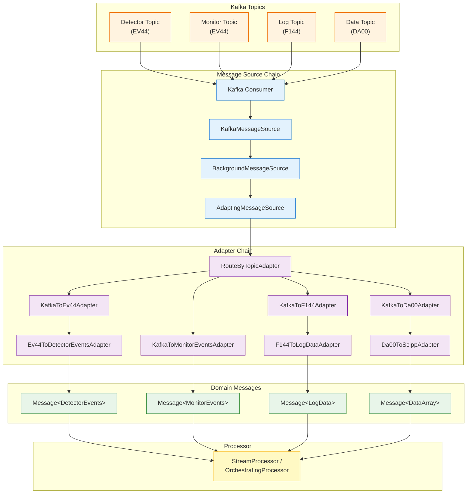

# Message Flow and Transformation

## Table of Contents

1. [Overview](#overview)
2. [End-to-End Message Journey](#end-to-end-message-journey)
3. [Message Abstraction](#message-abstraction)
4. [Stream Mapping](#stream-mapping)
5. [Message Adapters](#message-adapters)
6. [Message Batching](#message-batching)
7. [Message Source Chain](#message-source-chain)
8. [Serialization and Schema](#serialization-and-schema)

## Overview

ESSlivedata processes neutron detector data flowing through Kafka topics. Messages undergo several transformations as they move from raw Kafka messages to typed domain objects ready for processing. This document describes the message transformation pipeline and the abstractions that enable it.

**Key Principles:**
- **Isolation from Kafka details**: Internal code works with domain types, not Kafka specifics
- **Composable transformations**: Adapters can be chained and routed
- **Type safety**: Generic types ensure correct transformations
- **Performance**: Optimized parsing for high-throughput streams

## End-to-End Message Journey



**Stages:**

1. **Kafka Topics**: Raw messages in FlatBuffers format (EV44, F144, DA00)
2. **Message Source Chain**: Consumption, background polling, adaptation orchestration
3. **Adapter Chain**: Deserialization and transformation to domain types
4. **Domain Messages**: Typed messages ready for processing
5. **Processor**: Routes to handlers based on StreamId

## Message Abstraction

### The Message Type

All messages in ESSlivedata follow a consistent structure:

```python
from ess.livedata.core.message import Message, StreamId, StreamKind

@dataclass(frozen=True, slots=True, kw_only=True)
class Message(Generic[T]):
    """
    A message with a timestamp and a stream key.

    Parameters
    ----------
    timestamp:
        The timestamp of the message in nanoseconds since the epoch in UTC.
    stream:
        The stream key of the message. Identifies which stream the message belongs to.
    value:
        The value of the message.
    """
    timestamp: int  # nanoseconds since Unix epoch (UTC)
    stream: StreamId
    value: T
```

**Key Characteristics:**
- **Generic over value type**: `Message[DetectorEvents]`, `Message[DataArray]`, etc.
- **Immutable**: Frozen dataclass ensures messages aren't modified
- **Timestamp-based ordering**: Messages are comparable by timestamp
- **Stream identification**: Each message belongs to a specific stream

### StreamId: Identifying Message Streams

```python
from ess.livedata.core.message import StreamId, StreamKind

@dataclass(frozen=True, slots=True, kw_only=True)
class StreamId:
    kind: StreamKind = StreamKind.UNKNOWN
    name: str

class StreamKind(str, Enum):
    UNKNOWN = "unknown"
    MONITOR_COUNTS = "monitor_counts"
    MONITOR_EVENTS = "monitor_events"
    DETECTOR_EVENTS = "detector_events"
    LOG = "log"
    LIVEDATA_CONFIG = "livedata_config"
    LIVEDATA_DATA = "livedata_data"
    LIVEDATA_STATUS = "livedata_status"
```

**Purpose:**
- **Kind**: Broad category (detector, monitor, log, etc.)
- **Name**: Specific identifier within category (detector name, log variable name)
- **Isolation**: Internal code doesn't depend on Kafka topic names or source names

**Examples:**
```python
# Detector events from high_flux_detector
StreamId(kind=StreamKind.DETECTOR_EVENTS, name='high_flux_detector')

# Monitor events from monitor_1
StreamId(kind=StreamKind.MONITOR_EVENTS, name='monitor_1')

# Sample temperature log
StreamId(kind=StreamKind.LOG, name='sample_temperature')

# Processed data result
StreamId(kind=StreamKind.LIVEDATA_DATA, name='workflow_id/job_id/output_name')
```

## Stream Mapping

### Purpose

Stream mapping isolates ESSlivedata internals from Kafka topic structure:

- **Kafka side**: Messages identified by `(topic, source_name)` tuple
- **ESSlivedata side**: Messages identified by `StreamId(kind, name)`

This isolation allows:
- Topic renaming without code changes
- Split topics (multiple topics for same stream kind)
- Merging streams from different topics
- Simplified testing (bypass Kafka details)

### StreamMapping and StreamLUT

```python
from ess.livedata.kafka.stream_mapping import StreamMapping, StreamLUT, InputStreamKey

# InputStreamKey: Kafka-side identifier
@dataclass(frozen=True, slots=True, kw_only=True)
class InputStreamKey:
    topic: str
    source_name: str

# StreamLUT: Mapping from Kafka identifiers to internal names
StreamLUT = dict[InputStreamKey, str]

# Example detector mapping
detector_lut: StreamLUT = {
    InputStreamKey(topic='dream_detectors', source_name='bank01'): 'high_flux_detector',
    InputStreamKey(topic='dream_detectors', source_name='bank02'): 'low_flux_detector',
    # Multiple topics can map to same internal name (merged streams)
    InputStreamKey(topic='dream_detectors_split', source_name='bank01'): 'high_flux_detector',
}

# Create stream mapping for instrument
stream_mapping = StreamMapping(
    instrument='dream',
    detectors=detector_lut,
    monitors=monitor_lut,
    log_topics={'dream_logs'},
    livedata_config_topic='dream_livedata_config',
    livedata_data_topic='dream_livedata_data',
    livedata_status_topic='dream_livedata_status',
)
```

### Using Stream Mapping in Adapters

```python
from ess.livedata.kafka.message_adapter import KafkaToEv44Adapter

# Adapter uses stream_lut to convert Kafka identifiers to StreamId
adapter = KafkaToEv44Adapter(stream_lut=stream_mapping.detectors)

# When processing a Kafka message:
# 1. Deserialize EV44: source_name = 'bank01', topic = 'dream_detectors'
# 2. Look up in stream_lut: InputStreamKey('dream_detectors', 'bank01')
# 3. Get internal name: 'high_flux_detector'
# 4. Create StreamId: StreamId(kind=DETECTOR_EVENTS, name='high_flux_detector')
```

## Message Adapters

### Adapter Pattern

Adapters transform messages from one type to another:

```python
from ess.livedata.kafka.message_adapter import MessageAdapter

class MessageAdapter(Protocol, Generic[T, U]):
    def adapt(self, message: T) -> U:
        ...
```

**Benefits:**
- **Composable**: Chain adapters for multi-step transformations
- **Type-safe**: Generic types ensure correct connections
- **Testable**: Mock adapters for testing
- **Reusable**: Same adapter works in different contexts

### Core Adapters

#### KafkaToEv44Adapter

Deserializes EV44 event data and creates typed messages:

```python
from ess.livedata.kafka.message_adapter import KafkaToEv44Adapter
from streaming_data_types import eventdata_ev44

adapter = KafkaToEv44Adapter(
    stream_lut=stream_mapping.detectors,
    stream_kind=StreamKind.DETECTOR_EVENTS,
)

# KafkaMessage -> Message[eventdata_ev44.EventData]
message = adapter.adapt(kafka_message)
```

**Key Features:**
- Uses stream_lut to map `(topic, source_name)` → internal name
- Extracts timestamp from reference_time (or Kafka timestamp as fallback)
- Returns typed `Message[EventData]`

#### KafkaToMonitorEventsAdapter

Optimized adapter that skips intermediate EV44 deserialization:

```python
from ess.livedata.kafka.message_adapter import KafkaToMonitorEventsAdapter

adapter = KafkaToMonitorEventsAdapter(stream_lut=stream_mapping.monitors)

# KafkaMessage -> Message[MonitorEvents] (skips EventData intermediate)
message = adapter.adapt(kafka_message)
```

**Performance Optimization:**
- Directly extracts time-of-flight arrays from FlatBuffers
- Skips deserializing unused fields (detector_id, weights, etc.)
- Reduces memory allocations for high-rate monitor streams

#### Ev44ToDetectorEventsAdapter

Converts EV44 EventData to domain type:

```python
from ess.livedata.kafka.message_adapter import Ev44ToDetectorEventsAdapter

adapter = Ev44ToDetectorEventsAdapter(merge_detectors=True)

# Message[EventData] -> Message[DetectorEvents]
message = adapter.adapt(ev44_message)
```

**Options:**
- `merge_detectors=True`: All detectors merged into 'unified_detector' stream
- Useful for instruments with many detector banks treated as one

#### KafkaToDa00Adapter and Da00ToScippAdapter

Process DataArray messages:

```python
from ess.livedata.kafka.message_adapter import (
    KafkaToDa00Adapter,
    Da00ToScippAdapter,
    ChainedAdapter,
)

# KafkaMessage -> Message[list[Variable]] -> Message[DataArray]
adapter = ChainedAdapter(
    KafkaToDa00Adapter(stream_lut=stream_mapping.detectors),
    Da00ToScippAdapter(),
)
```

**DA00 Compatibility:**
- Handles differences between streaming_data_types DA00 and Scipp DataArray
- Converts variable list to proper DataArray structure

#### KafkaToF144Adapter and F144ToLogDataAdapter

Process log data messages:

```python
from ess.livedata.kafka.message_adapter import (
    KafkaToF144Adapter,
    F144ToLogDataAdapter,
    ChainedAdapter,
)

adapter = ChainedAdapter(
    KafkaToF144Adapter(stream_lut=stream_mapping.logs),
    F144ToLogDataAdapter(),
)

# KafkaMessage -> Message[ExtractedLogData] -> Message[LogData]
```

**LogData Domain Type:**
- Decouples from upstream schema changes
- Simplifies testing (no need to construct F144 objects)

### Adapter Composition

#### ChainedAdapter

Chains two adapters sequentially:

```python
from ess.livedata.kafka.message_adapter import ChainedAdapter

adapter = ChainedAdapter(
    first=KafkaToEv44Adapter(stream_lut=detectors),
    second=Ev44ToDetectorEventsAdapter(),
)

# Equivalent to: second.adapt(first.adapt(message))
```

#### RouteByTopicAdapter

Routes messages to different adapters based on Kafka topic:

```python
from ess.livedata.kafka.message_adapter import RouteByTopicAdapter

adapter = RouteByTopicAdapter({
    'dream_detectors': detector_adapter,
    'dream_monitors': monitor_adapter,
    'dream_logs': log_adapter,
})

# Looks up topic in message, routes to appropriate adapter
```

**Topic List:**
```python
topics = adapter.topics  # Returns list of topics to subscribe to
```

#### RouteBySchemaAdapter

Routes based on FlatBuffers schema identifier:

```python
from ess.livedata.kafka.message_adapter import RouteBySchemaAdapter

adapter = RouteBySchemaAdapter({
    'ev44': ev44_adapter,
    'f144': f144_adapter,
    'da00': da00_adapter,
})

# Extracts schema from FlatBuffers message, routes to adapter
```

**Use Case:**
- Multiple schemas on same topic
- Schema-based message routing

### Error Handling in Adapters

```python
from ess.livedata.kafka.message_adapter import AdaptingMessageSource

source = AdaptingMessageSource(
    source=kafka_source,
    adapter=adapter,
    raise_on_error=False,  # Log and skip on error (default)
)
```

**Error Modes:**
- `raise_on_error=False`: Log error, skip message, continue processing
- `raise_on_error=True`: Re-raise exception, stop processing
- Unknown schema exceptions always logged as warnings

## Message Batching

Message batching groups messages into time-aligned windows for processing.

### Why Batching?

- **Time-aligned processing**: Process data from specific time ranges
- **Job scheduling**: Activate jobs when data reaches start time
- **Efficient accumulation**: Batch updates to accumulators
- **Predictable latency**: Regular processing intervals

### MessageBatch Structure

```python
from ess.livedata.core.message_batcher import MessageBatch

@dataclass(slots=True, kw_only=True)
class MessageBatch:
    start_time: int  # nanoseconds
    end_time: int    # nanoseconds
    messages: list[Message[Any]]
```

**Semantics:**
- `start_time`: Lower bound (inclusive)
- `end_time`: Upper bound (exclusive)
- `messages`: All messages in this time window (may include late arrivals)

### SimpleMessageBatcher

Time-aligned batching used by `OrchestratingProcessor`:

```python
from ess.livedata.core.message_batcher import SimpleMessageBatcher

batcher = SimpleMessageBatcher(batch_length_s=1.0)  # 1-second batches

batch = batcher.batch(messages)
if batch is not None:
    # Batch is complete, process it
    process(batch)
```

**Behavior:**

1. **Initial batch**: First call returns batch containing all received messages
   - `start_time = min(msg.timestamp for msg in messages)`
   - `end_time = max(msg.timestamp for msg in messages)`

2. **Subsequent batches**: Aligned to batch_length intervals
   - Batch 1: `[T, T + 1s)`
   - Batch 2: `[T + 1s, T + 2s)`
   - Batch 3: `[T + 2s, T + 3s)`

3. **Late messages**: Included in next batch (timestamp < batch.end_time)

4. **Empty batches**: Returned when next batch starts (even with no messages)

5. **Batch completion**: Triggered by first message for next batch

**Important:** Batching relies on message timestamps, not wall-clock time. If messages stop arriving, the current batch may never complete.

### NaiveMessageBatcher

Simple batcher for testing (all messages in one batch):

```python
from ess.livedata.core.message_batcher import NaiveMessageBatcher

batcher = NaiveMessageBatcher(batch_length_s=1.0, pulse_length_s=1.0/14)

# Returns single batch with all messages
batch = batcher.batch(messages)
```

**Use Cases:**
- Testing without time-based logic
- Services that don't need time alignment

## Message Source Chain

### MessageSource Protocol

```python
from ess.livedata.core.message import MessageSource

class MessageSource(Protocol, Generic[Tin]):
    def get_messages(self) -> Sequence[Tin]:
        ...
```

**Simple Interface:**
- Called by processor in each iteration
- Returns batch of available messages
- May return empty list

### KafkaMessageSource

Basic Kafka consumer wrapper:

```python
from ess.livedata.kafka.source import KafkaMessageSource

source = KafkaMessageSource(
    consumer=kafka_consumer,
    num_messages=100,  # Messages per poll
    timeout=0.05,      # Poll timeout (seconds)
)

messages = source.get_messages()  # Blocks for up to timeout
```

**Blocking Behavior:**
- Polls Kafka for up to `timeout` seconds
- Returns fewer messages if timeout reached
- Processor blocked during poll

### BackgroundMessageSource

Non-blocking Kafka consumer:

```python
from ess.livedata.kafka.source import BackgroundMessageSource

with BackgroundMessageSource(
    consumer=kafka_consumer,
    num_messages=100,
    timeout=0.05,
    max_queue_size=1000,
) as source:
    messages = source.get_messages()  # Non-blocking
```

**Architecture:**
- Background thread polls Kafka continuously
- Messages queued in memory (queue.Queue)
- `get_messages()` drains queue without blocking
- Automatic overflow handling (drops oldest batches)

**Benefits:**
- Processor never blocked on Kafka I/O
- Handles bursts of messages
- Reduces risk of falling behind

**Context Manager:**
- `__enter__`: Start background thread
- `__exit__`: Stop thread, cleanup

### AdaptingMessageSource

Wraps source to apply adapters:

```python
from ess.livedata.kafka.message_adapter import AdaptingMessageSource

source = AdaptingMessageSource(
    source=kafka_source,
    adapter=adapter,
    raise_on_error=False,
)

# Returns adapted messages: list[Message[DomainType]]
messages = source.get_messages()
```

**Error Handling:**
- Catches exceptions during adaptation
- Logs error, skips message (if `raise_on_error=False`)
- Continues with remaining messages

### MultiConsumer

Combines multiple Kafka consumers:

```python
from ess.livedata.kafka.source import MultiConsumer

consumer = MultiConsumer([config_consumer, data_consumer])

# Polls all consumers, returns combined messages
messages = consumer.consume(num_messages=100, timeout=0.05)
```

**Use Case:**
- Different offset strategies for different topics
- Config topics: Read from earliest (auto.offset.reset=earliest)
- Data topics: Read from latest (auto.offset.reset=latest)

## Serialization and Schema

### FlatBuffers Schemas

ESSlivedata uses FlatBuffers schemas from `streaming_data_types`:

#### EV44: Event Data

```python
from streaming_data_types import eventdata_ev44

# Serialize
buffer = eventdata_ev44.serialise_ev44(
    source_name='detector_1',
    message_id=12345,
    reference_time=[time_ns],
    time_of_flight=[1000, 2000, 3000],
    detector_id=[0, 1, 2],
)

# Deserialize
ev44 = eventdata_ev44.deserialise_ev44(buffer)
```

**Fields:**
- `source_name`: Detector/monitor name
- `reference_time`: Pulse times (nanoseconds)
- `time_of_flight`: Event TOF (nanoseconds or microseconds)
- `detector_id`: Pixel IDs

#### F144: Log Data

```python
from streaming_data_types import logdata_f144

# Serialize
buffer = logdata_f144.serialise_f144(
    source_name='sample_temperature',
    value=293.15,
    timestamp_unix_ns=time_ns,
)

# Deserialize
f144 = logdata_f144.deserialise_f144(buffer)
```

**Fields:**
- `source_name`: Log variable name
- `value`: Scalar or array value
- `timestamp_unix_ns`: Timestamp (nanoseconds)

#### DA00: DataArray

```python
from streaming_data_types import dataarray_da00

# Serialize (via compatibility layer)
from ess.livedata.kafka.scipp_da00_compat import scipp_to_da00

buffer = dataarray_da00.serialise_da00(
    source_name='result_1',
    timestamp_ns=time_ns,
    data=scipp_to_da00(data_array),
)

# Deserialize
from ess.livedata.kafka.scipp_da00_compat import da00_to_scipp

da00 = dataarray_da00.deserialise_da00(buffer)
data_array = da00_to_scipp(da00.data)
```

**Compatibility Layer:**
- `scipp_to_da00`: Scipp DataArray → DA00 format
- `da00_to_scipp`: DA00 format → Scipp DataArray
- Handles differences in variable structure

### Kafka Sink Serialization

```python
from ess.livedata.kafka.sink import KafkaSink

sink = KafkaSink(
    instrument='dream',
    kafka_config=kafka_config,
    serializer=serialize_dataarray_to_da00,  # Default
)

# Publishes messages to Kafka
sink.publish_messages(messages)
```

**Built-in Serializers:**
- `serialize_dataarray_to_da00`: DataArray → DA00
- `serialize_dataarray_to_f144`: DataArray → F144 (for logs)

**Stream-Specific Serialization:**
- Config messages: JSON encoding with message key
- Status messages: X5f2 format
- Data messages: DA00 format

### UnrollingSinkAdapter

Handles DataGroup results (multiple outputs):

```python
from ess.livedata.kafka.sink import UnrollingSinkAdapter

sink = UnrollingSinkAdapter(KafkaSink(...))

# Input: Message[DataGroup] with {'result1': da1, 'result2': da2}
# Output: Two messages, one per DataGroup item
sink.publish_messages(messages)
```

**Purpose:**
- Workflows can return `DataGroup` with multiple outputs
- Each output published as separate DA00 message
- Stream name includes output name: `workflow_id/job_id/output_name`

---

## Summary

ESSlivedata's message transformation pipeline:

1. **Kafka Messages** → Raw FlatBuffers
2. **Source Chain** → Consumption, background polling, adaptation
3. **Adapters** → Deserialization and domain conversion
4. **Stream Mapping** → Isolation from Kafka details
5. **Batching** → Time-aligned processing windows
6. **Domain Messages** → Type-safe messages for handlers

**Key Abstractions:**
- `Message[T]`: Unified message structure
- `StreamId`: Internal stream identification
- `MessageAdapter`: Composable transformations
- `StreamMapping`: Kafka isolation layer
- `MessageBatcher`: Time-aligned batching
- `BackgroundMessageSource`: Non-blocking consumption

This architecture enables ESSlivedata to process high-rate data streams while maintaining type safety, testability, and isolation from Kafka implementation details.
