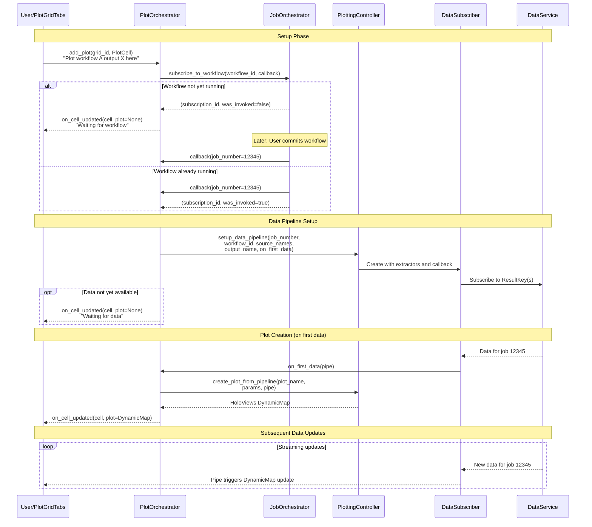

# Orchestrator Flow: Plot Creation Lifecycle

This document describes the interaction between PlotOrchestrator, JobOrchestrator, PlottingController, and DataService when a user requests a plot.

## Overview

The plot creation follows a **two-phase subscription model**:

1. **Phase 1**: Subscribe to JobOrchestrator → receive `job_number` when workflow is committed
2. **Phase 2**: Use `job_number` to set up data pipeline → wait for data → create plot

## Sequence Diagram



## Key Components

| Component | Responsibility |
|-----------|----------------|
| **PlotGridTabs** | UI widget where user selects what to plot and where |
| **PlotOrchestrator** | Manages plot lifecycle, subscribes to job availability, coordinates plot creation |
| **JobOrchestrator** | Manages workflow jobs, generates job numbers, notifies subscribers on commit |
| **PlottingController** | Creates DataSubscribers and HoloViews plots |
| **DataSubscriber** | Subscribes to DataService, invokes `on_first_data` callback when data arrives |
| **DataService** | Holds job data, notifies subscribers when data arrives |

## Waiting States

The UI can receive intermediate states before a plot is ready:

1. **"Waiting for workflow"**: The workflow hasn't been committed yet. The plot cell is configured but no job exists.
2. **"Waiting for data"**: The workflow is running (job exists) but no data has arrived yet.
3. **Plot ready**: Data has arrived and the HoloViews DynamicMap is created.

## Lifecycle Callbacks

PlotGridTabs subscribes to PlotOrchestrator lifecycle events:

```python
plot_orchestrator.subscribe_to_lifecycle(
    on_grid_created=...,
    on_grid_removed=...,
    on_cell_updated=...,  # Receives plot or waiting state
    on_cell_removed=...,
)
```

The `on_cell_updated` callback is called:
- When a cell is first added (waiting for workflow)
- When job becomes available but no data yet (waiting for data)
- When plot is created (with the DynamicMap)
- When plot creation fails (with error message)
