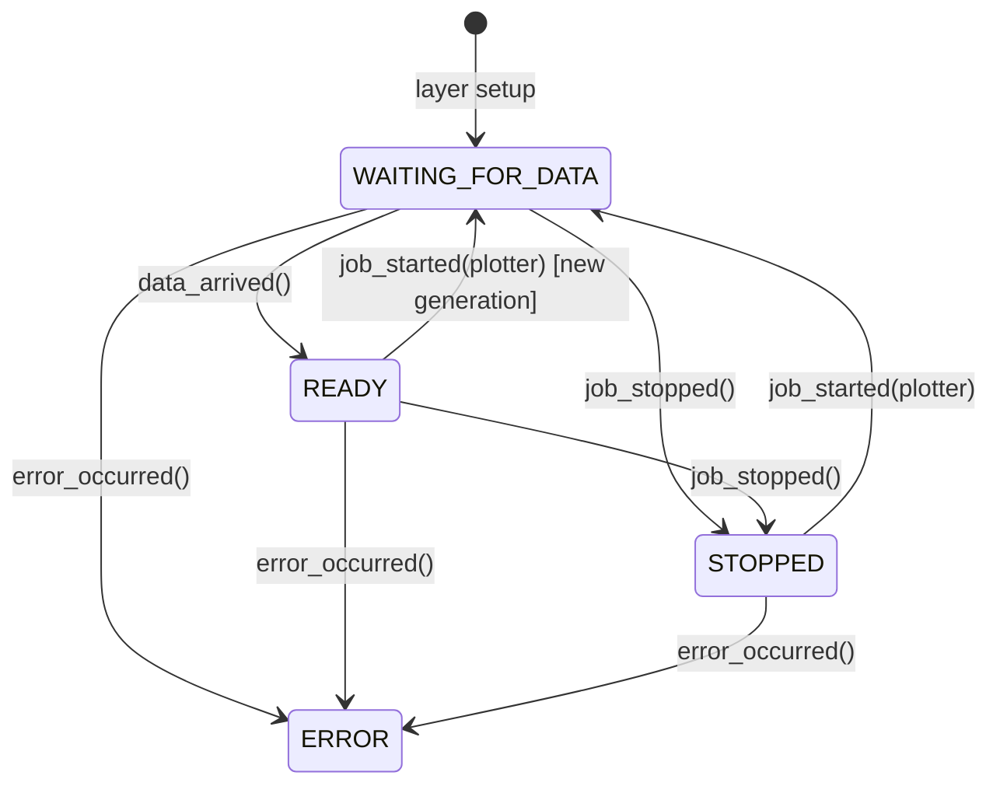

# Orchestrator Flow: Plot Creation Lifecycle

This document describes the interaction between PlotOrchestrator, JobOrchestrator, PlottingController, and PlotDataService when a plot layer is created.

## Overview

Plot creation is **static**: the dashboard data plane is keyed by stable `DataKey(workflow_id, source_name, output_name)`, so a layer's keys are fully determined by its `PlotConfig`. `add_layer` creates the plotter and sets up the data pipeline immediately and unconditionally — there is no waiting for a workflow job.

Workflow run-state reaches layers by **polling**, not callbacks: the orchestrator update loop calls `PlotOrchestrator.sync_job_states()` each pass, which compares every layer's workflows' active job numbers against the last observed values:

- **Changed, all running** — a new generation was committed. The commit cleared the workflow's buffers (`ActiveJobRegistry.begin_generation`), so the layer's presentation is reset: a fresh plotter replaces the old one, blanking the plot and resetting plotter-internal accumulation (e.g. autoscale ranges). The data pipeline is untouched; keys are generation-independent.
- **Changed, not all running** — the workflow stopped. The layer freezes in STOPPED with its last frame retained; the retained buffers stay displayed until the next commit clears them.

## Sequence Diagram

```mermaid
sequenceDiagram
    participant User as User/PlotGridTabs
    participant PO as PlotOrchestrator
    participant JO as JobOrchestrator
    participant PC as PlottingController
    participant PDS as PlotDataService

    Note over User,PDS: Layer setup (static, at add-layer time)
    User->>PO: add_layer(cell_id, PlotConfig)
    PO->>PC: create_plotter(plot_name, params)
    PC-->>PO: Plotter instance
    PO->>PDS: job_started(layer_id, plotter)<br/>[state: WAITING_FOR_DATA]
    PO->>PC: setup_pipeline(keys_by_role, plot_name,<br/>params, on_update callback)
    PC-->>PO: DataServiceSubscriber
    opt Workflow not running
        PO->>PDS: job_stopped(layer_id)<br/>[state: STOPPED; retained data still renders]
    end
    PO-->>User: on_cell_updated(cell)

    Note over User,PDS: Data arrival (ingestion thread)
    Note over PO: on_update marks layer dirty;<br/>flush_frames pulls and rebuilds
    PO->>PO: plotter.compute(data)
    PO->>PDS: data_arrived(layer_id)<br/>[state: READY]

    Note over User,PDS: Run-state poll (orchestrator update loop)
    PO->>JO: get_active_job_number(workflow_id) per workflow
    alt New generation (commit observed)
        PO->>PC: create_plotter(plot_name, params)
        PO->>PDS: job_started(layer_id, fresh plotter)<br/>[state: WAITING_FOR_DATA, blank]
    else Workflow stopped
        PO->>PDS: job_stopped(layer_id)<br/>[state: STOPPED, frame retained]
    end
```

## Key Components

| Component | Responsibility |
|-----------|----------------|
| **PlotGridTabs** | UI widget; subscribes to PlotOrchestrator lifecycle events, polls PlotDataService for layer state |
| **PlotOrchestrator** | Manages plot lifecycle: plotter creation, data pipeline setup, run-state polling (`sync_job_states`). See `dashboard/plot_orchestrator.py` |
| **JobOrchestrator** | Manages workflow jobs; exposes run-state via `get_active_job_number` and version counters. See `dashboard/job_orchestrator.py` |
| **PlottingController** | `create_plotter()` and `setup_pipeline()`. See `dashboard/plotting_controller.py` |
| **PlotDataService** | Layer state machine (WAITING_FOR_DATA → READY / STOPPED / ERROR). Version-based polling for UI. See `dashboard/plot_data_service.py` |
| **DataService** | Holds job result data under stable DataKeys; manages subscriber lifecycle and buffer retention |

## Layer States

Each layer transitions through explicit states managed by `PlotDataService`. States are derived from workflow run-state plus data arrival:

```mermaid
stateDiagram-v2
    [*] --> WAITING_FOR_DATA: layer setup
    WAITING_FOR_DATA --> READY: data_arrived()
    WAITING_FOR_DATA --> STOPPED: job_stopped()
    WAITING_FOR_DATA --> ERROR: error_occurred()

    READY --> STOPPED: job_stopped()
    READY --> WAITING_FOR_DATA: job_started(plotter) [new generation]
    READY --> ERROR: error_occurred()

    STOPPED --> WAITING_FOR_DATA: job_started(plotter)
    STOPPED --> ERROR: error_occurred()
```

Each transition increments a version counter. UI components poll for version changes to detect when rebuilds are needed. A layer in STOPPED may still display retained data: `data_arrived` while STOPPED is a no-op and `has_displayable_plot` reports True once the plotter holds a computed frame.

## Multi-Source Layers (Correlation Plots)

`PlotConfig.data_sources` maps role names to `DataSourceConfig`:

- **"primary"**: Main data source (required for all layers)
- **"x_axis"**, **"y_axis"**: Correlation axes (optional, for correlation histograms)

Data readiness is gated at the data layer: the `DataSubscriber` only assembles when every role has data. Run-state gating in `sync_job_states` mirrors this: the presentation resets only when *all* of the layer's workflows are running; a stop of *any* freezes the layer (a correlation plot cannot function with partial data).

The `keys_by_role` dict flows through to `setup_pipeline()`, preserving role structure so plotters receive data grouped by role.

## Lifecycle Callbacks

PlotGridTabs subscribes to PlotOrchestrator lifecycle events (grid created/removed/updated, cell updated/removed). The `on_cell_updated` callback signals that a cell's layer configuration changed. Actual layer state (waiting, ready, error) is read from `PlotDataService` by the UI during periodic polling.
