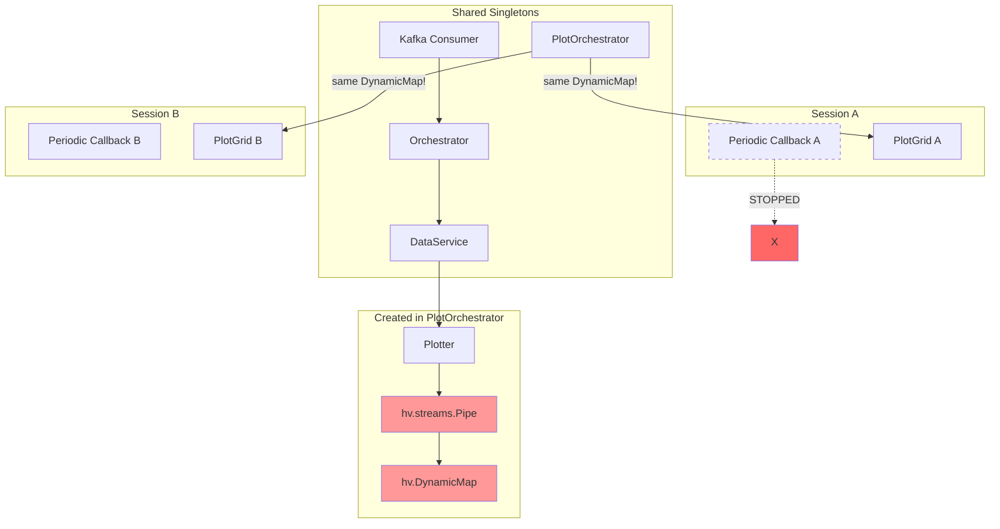
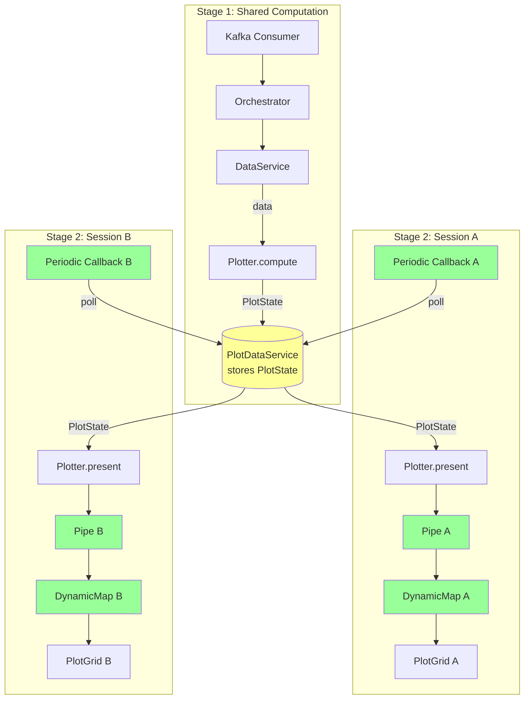
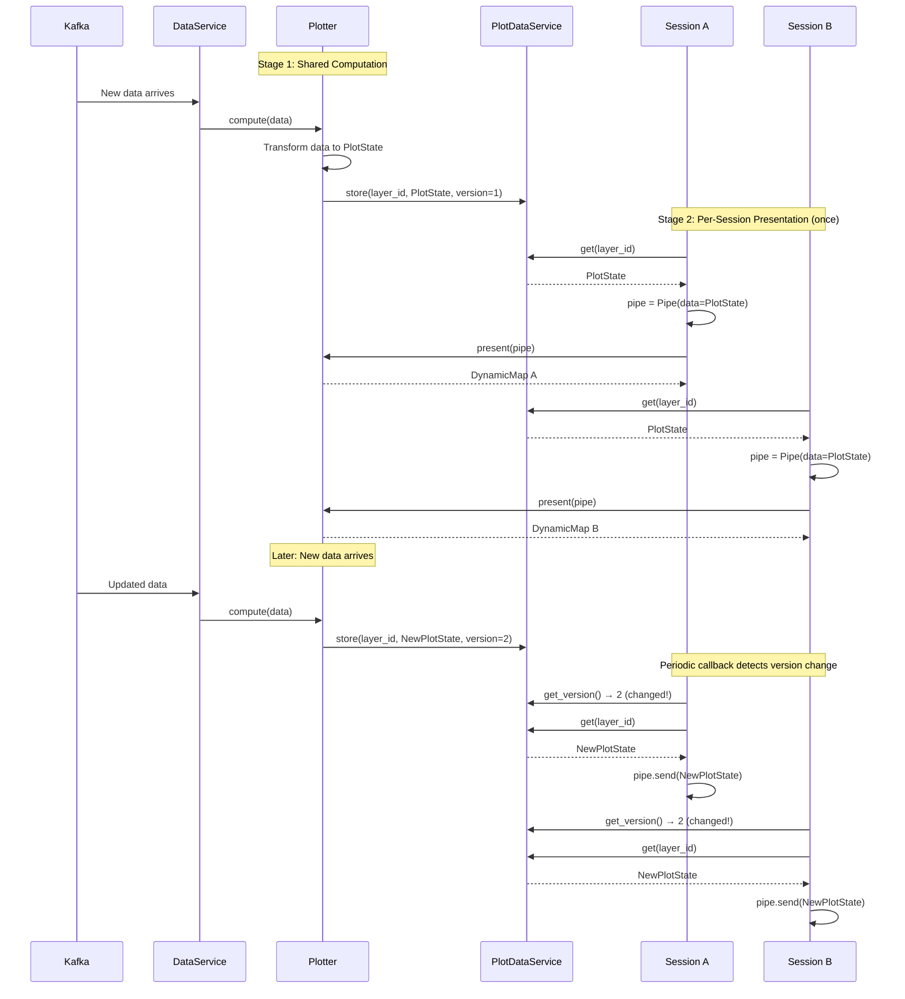

# Multi-Session Architecture Fix

This document analyzes the multi-session problems in the dashboard and proposes an architectural fix.

Related: [Issue #609 - Multi-session support for plots](https://github.com/scipp/esslivedata/issues/609)

## Problem Summary

When multiple browser tabs open the dashboard:
1. All notifications appear in one tab instead of one per tab
2. Plot updates may go to wrong tabs or fail entirely
3. Only the last-opened tab has a working periodic callback

## Root Cause Analysis

### The `self._callback` Bug

In `dashboard.py`, the periodic callback is stored on the shared `DashboardBase` instance:

```python
def start_periodic_updates(self, period: int = 500) -> None:
    if self._callback is not None:
        self._callback.stop()  # Stops PREVIOUS session's callback!
    self._callback = pn.state.add_periodic_callback(_safe_step, period=period)
```

Since `self` is shared across all sessions:
- Tab A opens → creates callback_A, stores in `self._callback`
- Tab B opens → stops callback_A, creates callback_B
- **Result: Only the last-opened tab has a running callback**

### Session Context Problem for Notifications

When the last tab's callback runs and processes notifications:
1. `orchestrator.update()` processes Kafka messages
2. `_notify_command_success()` calls ALL widget callbacks (from all sessions)
3. All callbacks execute in the current session's context
4. `pn.state.notifications` in all callbacks refers to the current session's notifications
5. **All notifications appear in one tab**

### Session Binding for Plots (The Deeper Issue)

The plot architecture has a more fundamental problem:

```
PlotOrchestrator (singleton)
    └── creates ONE Pipe per plot layer
    └── creates ONE DynamicMap per plot layer
    └── notifies ALL session widgets with the SAME DynamicMap
```

**But `hv.streams.Pipe` and `hv.DynamicMap` are session-bound!** They belong to whichever session's context they were created in.

### What's Session-Bound vs Shared

| Component | Shared/Session | Notes |
|-----------|---------------|-------|
| `DashboardBase` | Shared (1 instance) | Serves all sessions via `pn.serve(self.create_layout)` |
| `DashboardServices` | Shared | Created once in `DashboardBase.__init__` |
| `PlotOrchestrator` | Shared | Singleton service |
| `PlottingController` | Shared | Singleton service |
| `DataService` | Shared | Singleton service |
| `JobOrchestrator` | Shared | Singleton service |
| Widget instances | Per-session | Created in `create_layout()` per session |
| `hv.streams.Pipe` | **Session-bound** | Currently created in shared PlotOrchestrator |
| `hv.DynamicMap` | **Session-bound** | Currently created in shared PlotOrchestrator |
| `hv.streams.BoxEdit` | **Session-bound** | Responds to mouse events in specific tab |
| `pn.state.notifications` | **Session-bound** | Accessed via context |
| Periodic callbacks | **Session-bound** | Created via `pn.state.add_periodic_callback` |

## Key Insight: Two-Stage Plotter Architecture

Every plotter naturally has two stages:

1. **Compute Stage** (shared): Transform input data into plot state
2. **Present Stage** (per-session): Create session-bound presentation components

| Plotter Type | Stage 1: Compute (Shared) | Stage 2: Present (Per-Session) |
|-------------|---------------------------|-------------------------------|
| ImagePlotter | `data → hv.Image` | Wrap in Pipe + DynamicMap |
| LinePlotter | `data → hv.Curve` | Wrap in Pipe + DynamicMap |
| SlicerPlotter | `data → hv.Image` (with kdims) | Wrap in Pipe + DynamicMap + widgets |
| ROI Request | Parse config → initial ROI state | Create Pipe + DynamicMap + EditStream |

### Proposed Plotter Protocol

```python
class Presenter(Protocol):
    """Per-session presentation handler. Created fresh for each session."""

    def present(self, pipe: Pipe) -> DynamicMap:
        """Create session-bound DynamicMap from pre-initialized pipe."""


class DefaultPresenter:
    """Default presenter - just wraps pipe in DynamicMap."""

    def __init__(self, plotter: Plotter):
        self._plotter = plotter  # For kdims, opts, etc.

    def present(self, pipe: Pipe) -> DynamicMap:
        # This is what PlottingController.create_plot_from_pipeline() does today
        return hv.DynamicMap(
            lambda data: data,
            streams=[pipe],
            kdims=self._plotter.kdims,
        )


class Plotter(Protocol):
    def compute(self, data: dict[ResultKey, DataArray]) -> PlotState:
        """
        Stage 1: Compute shareable state from input data.

        Called on the shared plotter instance when data arrives.
        Result is stored in PlotDataService.

        MUST be stateless - do not store instance state here.

        Returns plotter-specific state (hv.Element, ROIState, etc.)
        """

    def create_presenter(self) -> Presenter:
        """
        Factory method - returns a fresh Presenter for each session.

        Default implementation returns DefaultPresenter (just DynamicMap wrapping).
        Override for complex presenters (ROI request plotters with edit streams).
        """
        return DefaultPresenter(self)
```

**Relationship to current implementation:**

The current `Plotter` base class has two methods:
- `__call__(data: dict[ResultKey, DataArray])` - **orchestrator** in base class that loops over data items, calls `plot()` for each, combines into Overlay/Layout, adds time info
- `plot(data: DataArray, data_key: ResultKey)` - **abstract method** that subclasses implement for a single DataArray

The proposed `compute()` replaces `__call__()` (the orchestrator). The individual `plot()` methods in subclasses remain unchanged - they're internal helpers called by `compute()`.

**Key insight: minimal migration for existing plotters**
- Base class `__call__()` → rename to `compute()` (keeps all orchestration logic)
- Subclass `plot()` methods → **no changes needed** (still called by compute)
- Current DynamicMap wrapping in `PlottingController` → moves to `DefaultPresenter`
- Most plotters use `DefaultPresenter` automatically - **zero changes to subclasses**
- Only ROI request plotters override `create_presenter()` to return custom Presenter

**Architecture:**
- **1 shared Plotter instance** per layer (for `compute()`)
- **1 Presenter instance** per session per layer (from `create_presenter()`)

```
Initial setup (once per session per layer):
    state = PlotDataService.get(layer_id)
    presenter = plotter.create_presenter()   # Fresh presenter for this session
    pipe = Pipe(data=state)                  # Create pipe with initial state
    dmap = presenter.present(pipe)           # Create DynamicMap

Periodic updates:
    if PlotDataService.version_changed(layer_id):
        new_state = PlotDataService.get(layer_id)
        pipe.send(new_state)                 # Send to existing pipe
```

This abstraction means:
- **PlotOrchestrator** calls `compute()` on shared plotter, stores results
- **Widgets** call `create_presenter()` once, then `presenter.present(pipe)`, then `pipe.send()` for updates
- **Most plotters** need zero changes - just rename `__call__` to `compute`

## Current Architecture (Broken)



**Problems:**
1. Only last session's periodic callback runs
2. Pipe/DynamicMap are session-bound but shared across sessions
3. All sessions receive the same DynamicMap instance

## Proposed Architecture

### Two-Stage Data Flow



### Sequence Diagram



### Example: Standard Plotter (ImagePlotter)

```python
class ImagePlotter(Plotter):
    """Standard plotter - uses DefaultPresenter, NO CHANGES needed to subclass."""

    # compute() inherited from base class - orchestrates looping, combining
    # create_presenter() inherited from base - returns DefaultPresenter

    def plot(self, data: DataArray, data_key: ResultKey, **kwargs) -> hv.Image:
        """Per-item plot creation - UNCHANGED from current implementation."""
        plot_data = self._prepare_2d_image_data(data, self._use_log_scale)
        return to_holoviews(plot_data).opts(**self._base_opts)

# Usage:
#   state = plotter.compute(data)              # PlotOrchestrator (calls plot() internally)
#   presenter = plotter.create_presenter()     # Widget (fresh per session)
#   pipe = Pipe(data=state)
#   dmap = presenter.present(pipe)             # DefaultPresenter wraps in DynamicMap
#   ...later...
#   pipe.send(new_state)                       # Widget sends updates
```

### Example: Interactive Plotter (RectanglesRequestPlotter)

```python
@dataclass
class ROIState:
    """Shareable state for ROI request plotters."""
    x_unit: str | None
    y_unit: str | None
    initial_rois: dict[int, RectangleROI]
    result_key: ResultKey


class ROIPresenter:
    """Custom presenter with session-local edit streams."""

    def __init__(self, params, roi_publisher):
        self._params = params
        self._roi_publisher = roi_publisher
        # Session state - safe because each session gets fresh instance
        self._edit_stream: hv.streams.BoxEdit | None = None
        self._result_key: ResultKey | None = None

    def present(self, pipe: Pipe) -> hv.DynamicMap:
        """Create interactive editor with session-local edit stream."""
        initial_state: ROIState = pipe.data

        # Create DynamicMap
        dmap = hv.DynamicMap(self._create_element, streams=[pipe])

        # Create session-local edit stream
        self._edit_stream = hv.streams.BoxEdit(
            source=dmap,
            num_objects=self._params.options.max_roi_count,
            data=self._converter.to_stream_data(initial_state.initial_rois),
        )
        self._edit_stream.param.watch(self._on_edit, 'data')

        # Store for publishing
        self._result_key = initial_state.result_key

        return dmap.opts(**self._style_opts)


class RectanglesRequestPlotter(Plotter):
    """ROI plotter - overrides create_presenter() for custom behavior."""

    def compute(self, data: dict[ResultKey, DataArray]) -> ROIState:
        """Extract static info from roi-readback data."""
        # Returns SAME state on every call → no version bumps after initial
        return ROIState(
            x_unit=self._extract_unit(data, 'x'),
            y_unit=self._extract_unit(data, 'y'),
            initial_rois=self._parse_initial_geometry(),
            result_key=next(iter(data.keys())),
        )

    def create_presenter(self) -> Presenter:
        """Return custom presenter with edit stream support."""
        return ROIPresenter(self._params, self._roi_publisher)

# For ROI plotters:
# - compute() returns same ROIState every time (no version bumps)
# - ROIPresenter stores session state (edit_stream, result_key)
# - Widget never calls pipe.send() after initial setup
# - User edits → _on_edit() → publish to Kafka
```

### What Changes vs What Stays

| Component | Current | Proposed | Change Required |
|-----------|---------|----------|-----------------|
| Periodic callback | Shared (bug) | Per-session | **Fix bug** |
| Widget state sync | Subscriptions | Polling via WidgetStateStore | **Refactor** |
| `pn.io.hold()` | Scattered across callbacks | Single place in SessionUpdater | **Consolidate** |
| Plotter interface | Single `__call__` method | Two-stage `compute`/`present` | **Refactor** |
| Plotter execution | All in PlotOrchestrator | `compute` in background, `present` per-session | **Split** |
| Plot state storage | In DynamicMap | In PlotDataService | **New service** |
| `hv.streams.Pipe` | In PlotOrchestrator | Per-session in widgets | **Move** |
| `hv.DynamicMap` | In PlotOrchestrator | Per-session in widgets | **Move** |
| Notifications | Direct callbacks | Event queue + polling | **New queue** |

## Critical Design Constraint: Deferred Setup for Session-Bound Components

**This is the most important insight for correct implementation.**

When the shared orchestrator notifies widgets that "state is available", the callback runs in whatever session triggered the orchestrator update. If Session B's periodic callback processed the data, then Session A's widget callback also runs **in Session B's context**.

```
Session B's periodic callback → orchestrator.update() → _notify_cell_updated() →
   → Session A's _on_layer_ready() runs IN SESSION B's CONTEXT
   → Pipe/DynamicMap created "for A" actually belong to B's Bokeh Document!
```

### The Solution: Deferred Setup Pattern

Callbacks from shared orchestrators must **only flag that setup is needed**, not create session-bound components. The actual setup happens in each session's periodic callback, which runs in the correct context.

```python
class PlotGridTabs:
    def __init__(self, ...):
        # Queue of layers needing setup (populated by orchestrator callbacks)
        self._pending_layer_setups: list[tuple[LayerId, Plotter]] = []

    def _on_layer_available(self, layer_id: LayerId, plotter: Plotter) -> None:
        """Callback from orchestrator - runs in UNKNOWN session context."""
        # DON'T create Pipe/DynamicMap here!
        # Just record that this layer needs setup
        self._pending_layer_setups.append((layer_id, plotter))

    def _process_pending_setups(self) -> None:
        """Called from THIS session's periodic callback - runs in CORRECT context."""
        for layer_id, plotter in self._pending_layer_setups:
            # NOW it's safe to create session-bound components
            layer_state = self._plot_data_service.get(layer_id)
            if layer_state is None:
                continue

            presenter = plotter.create_presenter()
            pipe = hv.streams.Pipe(data=layer_state.state)  # Session-local!
            dmap = presenter.present(pipe)                   # Session-local!

            self._session_pipes[layer_id] = pipe
            self._session_dmaps[layer_id] = dmap
            self._last_versions[layer_id] = layer_state.version
            self._insert_plot(layer_id, dmap)

        self._pending_layer_setups.clear()
```

This pattern ensures:
- Orchestrator callbacks are lightweight (just append to a list)
- Session-bound components are created in the correct session context
- Each session processes its own pending setups independently

## Unified Polling Architecture

### Why Subscriptions Are Problematic

The current architecture uses subscription callbacks for cross-session state synchronization:

```python
# Current pattern in JobOrchestrator
def _notify_staged_changed(self, workflow_id: WorkflowId) -> None:
    for subscription_id, callbacks in self._widget_subscriptions.items():
        if callbacks.on_staged_changed is not None:
            callbacks.on_staged_changed(workflow_id)  # Runs in UNKNOWN context!
```

This causes several problems:

1. **Wrong session context**: When Session B's periodic callback triggers `orchestrator.update()`, all subscription callbacks run in Session B's context. Session A's widget callbacks execute in Session B's Bokeh document context.

2. **Scattered `pn.io.hold()`**: Every callback that updates multiple widgets must remember to wrap updates in `pn.io.hold()`. Currently there are 18+ uses scattered across the codebase.

3. **Threading incompatibility**: If orchestrator processing moves to a background thread (for performance), subscription callbacks would run in the wrong thread entirely.

4. **Batching lost**: Each subscription callback triggers separately, preventing efficient batching of related updates.

### The Two Categories of UI Updates

UI updates fall into two distinct categories:

**Cross-session state** (workflow status, backend status, plot data):
- Triggered by shared services (JobOrchestrator, DataService, etc.)
- Must update widgets in ALL browser sessions
- Currently uses subscriptions → problematic

**Session-local state** (modal selections, expand/collapse, grid initialization):
- Triggered by user actions in ONE session
- Only affects that session's widgets
- Direct widget updates → works fine, still needs local `pn.io.hold()` for batching

The key insight: **cross-session state updates should use polling, not subscriptions**.

### WidgetStateStore: Unified State for Widget Updates

Instead of subscription callbacks, services update a shared state store:

```python
@dataclass
class StateEntry:
    state: Any
    version: int

class WidgetStateStore:
    """Shared state store for all widget-relevant state changes."""

    def __init__(self):
        self._states: dict[StateKey, StateEntry] = {}
        self._global_version = 0
        self._lock = threading.Lock()
        self._in_transaction = False

    @contextmanager
    def transaction(self):
        """Batch multiple updates into a single version bump."""
        with self._lock:
            self._in_transaction = True
        try:
            yield
        finally:
            with self._lock:
                self._in_transaction = False
                self._global_version += 1

    def update(self, key: StateKey, state: Any) -> None:
        """Called by services when state changes."""
        with self._lock:
            self._states[key] = StateEntry(state=state, version=self._global_version)
            if not self._in_transaction:
                self._global_version += 1

    def get_changes_since(self, last_version: int) -> tuple[int, dict[StateKey, Any]]:
        """Called by each session's periodic callback."""
        with self._lock:
            changed = {
                k: e.state for k, e in self._states.items()
                if e.version > last_version
            }
            return self._global_version, changed
```

Services use transactions to batch related updates:

```python
# In JobOrchestrator.commit_workflow()
with self._widget_state_store.transaction():
    self._widget_state_store.update(
        StateKey("workflow_status", workflow_id),
        WorkflowStatusState(is_running=True, job_number=job_set.job_number)
    )
    self._widget_state_store.update(
        StateKey("staging", workflow_id),
        StagingState(staged_jobs=state.staged_jobs)
    )
# Single version bump for both updates
```

### SessionUpdater: Single Entry Point for All Updates

Each session has a `SessionUpdater` that polls all state stores in one place:

```python
class SessionUpdater:
    """Per-session component that drives all widget updates."""

    def __init__(
        self,
        session_id: str,
        plot_data_service: PlotDataService,
        widget_state_store: WidgetStateStore,
        notification_queue: NotificationQueue,
        session_registry: SessionRegistry,
    ):
        self._session_id = session_id
        self._plot_data_service = plot_data_service
        self._widget_state_store = widget_state_store
        self._notification_queue = notification_queue
        self._session_registry = session_registry

        # Track last seen versions
        self._last_widget_state_version = 0
        self._last_plot_versions: dict[LayerId, int] = {}

        # Widgets to update (set during session setup)
        self._widgets: dict[str, Any] = {}

    def periodic_update(self) -> None:
        """
        Called from this session's periodic callback.

        This is THE SINGLE PLACE where cross-session state updates happen.
        All updates are batched in one pn.io.hold() block.
        """
        # Heartbeat for stale session detection
        self._session_registry.heartbeat(self._session_id)

        # Collect all pending updates
        widget_changes = self._poll_widget_state()
        plot_updates = self._poll_plot_updates()
        notifications = self._poll_notifications()

        # Apply all updates in one batch
        if widget_changes or plot_updates or notifications:
            with pn.io.hold():  # ← THE SINGLE BATCHING POINT
                self._apply_widget_state_changes(widget_changes)
                self._apply_plot_updates(plot_updates)
                self._show_notifications(notifications)

    def _poll_widget_state(self) -> dict[StateKey, Any]:
        """Poll WidgetStateStore for changes."""
        new_version, changes = self._widget_state_store.get_changes_since(
            self._last_widget_state_version
        )
        self._last_widget_state_version = new_version
        return changes

    def _poll_plot_updates(self) -> list[tuple[LayerId, Any]]:
        """Poll PlotDataService for version changes."""
        updates = []
        for layer_id, pipe in self._session_pipes.items():
            current_version = self._plot_data_service.get_version(layer_id)
            if current_version > self._last_plot_versions.get(layer_id, 0):
                layer_state = self._plot_data_service.get(layer_id)
                if layer_state:
                    updates.append((layer_id, layer_state.state))
                    self._last_plot_versions[layer_id] = current_version
        return updates

    def _poll_notifications(self) -> list[NotificationEvent]:
        """Poll NotificationQueue for new events."""
        return self._notification_queue.get_new_events(self._session_id)

    def _apply_widget_state_changes(self, changes: dict[StateKey, Any]) -> None:
        """Dispatch state changes to appropriate widgets."""
        for key, state in changes.items():
            if key.type == "workflow_status":
                self._widgets["workflow_status"].update_status(key.id, state)
            elif key.type == "staging":
                self._widgets["workflow_status"].update_staging(key.id, state)
            elif key.type == "backend_status":
                self._widgets["backend_status"].update(state)
            # ... etc

    def _apply_plot_updates(self, updates: list[tuple[LayerId, Any]]) -> None:
        """Send new plot state to session-local pipes."""
        for layer_id, state in updates:
            self._session_pipes[layer_id].send(state)

    def _show_notifications(self, notifications: list[NotificationEvent]) -> None:
        """Display notifications in this session."""
        for event in notifications:
            if event.level == "success":
                pn.state.notifications.success(event.message)
            elif event.level == "error":
                pn.state.notifications.error(event.message)
            elif event.level == "warning":
                pn.state.notifications.warning(event.message)
```

### Store Separation: Different Data, Same Loop

The architecture uses separate stores for different data types, but polls them in the same loop:

| Store | Contents | Update Frequency | Size |
|-------|----------|------------------|------|
| `PlotDataService` | hv.Elements per layer | High (data arrival, ~2Hz) | Large |
| `WidgetStateStore` | Workflow status, backend status, staging | Low (user/backend events) | Small |
| `NotificationQueue` | Transient notifications | Low (command ACKs) | Small |

**Why separate stores:**
- Plot data uses specialized versioning per-layer (not global)
- Notifications are append-only with cursor-based consumption
- Widget state is simple key-value with global versioning

**Why same polling loop:**
- Single `pn.io.hold()` batches all updates
- Consistent update timing
- Simpler mental model

### Eliminating Scattered `pn.io.hold()`

The polling architecture consolidates `pn.io.hold()` usage:

**Before (18+ scattered uses):**
```python
# In BackendStatusWidget._on_status_update()
with pn.io.hold():
    self._summary.object = self._format_summary()
    self._update_worker_list()

# In WorkflowStatusWidget._on_staged_changed()
with pn.io.hold():
    self._build_widget()

# In dashboard._step()
with pn.io.hold():
    self._services.orchestrator.update()

# ... 15+ more places
```

**After (single location for cross-session updates):**
```python
# In SessionUpdater.periodic_update()
if widget_changes or plot_updates or notifications:
    with pn.io.hold():
        self._apply_widget_state_changes(widget_changes)
        self._apply_plot_updates(plot_updates)
        self._show_notifications(notifications)
```

**What remains:** Session-local UI batching (e.g., "Expand All" button) still needs `pn.io.hold()` at call sites. These are:
- Clearly local operations (user clicked in THIS session)
- Not affected by threading/context issues
- Natural to think about (looping over widgets)

## Session Lifecycle and Cleanup

### Session Destruction

When a browser tab closes, we need to clean up:
- Stop the session's periodic callback
- Unsubscribe from orchestrator lifecycle events
- Clean up Pipes/DynamicMaps (garbage collected with session)

`pn.state.on_session_destroyed()` is the primary mechanism, but it has known reliability issues - it may not fire in all cases (browser crash, network disconnect, etc.).

### Stale Session Detection

To handle unreliable `on_session_destroyed`, implement defensive cleanup:

```python
class SessionRegistry:
    """Track active sessions and clean up stale ones."""

    def __init__(self, stale_threshold_seconds: float = 300):
        self._sessions: dict[str, SessionInfo] = {}
        self._stale_threshold = stale_threshold_seconds

    def heartbeat(self, session_id: str) -> None:
        """Called from each session's periodic callback."""
        if session_id not in self._sessions:
            self._sessions[session_id] = SessionInfo(
                session_id=session_id,
                last_heartbeat=time.time(),
                subscriptions=[],
            )
        else:
            self._sessions[session_id].last_heartbeat = time.time()

    def cleanup_stale_sessions(self) -> list[str]:
        """Remove sessions that haven't sent a heartbeat recently."""
        now = time.time()
        stale = [
            sid for sid, info in self._sessions.items()
            if now - info.last_heartbeat > self._stale_threshold
        ]
        for sid in stale:
            self._cleanup_session(sid)
            del self._sessions[sid]
        return stale

    def _cleanup_session(self, session_id: str) -> None:
        """Unsubscribe from all orchestrators, clean up resources."""
        info = self._sessions.get(session_id)
        if info:
            for subscription in info.subscriptions:
                subscription.unsubscribe()
```

Stale session cleanup can run periodically (e.g., every 60 seconds) from any active session's callback.

## Thread Safety Analysis

### Execution Model

The dashboard uses Tornado's single-threaded event loop:

1. **Background thread**: Kafka polling via `BackgroundMessageSource` - messages are queued
2. **Main thread (event loop)**: All periodic callbacks, message processing, UI updates

Since all periodic callbacks run on the same event loop, they execute **serially, not concurrently**. This means:
- `compute()` runs in one periodic callback
- Session polling runs in other periodic callbacks
- They never run simultaneously

### Moving `pn.io.hold()` to Per-Session Polling

Currently, `DashboardBase._step()` wraps `orchestrator.update()` in `pn.io.hold()`:
```python
def _step(self):
    with pn.io.hold():
        self._services.orchestrator.update()
```

This batches UI updates during message processing to prevent flicker. However, `pn.io.hold()` only works in a session context where there's a Bokeh document to batch updates to.

**When the orchestrator moves to a background thread**, `pn.io.hold()` must move to the per-session periodic callback that polls `PlotDataService` and updates Pipes:

```python
def _poll_for_updates(self):
    """Per-session periodic callback."""
    updates = self._collect_pending_updates()
    if updates:
        with pn.io.hold():
            for layer_id, state in updates:
                self._pipes[layer_id].send(state)
```

This ensures multiple `pipe.send()` calls are batched into a single Bokeh document update, preventing visible flicker between plot updates.

### PlotDataService Locking

Although concurrent access is prevented by the event loop, PlotDataService includes defensive locking for:
- Future-proofing if architecture changes
- Making thread-safety guarantees explicit in the code
- Negligible performance cost for simple lock operations

```python
class PlotDataService:
    def __init__(self):
        self._data: dict[LayerId, PlotLayerState] = {}
        self._lock = threading.Lock()  # Defensive, not strictly required

    def update(self, layer_id: LayerId, state: Any) -> None:
        with self._lock:
            # ... update logic
```

### Multiple Sessions Calling orchestrator.update()

With the periodic callback bug fixed, multiple sessions' callbacks will call `_step()` → `orchestrator.update()`. This is safe because:

1. `orchestrator.update()` drains the message queue
2. Only the first call processes messages; subsequent calls find an empty queue
3. This is slightly wasteful but harmless

**Optimization (optional)**: Use a shared "update needed" flag:
```python
class Orchestrator:
    def update(self) -> bool:
        """Returns True if messages were processed."""
        messages = self._message_source.get_messages()
        if not messages:
            return False  # No work done
        # ... process messages
        return True
```

## Implementation Plan

### Phase 1: Fix the Periodic Callback Bug

Remove `self._callback` storage - each session manages its own callback:

```python
def start_periodic_updates(self, period: int = 500) -> None:
    # Don't store on self - each session manages its own
    callback = pn.state.add_periodic_callback(_safe_step, period=period)

    # Stop callback when session is destroyed
    def stop_callback(session_context):
        callback.stop()
    pn.state.on_session_destroyed(stop_callback)
```

**Note**: `on_session_destroyed` may not fire reliably in all cases. Phase 1.5 adds stale session cleanup as a fallback.

### Phase 1.5: Session Registry and Stale Cleanup

Add `SessionRegistry` to track active sessions via heartbeats. Each session's periodic callback:
1. Sends a heartbeat to the registry
2. Periodically triggers stale session cleanup (e.g., every 60 seconds)

This provides defense-in-depth for session cleanup when `on_session_destroyed` fails.

### Phase 2: State Stores (WidgetStateStore + NotificationQueue)

Replace subscription callbacks with polling-based state stores. This phase introduces two complementary stores:

**NotificationQueue** - for transient notifications (command success/error):

```python
@dataclass
class NotificationEvent:
    workflow_id: WorkflowId
    message: str
    level: Literal["success", "error", "warning"]
    timestamp: float


class NotificationQueue:
    """
    Thread-safe queue for notification events.

    Uses cursor-based tracking so each session independently tracks which
    events it has seen. This is critical: a simple pop_all() would only
    let ONE session see each notification.
    """

    def __init__(self):
        self._events: list[NotificationEvent] = []
        self._lock = threading.Lock()
        self._session_cursors: dict[str, int] = {}  # session_id -> index

    def push(self, event: NotificationEvent) -> None:
        with self._lock:
            self._events.append(event)

    def register_session(self, session_id: str) -> None:
        """Register a new session, starting from current position."""
        with self._lock:
            # New sessions start at current position (don't see old notifications)
            self._session_cursors[session_id] = len(self._events)

    def unregister_session(self, session_id: str) -> None:
        """Remove session tracking on cleanup."""
        with self._lock:
            self._session_cursors.pop(session_id, None)

    def get_new_events(self, session_id: str) -> list[NotificationEvent]:
        """Get events this session hasn't seen yet."""
        with self._lock:
            cursor = self._session_cursors.get(session_id, 0)
            new_events = self._events[cursor:]
            self._session_cursors[session_id] = len(self._events)
            return new_events

    def cleanup_old_events(self, max_age_seconds: float = 60.0) -> None:
        """Remove old events to prevent unbounded growth."""
        with self._lock:
            cutoff = time.time() - max_age_seconds
            keep_from = next(
                (i for i, e in enumerate(self._events) if e.timestamp >= cutoff),
                len(self._events),
            )
            if keep_from > 0:
                # Adjust all cursors when removing old events
                for sid in self._session_cursors:
                    self._session_cursors[sid] = max(
                        0, self._session_cursors[sid] - keep_from
                    )
                self._events = self._events[keep_from:]
```

**WidgetStateStore** - for widget state updates (workflow status, staging, backend status):

See the WidgetStateStore implementation in the "Unified Polling Architecture" section above.

**Changes to JobOrchestrator:**
- Remove `on_command_success` and `on_command_error` from `WidgetLifecycleCallbacks`
- Remove `on_staged_changed`, `on_workflow_committed`, `on_workflow_stopped` (replaced by polling)
- Push notification events to NotificationQueue
- Update WidgetStateStore when workflow state changes
- Use transactions to batch related state updates

**Changes to other services:**
- ServiceRegistry updates WidgetStateStore for backend status changes
- PlotOrchestrator uses PlotDataService (Phase 4) for plot state

### Phase 3: Plotter/Presenter Protocol

Refactor the Plotter base class to use a Presenter factory:

```python
from typing import Any, Protocol
from abc import ABC, abstractmethod

import holoviews as hv


class Presenter(Protocol):
    """Per-session presentation handler."""
    def present(self, pipe: hv.streams.Pipe) -> hv.DynamicMap: ...


class DefaultPresenter:
    """Default presenter - wraps pipe in DynamicMap."""

    def __init__(self, plotter: Plotter):
        self._plotter = plotter

    def present(self, pipe: hv.streams.Pipe) -> hv.DynamicMap:
        return hv.DynamicMap(
            lambda data: data,
            streams=[pipe],
            kdims=self._plotter.kdims,
        )


class Plotter(ABC):
    """Base class for two-stage plotters."""

    def compute(self, data: dict[ResultKey, DataArray]) -> Any:
        """
        Stage 1: Compute shareable state from input data.

        Called on the shared plotter instance. Result stored in PlotDataService.
        This replaces the current base class __call__ - keeps all orchestration
        logic (looping over data items, calling plot(), combining into Overlay/Layout).
        """
        # Same implementation as current __call__:
        # - Loop over data.items()
        # - Call self.plot(da, data_key) for each
        # - Combine into Overlay/Layout
        # - Add time info
        ...

    @abstractmethod
    def plot(self, data: DataArray, data_key: ResultKey, **kwargs) -> Any:
        """Per-item plot creation - subclasses implement this (unchanged)."""

    def create_presenter(self) -> Presenter:
        """
        Factory - returns fresh Presenter for each session.

        Default returns DefaultPresenter. Override for custom behavior
        (e.g., ROI plotters with edit streams).
        """
        return DefaultPresenter(self)

    # For backward compatibility during migration
    def __call__(self, data: dict[ResultKey, DataArray]) -> Any:
        """Legacy interface - calls compute()."""
        return self.compute(data)
```

**Migration path:**
1. Rename base class `__call__` to `compute()` (keeps orchestration logic)
2. Subclass `plot()` methods: **no changes** (still called by compute)
3. ROI request plotters: override `create_presenter()` to return `ROIPresenter`

### Phase 4: PlotDataService

Create a service to store computed plot state:

```python
@dataclass
class PlotLayerState:
    """Computed plot state for a layer."""
    state: Any  # The PlotState from compute()
    timestamp: float
    version: int  # Incremented on each update


class PlotDataService:
    """Stores computed plot state for all layers."""

    def __init__(self):
        self._data: dict[LayerId, PlotLayerState] = {}
        self._lock = threading.Lock()

    def update(self, layer_id: LayerId, state: Any) -> None:
        """Store new plot state (called after compute())."""
        with self._lock:
            current = self._data.get(layer_id)
            version = (current.version + 1) if current else 1
            self._data[layer_id] = PlotLayerState(
                state=state,
                timestamp=time.time(),
                version=version,
            )

    def get(self, layer_id: LayerId) -> PlotLayerState | None:
        """Get current plot state (called by sessions)."""
        with self._lock:
            return self._data.get(layer_id)

    def get_version(self, layer_id: LayerId) -> int:
        """Get current version for change detection."""
        with self._lock:
            data = self._data.get(layer_id)
            return data.version if data else 0
```

### Phase 5: SessionUpdater and Widget Restructuring

This phase brings everything together with the unified `SessionUpdater` pattern.

**SessionUpdater** (new component):
- Single entry point for all per-session updates
- Polls PlotDataService, WidgetStateStore, and NotificationQueue
- Wraps all updates in a single `pn.io.hold()` block
- See full implementation in "Unified Polling Architecture" section above

**PlotOrchestrator changes:**
- Call `plotter.compute(data)` when data arrives
- Store result in PlotDataService
- Remove direct widget notification callbacks

**PlotGridTabs changes:**
- Track session-local Pipes, Presenters, and DynamicMaps per layer
- **Use deferred setup pattern** (see Critical Design Constraint above)
- On notification from orchestrator: just queue the layer for setup
- In periodic callback: process pending setups in correct session context
- Poll PlotDataService for updates, call `pipe.send(new_state)` directly

```python
class PlotGridTabs:
    def __init__(self, orchestrator, plot_data_service, session_registry):
        self._orchestrator = orchestrator
        self._plot_data_service = plot_data_service
        self._session_registry = session_registry
        self._session_id = pn.state.curdoc.session_context.id  # Capture at creation

        # Session-local state (per layer, per session)
        self._session_pipes: dict[LayerId, hv.streams.Pipe] = {}
        self._session_dmaps: dict[LayerId, hv.DynamicMap] = {}
        self._session_presenters: dict[LayerId, Presenter] = {}
        self._last_versions: dict[LayerId, int] = {}

        # CRITICAL: Pending setups queue - populated by orchestrator callbacks
        self._pending_layer_setups: list[tuple[LayerId, Plotter]] = []

    def _on_layer_available(self, layer_id: LayerId, plotter: Plotter) -> None:
        """
        Callback from orchestrator - MAY RUN IN WRONG SESSION CONTEXT.

        DO NOT create Pipe/DynamicMap here! Just queue for deferred setup.
        """
        self._pending_layer_setups.append((layer_id, plotter))

    def periodic_update(self) -> None:
        """
        Called by THIS session's periodic callback - RUNS IN CORRECT CONTEXT.

        This is the main entry point for per-session updates.
        """
        # Send heartbeat for stale session detection
        self._session_registry.heartbeat(self._session_id)

        # Process any pending layer setups (deferred from orchestrator callbacks)
        self._process_pending_setups()

        # Check for data updates to existing plots
        self._check_for_updates()

    def _process_pending_setups(self) -> None:
        """Create session-bound components for pending layers."""
        for layer_id, plotter in self._pending_layer_setups:
            layer_state = self._plot_data_service.get(layer_id)
            if layer_state is None:
                continue

            # NOW safe to create session-bound components
            presenter = plotter.create_presenter()
            pipe = hv.streams.Pipe(data=layer_state.state)
            dmap = presenter.present(pipe)

            # Store session-local state
            self._session_pipes[layer_id] = pipe
            self._session_dmaps[layer_id] = dmap
            self._session_presenters[layer_id] = presenter
            self._last_versions[layer_id] = layer_state.version

            # Insert into grid
            self._insert_plot(layer_id, dmap)

        self._pending_layer_setups.clear()

    def _check_for_updates(self) -> None:
        """Poll PlotDataService for version changes and update pipes."""
        for layer_id, pipe in self._session_pipes.items():
            current_version = self._plot_data_service.get_version(layer_id)
            last_version = self._last_versions.get(layer_id, 0)

            if current_version > last_version:
                # New data available - send to existing pipe
                layer_state = self._plot_data_service.get(layer_id)
                if layer_state:
                    pipe.send(layer_state.state)
                    self._last_versions[layer_id] = layer_state.version
```

**Initial Synchronization for New Sessions**

When a new session opens and widgets are created:
1. Widgets call `orchestrator.get_all_grids()` to discover existing grids
2. For each existing layer with computed state, add to `_pending_layer_setups`
3. First periodic callback processes these and creates session-local Pipes/DynamicMaps

This mechanism already exists in the current implementation and continues to work.

## Architecture Summary

### Before (Broken)

```
Shared Services (JobOrchestrator, PlotOrchestrator, etc.)
    └── Process data/events
    └── Fire subscription callbacks directly
    └── Callbacks run in UNKNOWN session context
    └── Each callback needs pn.io.hold() (scattered)
    └── Creates session-bound components in wrong context

Singleton PlotOrchestrator
    └── Creates Plotter
    └── Calls plotter(data) → hv.Element
    └── Creates Pipe (session-bound!)
    └── Creates DynamicMap (session-bound!)
    └── Notifies all widgets with same DynamicMap
```

### After (Fixed)

```
Shared Services
    └── Process data/events
    └── Update state stores (PlotDataService, WidgetStateStore, NotificationQueue)
    └── NO direct widget callbacks
    └── Thread-safe writes

Per-Session SessionUpdater (in periodic callback)
    └── Polls all state stores for changes
    └── with pn.io.hold():  # SINGLE BATCHING POINT
        └── Apply widget state changes
        └── Apply plot updates (pipe.send)
        └── Show notifications
    └── Correct session context GUARANTEED

Singleton PlotOrchestrator
    └── 1 shared Plotter per layer
    └── Calls plotter.compute(data) → PlotState
    └── Stores PlotState in PlotDataService (with version)

Per-Session Widget (initial setup, once per layer)
    └── Gets PlotState from PlotDataService
    └── Calls plotter.create_presenter() → fresh Presenter
    └── Creates session-local Pipe(data=PlotState)
    └── Calls presenter.present(pipe) → session-local DynamicMap
    └── Stores presenter, pipe, dmap, version
```

## Summary

The multi-session issues stem from session-bound components (Pipe, DynamicMap, EditStream, notifications) being created in shared singleton code. The fix introduces two key architectural changes:

### 1. Plotter/Presenter Architecture (for plots)

- **Plotter** (shared): `compute()` transforms data into shareable PlotState
- **Presenter** (per-session): `present()` creates session-bound DynamicMap
- `DefaultPresenter` handles most plotters automatically
- ROI plotters override `create_presenter()` for custom behavior

### 2. Unified Polling Architecture (for all updates)

- **State stores** (PlotDataService, WidgetStateStore, NotificationQueue) hold versioned state
- **SessionUpdater** polls all stores in each session's periodic callback
- **Single `pn.io.hold()`** batches all cross-session updates
- Eliminates scattered `pn.io.hold()` across subscription callbacks

### Key Design Principles

- **Session-bound components** must be created in the correct session context
- **Orchestrator callbacks** only queue setup requests (don't create Pipes/DynamicMaps)
- **Services update state stores**, not widgets directly
- **Sessions poll for changes** in their own periodic callback
- **Minimal migration** for plotters: rename `__call__` to `compute()`, subclass `plot()` unchanged

### Benefits

- Correct session context guaranteed for all widget updates
- Thread-safe by design (services write, sessions poll)
- Consistent batching of related updates
- Simpler mental model (state stores + polling vs scattered subscriptions)

### Implementation Phases

1. Fix periodic callback bug (remove shared `self._callback`)
1.5. Session registry and stale cleanup (defense-in-depth)
2. State stores (WidgetStateStore + NotificationQueue)
3. Plotter/Presenter protocol (two-stage architecture)
4. PlotDataService for computed state (version-based change detection)
5. SessionUpdater and widget restructuring (unified polling)

## References

- [Issue #609 - Multi-session support for plots](https://github.com/scipp/esslivedata/issues/609)
- [Panel Session State Documentation](https://panel.holoviz.org/how_to/state/index.html)
- [Panel Thread Safety - Modifying Bokeh Models](https://panel.holoviz.org/how_to/callbacks/server.html)
- [Panel Issue #5488 - pn.state.notifications is None in threading](https://github.com/holoviz/panel/issues/5488) - explains session context detection
- [HoloViews DynamicMap](https://holoviews.org/reference/containers/bokeh/DynamicMap.html) - session-bound behavior
- Branch `fix-session-subscription-cleanup` - attempted fix that doesn't address root cause
