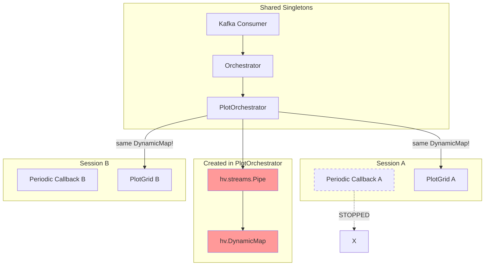
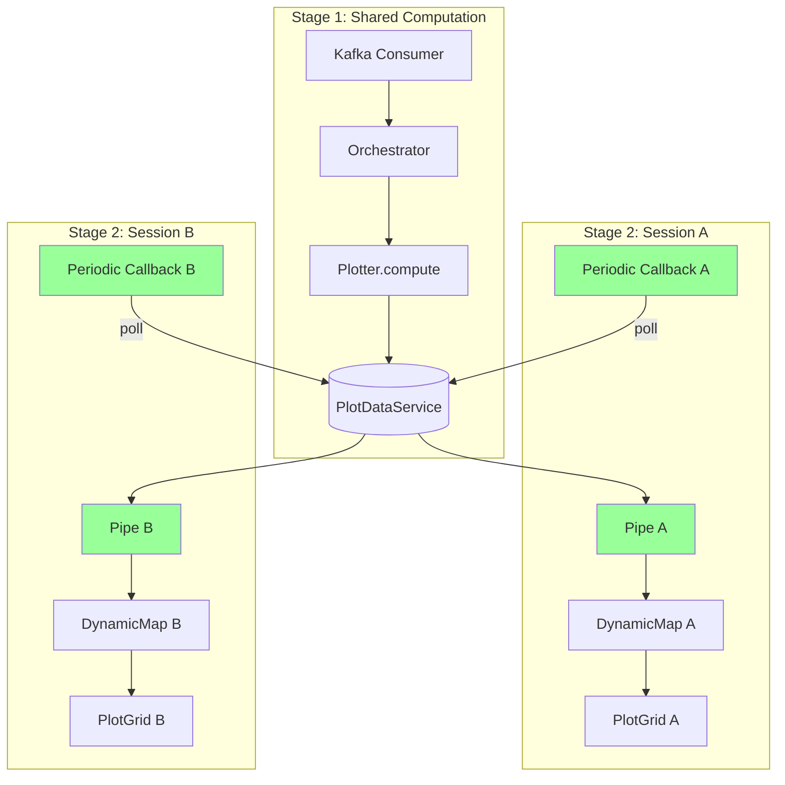

# Multi-Session Architecture Fix

This document describes the fix for multi-session issues in the dashboard.

Related: [Issue #609 - Multi-session support for plots](https://github.com/scipp/esslivedata/issues/609)

## Problem

When multiple browser tabs open the dashboard:
1. All notifications appear in one tab instead of one per tab
2. Plot updates may go to wrong tabs or fail entirely
3. Only the last-opened tab has a working periodic callback

## Root Cause

Session-bound components (`hv.streams.Pipe`, `hv.DynamicMap`, `hv.streams.BoxEdit`, `pn.state.notifications`, periodic callbacks) are created in shared singleton code. When Session B's periodic callback processes data, Session A's widget callbacks also run in Session B's context, causing components to bind to the wrong session.

The immediate bug: `self._callback` in `DashboardBase` stores ONE callback shared across all sessions - each new tab stops the previous tab's callback.

## Solution Overview

Two architectural changes:

1. **Two-Stage Plotter Architecture**: Split plotters into shared `compute()` (data → PlotState) and per-session `present()` (PlotState → DynamicMap)

2. **Polling Instead of Subscriptions**: Services update state stores; each session polls for changes in its own periodic callback (guaranteed correct context)

## What Changes vs What Stays

| Component | Current | Proposed | Change |
|-----------|---------|----------|--------|
| Periodic callback | Shared (bug) | Per-session | Fix bug |
| Widget state sync | Subscriptions | Polling via WidgetStateStore | Refactor |
| `pn.io.hold()` | Scattered (18+ uses) | Single place in SessionUpdater | Consolidate |
| Plotter interface | Single `__call__` | Two-stage `compute`/`present` | Refactor |
| `hv.streams.Pipe` | In PlotOrchestrator | Per-session in widgets | Move |
| `hv.DynamicMap` | In PlotOrchestrator | Per-session in widgets | Move |
| Notifications | Direct callbacks | Event queue + polling | New queue |

## Architecture Diagrams

### Current (Broken)



### Proposed (Fixed)



## Critical Design Constraint: Deferred Setup

**This is the most important insight for correct implementation.**

When the shared orchestrator notifies widgets that "state is available", the callback runs in whatever session triggered the update. Callbacks from shared orchestrators must **only flag that setup is needed**, not create session-bound components. The actual setup happens in each session's periodic callback.

```python
class PlotGridTabs:
    def __init__(self, ...):
        self._pending_layer_setups: list[tuple[LayerId, Plotter]] = []

    def _on_layer_available(self, layer_id: LayerId, plotter: Plotter) -> None:
        """Callback from orchestrator - runs in UNKNOWN session context."""
        # DON'T create Pipe/DynamicMap here! Just record that setup is needed.
        self._pending_layer_setups.append((layer_id, plotter))

    def _process_pending_setups(self) -> None:
        """Called from THIS session's periodic callback - CORRECT context."""
        for layer_id, plotter in self._pending_layer_setups:
            layer_state = self._plot_data_service.get(layer_id)
            if layer_state is None:
                continue

            # NOW safe to create session-bound components
            presenter = plotter.create_presenter()
            pipe = hv.streams.Pipe(data=layer_state.state)
            dmap = presenter.present(pipe)

            self._session_pipes[layer_id] = pipe
            self._session_dmaps[layer_id] = dmap
            self._last_versions[layer_id] = layer_state.version
            self._insert_plot(layer_id, dmap)

        self._pending_layer_setups.clear()
```

## Key Interfaces

### Plotter Protocol (Two-Stage)

```python
class Presenter(Protocol):
    """Per-session presentation handler. Created fresh for each session."""
    def present(self, pipe: hv.streams.Pipe) -> hv.DynamicMap: ...


class Plotter(ABC):
    """Base class for two-stage plotters."""

    def compute(self, data: dict[ResultKey, DataArray]) -> Any:
        """
        Stage 1: Compute shareable state from input data.
        Called on the shared plotter instance. Result stored in PlotDataService.
        Replaces current __call__ - keeps orchestration logic (loop, combine, overlay).
        """

    @abstractmethod
    def plot(self, data: DataArray, data_key: ResultKey, **kwargs) -> Any:
        """Per-item plot creation - subclasses implement this (unchanged)."""

    def create_presenter(self) -> Presenter:
        """Factory - returns fresh Presenter for each session."""
        return DefaultPresenter(self)
```

**Migration**: Rename base class `__call__` to `compute()`. Subclass `plot()` methods unchanged. ROI plotters override `create_presenter()`.

### State Stores

```python
class PlotDataService:
    """Stores computed plot state with version tracking."""
    def update(self, layer_id: LayerId, state: Any) -> None: ...
    def get(self, layer_id: LayerId) -> PlotLayerState | None: ...
    def get_version(self, layer_id: LayerId) -> int: ...


class WidgetStateStore:
    """Key-value store for widget state with global versioning."""
    def update(self, key: StateKey, state: Any) -> None: ...
    def get_changes_since(self, last_version: int) -> tuple[int, dict[StateKey, Any]]: ...
    @contextmanager
    def transaction(self): ...  # Batch updates into single version bump


class NotificationQueue:
    """Cursor-based queue so each session sees all notifications."""
    def push(self, event: NotificationEvent) -> None: ...
    def register_session(self, session_id: str) -> None: ...
    def get_new_events(self, session_id: str) -> list[NotificationEvent]: ...
```

### SessionUpdater

```python
class SessionUpdater:
    """Per-session component that drives all widget updates."""

    def periodic_update(self) -> None:
        """Called from this session's periodic callback."""
        self._session_registry.heartbeat(self._session_id)

        widget_changes = self._poll_widget_state()
        plot_updates = self._poll_plot_updates()
        notifications = self._poll_notifications()

        if widget_changes or plot_updates or notifications:
            with pn.io.hold():  # THE SINGLE BATCHING POINT
                self._apply_widget_state_changes(widget_changes)
                self._apply_plot_updates(plot_updates)
                self._show_notifications(notifications)
```

### Session Registry

```python
class SessionRegistry:
    """Track active sessions and clean up stale ones."""
    def heartbeat(self, session_id: str) -> None: ...
    def cleanup_stale_sessions(self) -> list[str]: ...
```

Provides defense-in-depth when `pn.state.on_session_destroyed()` fails to fire.

## Implementation Phases

### Phase 1: Fix the Periodic Callback Bug

Remove `self._callback` storage. Each session manages its own callback via `pn.state.on_session_destroyed()`.

### Phase 1.5: Session Registry

Add `SessionRegistry` for heartbeat-based stale session detection. Each session's periodic callback sends heartbeats; periodic cleanup removes sessions that haven't responded.

### Phase 2: State Stores

Implement `WidgetStateStore` and `NotificationQueue`. Migrate `JobOrchestrator` to update stores instead of firing subscription callbacks. Remove `on_command_success`, `on_command_error`, `on_staged_changed`, `on_workflow_committed`, `on_workflow_stopped` from `WidgetLifecycleCallbacks`.

### Phase 3: Plotter/Presenter Protocol

Refactor `Plotter` base class:
- Rename `__call__` to `compute()` (keeps orchestration logic)
- Add `create_presenter()` factory method returning `DefaultPresenter`
- ROI plotters override `create_presenter()` to return custom `ROIPresenter` with edit streams

### Phase 4: PlotDataService

Create `PlotDataService` to store computed plot state with version tracking. `PlotOrchestrator` stores results after calling `plotter.compute()`.

### Phase 5: SessionUpdater and Widget Restructuring

Implement `SessionUpdater` as single entry point for per-session updates. Refactor `PlotGridTabs` to:
- Use deferred setup pattern for layer initialization
- Track session-local Pipes, Presenters, DynamicMaps
- Poll `PlotDataService` for updates

Remove direct widget notification from `PlotOrchestrator`.

## References

- [Issue #609 - Multi-session support for plots](https://github.com/scipp/esslivedata/issues/609)
- [Panel Session State Documentation](https://panel.holoviz.org/how_to/state/index.html)
- [Panel Issue #5488 - pn.state.notifications is None in threading](https://github.com/holoviz/panel/issues/5488)
