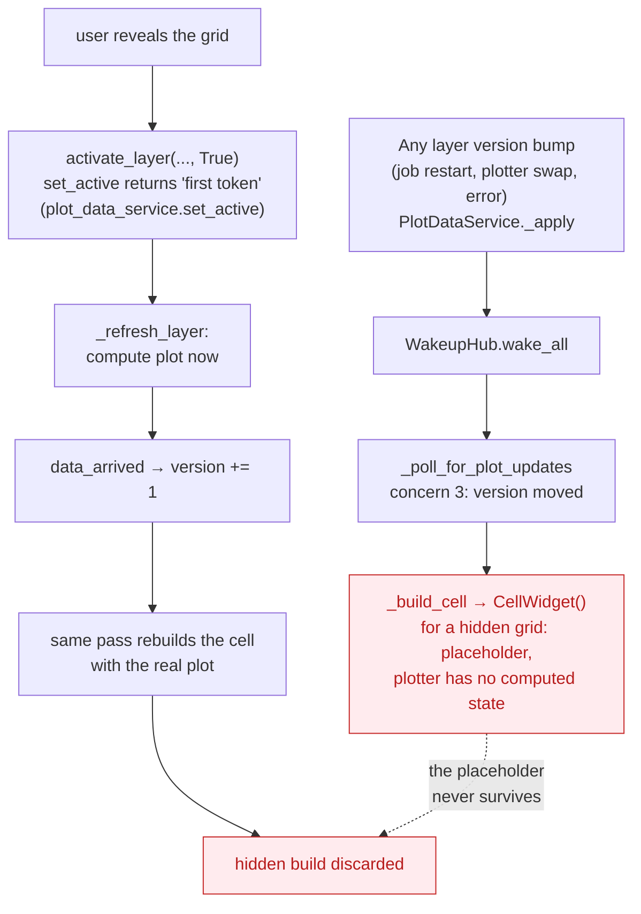

# The session reconciler today — detailed analysis

Companion to the
[declarative session reconciler proposal](declarative-session-reconciler.md).
This document pins the claims made there to code, as of `main` before
[#1220](https://github.com/scipp/esslivedata/pull/1220) merged. Line numbers
drift; symbol names are the stable reference.

## The pass and its six concerns

`PlotGridTabs._poll_for_plot_updates`
(`src/ess/livedata/dashboard/widgets/plot_grid_tabs.py`) runs on every wake or
housekeeping tick of a session, inside one batched update. It interleaves:

1. **Tab reconcile** — rebuild the tab strip when the shared topology's
   grid-level composition changed (`_reconcile_topology`), preserving the
   focused tab by identity, honoring a pending local-creation focus.
2. **Cell composition diff** — per cell, compare a signature (geometry, user
   title, layer ids) against a memo to detect layer add/remove/reconfigure
   and title changes (`_cell_signature`).
3. **Layer lifecycle tracking** — per layer, compare
   `PlotDataService` snapshot versions against a per-session memo
   (`SessionLayer.last_seen_version`) to detect plotter swaps and lifecycle
   transitions that require a widget rebuild.
4. **Viewer-token maintenance** — acquire tokens for the visible grid's
   layers, release the rest (`PlotOrchestrator.activate_layer`). This step
   has a side effect: the first token on a layer (0→1) synchronously computes
   the plot and bumps the very version that concern 3 reads — deliberately, so
   the same pass sees fresh state, but it means step order inside the pass is
   load-bearing (see the comment about sampling time bounds *after*
   activation).
5. **Data flush** — push pending plot data into the visible tab's figures,
   gated on the grid's frame generation having advanced or the visible tab
   having changed, so one data burst repaints in one frame.
6. **Freshness aging** — update the per-cell freshness pill and per-layer
   time labels, on flush, on rebuild, or on a 2 s wall-clock stall cadence.

Concerns 2 and 3 feed one `cells_to_rebuild` dict; the rebuild+insert runs at
the end of the pass, after an orphan sweep (concern 1's cell-level
counterpart).

## The bookkeeping inventory

Every field below is a hand-maintained invariant of the form "this record
reflects what my widgets currently show". Each is written in a different
place in the pass; forgetting one write is a silent bug bounded only by the
5 s unconditional full pass.

| Field | Mirrors | Invariant maintained by hand |
|---|---|---|
| `_last_topology_version` | orchestrator topology version | tabs + cells reflect this topology version |
| `_tab_composition` | grid ids/titles/enabled, in order | tab strip matches; distinguishes cell-level bumps from tab-level ones |
| `_cell_signatures` | per-cell composition | widget matches composition; **left stale on purpose by the #1220 fix** to force a later rebuild |
| `_cell_grid` | topology's cell→grid mapping | a vanished cell can still be removed from its grid widget |
| `SessionLayer.last_seen_version` (per layer) | per-layer snapshot version | widget was built against this lifecycle state |
| `_last_flushed_generation` | frame clock, per grid | visible figures show this data burst |
| `_last_active_grid_id` | this session's tab index | detects tab switches between passes |
| `_last_layer_version` | `PlotDataService.version` aggregate | gate for concern 3; must be snapshotted *before* the pass and recorded *after*, or mid-pass bumps are absorbed unrendered |
| `_last_freshness_update` | wall clock | stall-aging cadence |

(`_pending_focus_grid_id` is related but different in kind: a pending local
intent, not a mirror of shared state.)

The `_last_layer_version` row's before/after choreography is documented in a
12-line comment in the pass — correct, subtle, and exactly the kind of
reasoning the proposal wants to make unnecessary.

## The mirrored predicate

`_has_pending_work` exists so that a wake meant for another session's tab
costs nothing. It must re-state, by hand, every gate the pass applies:
topology version, aggregate layer version, active-grid change, frame
generation, freshness stall. Its docstring says so explicitly ("Mirrors the
gates inside `_poll_for_plot_updates`"). A gate added to the pass but not the
predicate freezes that update until the next full pass; the reverse wastes
wakes. Nothing checks the two stay in sync.

## Defect walkthrough: #1216

The wasted-build loop, with the components involved:

Key facts:

- The rebuild in the pass was ungated by visibility; only compute and flush
  were gated. This was documented as intentional: "hidden grids do no display
  work at all between switches … this pass only keeps their structure
  reconciled".
- Frame flushes skip layers without viewer tokens
  (`PlotOrchestrator.flush_frames`), so a hidden layer's plotter holds no
  computed state, so the hidden build renders a placeholder.
- The reveal is a 0→1 token transition for a sole viewer
  (`PlotDataService.set_active` returns `not was_active`), which triggers
  `_refresh_layer` → `data_arrived` → version bump → rebuild *in the same
  pass*. First reveal and tenth reveal are structurally identical.
- Measured cost (15-cell fixture): 272 ms page load, 89 ms per bump, per
  session, serialized on the shared loop.

The #1220 fix gates hidden-cell rebuilds on
`PlotDataService.has_viewers` — build only when another session already
watches, i.e. when the build will survive. Correct, minimal — and it *adds*
a sixth gate and relies on deliberately-stale memo records for the deferred
rebuild, deepening the pattern this proposal removes.

## Defect walkthrough: #1219

`PlotGrid` (`src/ess/livedata/dashboard/widgets/plot_grid.py`) decides free
positions from `_occupied_cells`, populated only by `insert_widget_at`.
Topology is the actual authority. When they disagree — cross-session wizard
race today, reproducibly after #1216's gate defers builds — the grid offers
"free" cells over occupied positions; completing the wizard there hits
`PlotOrchestrator.add_cell`'s overlap `ValueError`, which the success handler
did not catch. Two fixes: catch the error (done in #1220; the simultaneous-
wizard race needs it regardless), and derive occupancy from topology (the
structural half, deferred to a follow-up — phase 1 of the migration plan).

## Five representations of "is anyone looking"

| # | Mechanism | Scope | Where |
|---|---|---|---|
| 1 | Viewer tokens | shared, per (session, layer) | `PlotDataService.set_active` / `has_viewers` |
| 2 | Active-tab arithmetic | session | `_get_active_grid_id` (tab index minus static-tab count, via identity lookup) |
| 3 | Lazy tab rendering (`dynamic=True`) | browser/Bokeh | only the active tab's models exist |
| 4 | Modal guard | session | `_get_active_grid_id` returns None while a modal is open |
| 5 | Watcher predicate for pre-warm | shared | `has_viewers`, consulted by the #1220 gate |

They interlock: 2+4 decide token acquisition (1), 1 gates compute, 3 gates
model materialization, 5 patches the hole the others left. A category error
between them — #1216 classified widget construction under "structure" when its
value depended on 1 — is invisible locally, because no single site owns the
question.

## The parts that are essential complexity

To be fair to the current code, much of its weight cannot be refactored away
and the proposal does not claim otherwise:

- **Session-bound objects may only be touched from their own loop** (the
  empirically-derived constraint behind the whole per-session pull
  architecture; Panel cannot resolve a session context from another thread).
- **Batching** (`hold` + model freeze) is required to avoid per-widget
  patch storms; lazy tabs (`dynamic=True`) are required to avoid multi-second
  freezes. Both respond to measured failures, referenced in code comments.
- **Teardown is two-tier** (shared-state release safe on any thread; widget
  disposal marshalled to the session loop) because sessions die in two ways
  (clean disconnect vs. reaper).
- The **wake-before-load guard**, the **modal container parenting rules**,
  and the markup-pane reveal workaround each encode a real framework trap.

The proposal's target is specifically the *consumer-side accretion* — the
memo fields, the mirrored predicate, the smeared build decision — not this
floor.
