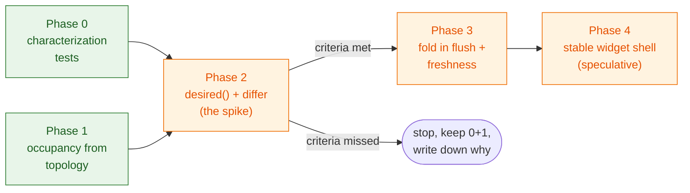

# Declarative session reconciler — migration plan

Companion to the
[declarative session reconciler proposal](declarative-session-reconciler.md).
Four phases, each shippable and useful on its own; phase 2 doubles as the
go/no-go spike for the rest.



## Phase 0 — characterization tests

Lock in what the current pass does before changing how it does it. The tests
from #1220 (hidden cell not built, reveal builds once, watcher preserves
pre-warm, deferred rebuild) and #1226 (pipe subscribers severed on dispose,
subscriber count flat across a rebuild) are the seed; add:

- Tab reconcile: focus preserved across rebuilds, local-creation focus,
  disabled-grid tab omission, mid-removal identity lookups.
- Orphan sweep: cell removed from topology → widget removed and disposed;
  disabled grid's cells survive for re-enable.
- Flush gating: one flush per frame generation, tab-switch flush without a
  generation change does not consume the next frame's flush.
- Freshness: pill updates on flush/rebuild, stall aging at the 2 s cadence,
  no double-update beat.
- Predicate/pass agreement: for each gate, "pass would do work ⇒ predicate
  fires" (this test is only writable per-gate today; under phase 2 it becomes
  a single generic property).
- Resource symmetry: dispose releases everything build acquired — total
  pipe-subscriber count across a session's layers is flat across rebuilds and
  removals, and `hv.DynamicMap` callback executions per pass stay flat
  (#1224's acceptance checks; cheap to instrument in the pass).

Also enumerate the framework-trap invariants that tests cannot easily cover
as a checklist in the module docstring (they are currently scattered across
`IMPORTANT:` comments): modal container has one stable parent at top level;
wake registration deferred until browser load; batching around multi-widget
updates; disposal breaks toolbar reference cycles and severs pipe
subscriptions *before* the replacement renders (holoviews severs all weak
plot-refresh subscribers on the touched streams, so ordering carries the
correctness — #1224); markup-pane reveal workaround.

Value: independent of this proposal — it is the safety net any future change
to this module needs.

## Phase 1 — occupancy from topology (#1219, structural half)

**Status: merged as [#1221](https://github.com/scipp/esslivedata/pull/1221).**

`PlotGrid` stops deriving free positions from inserted widgets. Instead it
receives a callable returning the grid's topology geometries (wired to the
orchestrator by `PlotGridTabs`), and the second click of the selection
gesture re-validates the region before opening the wizard. `_occupied_cells`
shrinks to "which widget sits at which geometry" (needed for
removal/replacement) and no longer feeds selection decisions.

Small, local, already agreed as the right fix in #1219. Kills the
stale-display path (empty cells offered over positions topology holds). One
residue is unavoidable by construction: two sessions can still complete the
wizard *simultaneously* on the same genuinely-free region, so the loser hits
the overlap `ValueError` — #1220's error handler stays necessary as the last
line of defence, and no occupancy model removes it.

## Phase 2 — `desired()` + differ for structure and materialization

The spike. Scope: concerns 1–4 of the current pass (tabs, cell composition,
layer lifecycle, tokens) move to the new shape; flush (5) and freshness (6)
stay as they are, driven after the apply step exactly as today.

Sketch of the types (final naming via the glossary before implementation):

```python
@dataclass(frozen=True)
class LayerBuildInput:
    layer_id: LayerId
    plotter: object | None      # identity comparison only
    has_plot: bool              # plotter holds a computed frame

@dataclass(frozen=True)
class CellPlan:
    grid_id: GridId
    geometry: CellGeometry
    materialize: bool
    build_inputs: tuple[...]    # composition + per-layer LayerBuildInput

def desired(
    topology: Mapping[GridId, PlotGridConfig],   # orchestrator snapshot
    layer_states: Mapping[LayerId, LayerSnapshot],
    view: SessionView,                            # active grid, modal open
    watched: Callable[[LayerId], bool],           # other sessions' tokens
) -> dict[CellId, CellPlan]: ...
```

The differ compares `CellPlan`s against the applied record (which stores each
widget's `build_inputs`) and emits build/insert/dispose actions; token
acquire/release is derived from the same plans (materialized-and-visible ⇒
hold tokens). The wake predicate becomes: input version stamp ≠ stamp at last
apply, plus the freshness time term.

Deleted on success: `_cell_signatures`, `SessionLayer.last_seen_version`
(as a rebuild trigger), `_last_layer_version` and its before/after
choreography, the rebuild half of `_has_pending_work`, and the
deliberately-stale-records device from #1220. `_cell_grid` folds into the
applied record. `_tab_composition` and the tab-focus logic can stay initially
— tabs are a small, self-contained concern.

Order-of-operations invariants to carry over explicitly (they do not
disappear, they become documented steps of the apply stage):

- Token 0→1 computes synchronously; sample time bounds and flush *after*
  activation so a reveal renders on its own pass.
- Rebuild+insert runs inside the same batched update as removal, in one pass.
- Records update only after a successful build (exception ⇒ retry next tick) —
  under the differ this is automatic: a failed build leaves the applied record
  unchanged.

### Acceptance criteria (agree before starting, judge after ≤ 1 week)

1. ≥ half of the bookkeeping fields deleted (measured against the
   [inventory](declarative-session-reconciler-current-state.md)).
2. The hand-mirrored rebuild predicate deleted, replaced by the generic
   stamp comparison.
3. All phase-0 characterization tests and the browser smoke tests pass
   unchanged (behavioral equivalence, not "tests updated to match").
4. No new framework workaround was needed (a rewrite that trips a new
   Panel/Bokeh trap has negative value).
5. `desired()` has direct unit tests with plain data and no Panel imports.

Any criterion missed → stop, keep phases 0–1, record the reason in this
document.

## Test-suite impact and cleanup

The proposal's testing claim deserves the same scrutiny as its code claim,
so here is what the suite looks like on each side of phase 2.

**Today** (~2100 lines across `plot_grid_tabs_test.py` and
`plot_grid_tabs_layout_test.py`):

- Every test pays the full integration price, including pure policy
  questions ("is this cell rebuilt when X changes?"): an eleven-fixture
  service chain (`DataService` → `StreamManager` → `PlottingController` →
  `PlotOrchestrator` → … → `PlotGridTabs`), a Bokeh/HoloViews extension
  load, and eight ad-hoc fake classes, several redefined per test class.
- The `_tick` helper runs the pass only when `_has_pending_work` fires, so
  every behavioral test silently doubles as a guard on the mirrored
  predicate — deliberate and valuable today, but it means test *intent*
  (policy? mechanism? predicate?) is not readable from the test, and tests
  for documented predicate holes must bypass the helper and call the pass
  directly.

**After phase 2**, tests separate along the same seam as the code:

- **Policy tests become plain-data tests of `desired()`**: construct
  topology, layer snapshots, and session view as literals; compare the
  returned plans. No fixtures, no Panel import, table-driven; a fake
  plotter reduces to a sentinel object compared by identity. This absorbs
  the bulk of the rebuild/visibility scenarios — including the #1216/#1220
  gate scenarios, which today each need the full stack.
- **Differ tests are a small fixed set** for the generic rules (build,
  rebuild on changed inputs, dispose, deferred no-op, failed build leaves
  the applied record unchanged → retry). Written once; future policy work
  never touches them.
- **Integration tests remain for what is genuinely integration** — tab-strip
  reconcile and focus, widget insertion/disposal, toolbars, overlay
  composition, teardown — but stop re-litigating policy through the UI, so
  they shrink in count while keeping the eleven-fixture chain they
  legitimately need.
- **The predicate guard collapses to one property**: work is pending iff
  input stamps differ from the applied stamp — testable directly, retiring
  both `_tick`'s dual role and the direct-call escape hatch.

**Sequencing.** During the spike, none of this happens: criterion 3 freezes
the existing tests as the equivalence oracle. The reorganization is a
follow-up after acceptance, and a characterization test is retired only when
a named `desired()`/differ pair replaces it.

**Cleanup worth doing regardless of the go/no-go** (fits phase 0): move the
eight ad-hoc fakes into shared test helpers, and hoist the fixture chain
into a `conftest.py` so the phase-0 characterization tests do not copy it a
third time. Neither depends on the rewrite.

## Phase 3 — fold in flush and freshness (optional)

Model the data flush as part of the desired state ("grid G should display
frame generation N") and freshness as a derived output. Only worth it if
phase 2 leaves flush/freshness as the odd ones out complicating the tick
entry points; they are edge-triggered by nature and may legitimately stay a
small imperative tail. Decide on the phase-2 outcome, same criteria style.

## Phase 4 — stable widget shell (speculative spike)

Today a plotter swap rebuilds the whole `CellWidget` (titlebar, toolbars,
panes, figure). If the shell were stable and only the figure pane swapped,
rebuild cost would drop enough that much gating precision becomes
unnecessary — the differ's job shrinks further. Risk: Panel pane replacement
has its own churn and known traps (reveal latch, reparenting); history in
this codebase says prototype first. Strictly optional; nothing in phases 0–3
depends on it. The #1224 sever must survive this phase: swapping only the
figure pane still discards a rendered plot, and the phase-0 subscriber-count
invariant is the guard that it keeps being released.

## Risks and mitigations

| Risk | Mitigation |
|---|---|
| Silently dropping a framework workaround | Phase 0 checklist + tests; criterion 4 |
| Behavioral drift hidden by rewritten tests | Criterion 3 forbids test rewrites during the spike |
| `desired()` grows imperative side effects over time | Enforce purity: no Panel imports in its module; unit tests construct inputs as plain data |
| Differ becomes the new dumping ground | Differ rules are fixed and generic; policy changes go to `desired()` only — review rule to state in `.claude/rules/dashboard-widgets.md` |
| Spike overruns | Hard time box; abandoning keeps phases 0–1 |
