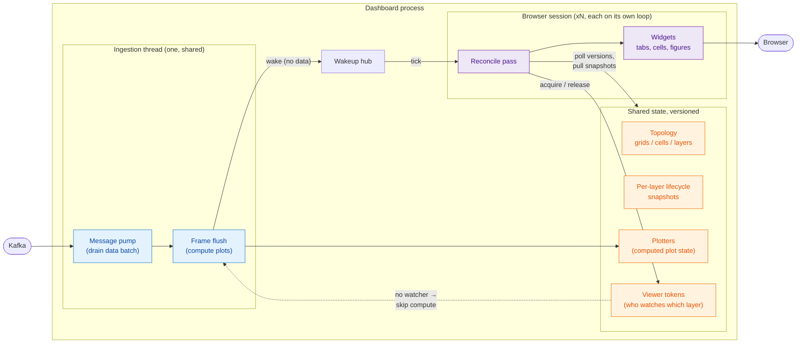
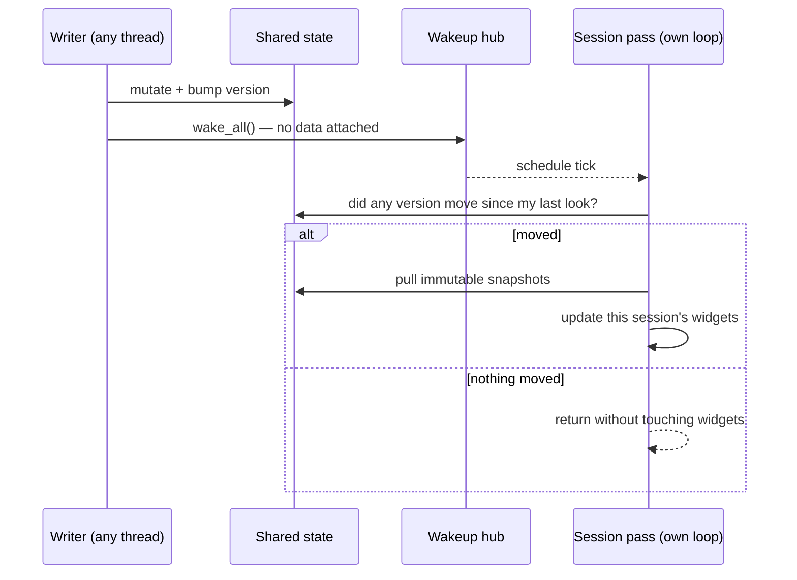
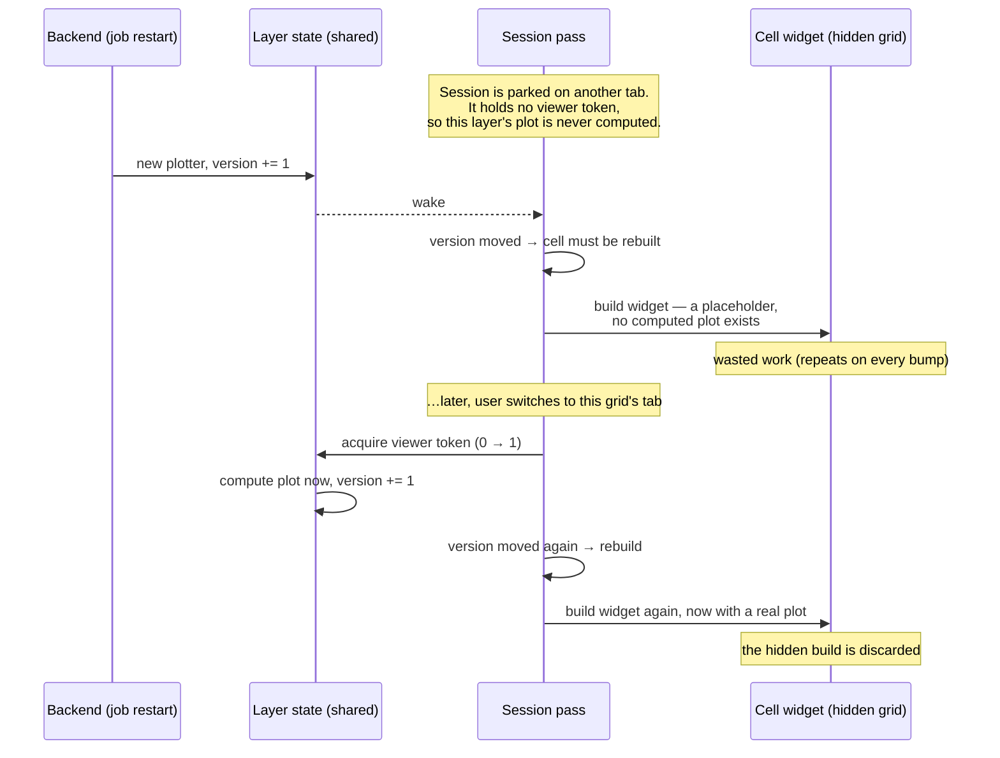
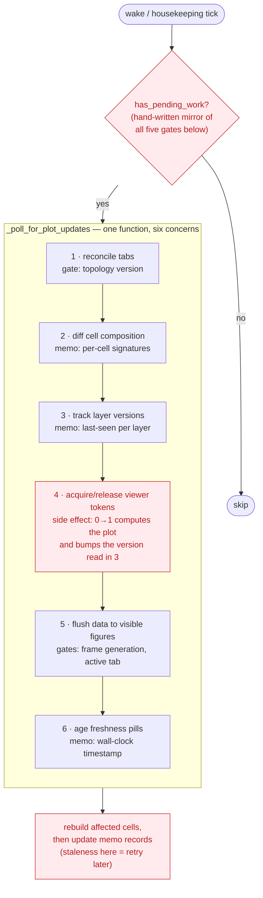
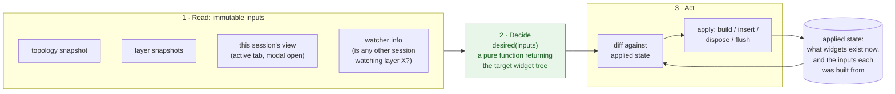
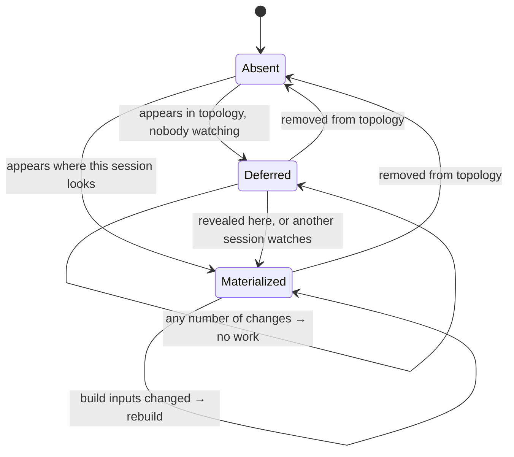
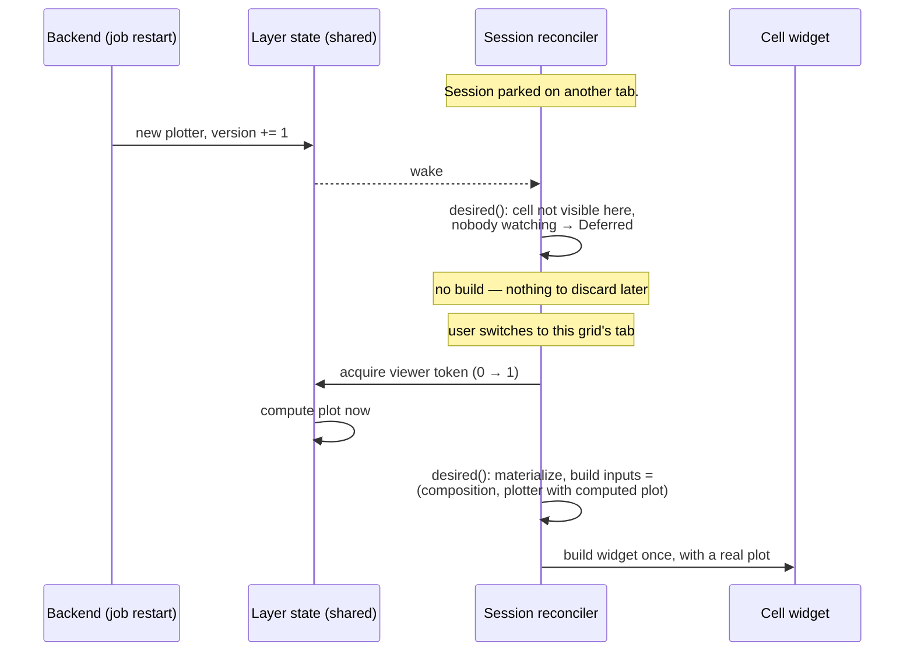

# Proposal: A declarative reconciler for plot-grid sessions

- Status: draft, for discussion
- Date: 2026-08-08
- Motivated by: [#1216](https://github.com/scipp/esslivedata/issues/1216),
  [#1219](https://github.com/scipp/esslivedata/issues/1219), and the analysis
  behind the point fix in [#1220](https://github.com/scipp/esslivedata/pull/1220)
- Companion documents: [The reconciler today — detailed analysis](declarative-session-reconciler-current-state.md)
  and [Migration plan](declarative-session-reconciler-migration.md)

## Summary

Each browser session keeps its plot widgets in sync with shared state by
running a periodic *reconcile pass*. That pass is today an imperative
diff-and-patch loop that has accreted, one fix at a time, into a function with
six interleaved concerns, nine pieces of hand-maintained bookkeeping, and a
duplicated "is there work?" predicate that must mirror the loop's internal
gates by hand. Two recent defects (#1216 and its sibling #1219) were not
concurrency bugs — the concurrency model worked — but *policy composition*
bugs: individually reasonable rules, implemented in different components,
interacting wastefully in a way no single component could see.

This proposal restructures the pass into three explicit stages — a **pure
function computing the desired widget state**, a **differ** comparing it
against what is applied, and an **applier** — without touching the
concurrency model (single-writer versioned pull, wakeup hub, frame clock; ADRs
0005/0007). The defect class that produced #1216 and #1219 becomes
unrepresentable, most bookkeeping is deleted, and future policy changes become
one-line edits to a pure, unit-testable function.

The closing section asks honestly whether this is worth doing and proposes a
concrete decision procedure, because the current code *works* and its
complexity is partly the irreducible price of the UI framework.

## Background: how a session stays up to date

Skip this section if you know the dashboard internals; it defines every term
the rest of the document uses.

The dashboard is one Python process serving N browser **sessions**. All
sessions look at the same shared world:

- **Topology** — the arrangement of plots: **grids** (one dashboard tab each)
  contain **cells** (positions in the grid), which contain **layers** (one
  plotted quantity each; multiple layers overlay in one figure). Any session
  can edit the topology; all sessions see the result.
- **Plotters** — shared objects holding the computed state of each layer's
  plot. Computing a plot is expensive; it is done once, centrally, not per
  session.
- **Per-session widgets** — each session builds its *own* UI objects (tabs,
  cell widgets, figures). The UI framework (Panel/Bokeh) requires that a
  session's widgets are only ever touched from that session's own event loop.
  This is a hard constraint, not a style choice.

Changes propagate by **versioned pull** (ADR 0007): a writer mutates shared
state and bumps an integer version counter; each session, on its own loop,
compares counters against what it last saw and pulls immutable snapshots when
something moved. A **wakeup hub** nudges sessions promptly after a change, but
a wake carries no data — it only means "look now rather than at the next
housekeeping tick".



Two mechanisms matter for what follows:

- **Viewer tokens**: a session holds a token on each layer of the grid it is
  currently displaying, and releases the tokens when it switches away. The
  frame flush skips layers with no tokens — *nobody watching, nothing
  computed*. When the first token arrives (a "0→1 transition"), the layer's
  plot is computed on the spot so the revealing session has something to show.
- **Version counters carry one bit.** A counter says *that* something changed,
  never *why*. This is deliberate — it is what makes the pattern trivially
  thread-safe — and it is also the root of the problem described next.

The generic update contract, which this proposal does **not** change:



## What went wrong: two defects, one pattern

### The waste loop (#1216)

Sessions rebuilt the cell widgets of *every* enabled grid — including grids
they were not displaying — on page load and again on every layer version bump
(job restarts, plotter swaps, errors). Measured on a 15-cell fixture: 272 ms
at page load, 89 ms per bump, per session, serialized on the shared loop.

The build of a hidden cell was not merely premature; it was *doomed*. While
nobody watches a layer, its plot is never computed, so the hidden build is an
empty placeholder. And the reveal that the build supposedly prepares for
destroys it: revealing the grid acquires the first viewer token, which
computes the plot, which bumps the layer version, which the same pass reads as
"rebuild this cell".



The eager hidden build was a *documented, deliberate decision* ("hidden grids
do no display work; this pass only keeps their structure reconciled") — locally
reasonable, and falsified only by the feedback loop above, which runs through
four components. No single component's local reasoning could see it.

### The stale-occupancy defect (#1219)

The grid widget decides which positions are free from a session-local dict
populated only when a widget is *inserted* — a cached copy of information whose
authority is the topology. The moment cells can legitimately exist without a
widget in this session (exactly what fixing #1216 introduces), the cache is
wrong: the user is offered "free" positions that are occupied, and completing
the wizard there raised an uncaught exception.

### The pattern

Both defects share one shape, and the point fixes in #1220 (a visibility gate
on the rebuild; catching the exception) do not remove it:

1. **One version channel, many causes.** "Plotter swapped", "job stopped",
   and "you just started watching" all fund the same counter. The rebuild
   decision needs the cause; the counter, by design, cannot say.
2. **The build decision is smeared.** Whether a widget should exist is decided
   by policy in the pass, gated by tokens in a service, triggered by versions
   in snapshots. Nowhere is "should this cell have a widget, and will the
   build survive?" a single, checkable expression.
3. **Bookkeeping maintained by hand.** The pass keeps ~9 memo fields
   (last-seen versions, per-cell signatures, widget-to-grid maps, flush
   generations, timestamps), each an invariant of the form "this record
   reflects what my widgets show". The #1220 fix works by *deliberately
   letting records go stale* so a later pass retries — correctness by
   choreographed staleness.
4. **A duplicated predicate.** A cheap "is there work?" check lets wake ticks
   skip idle sessions, but it must mirror every gate inside the pass by hand.
   Drift in one direction freezes widgets; in the other, it wastes wakes.
5. **Derived state without a single source of truth.** The occupancy cache is
   a second copy of topology, coherent only under an unstated invariant.

A detailed inventory — every concern, every memo field, every representation
of "is anyone looking", with code references — is in
[the companion analysis](declarative-session-reconciler-current-state.md).

The anatomy of the pass today, with its bookkeeping and the hand-mirrored
predicate:



## Proposal

Restructure the per-session pass into three stages with a strict read → decide
→ act shape. The concurrency model, the wakeup mechanism, the frame clock, and
the compute gating are untouched; this is a change to how one consumer is
written, not to how state is shared.



### The desired-state function

`desired()` maps inputs to a target tree: for each cell, its geometry, its
grid, whether this session should **materialize** it (actually construct the
widget), and the **build inputs** the widget must be constructed from
(composition plus, per layer, the plotter's identity and whether it holds a
computed plot).

The policy that #1216 needed becomes one legible line instead of a gate
threaded through a loop:

```python
materialize = cell.grid is my_active_grid or any_other_session_watches(cell)
```

Being pure, `desired()` is unit-testable with plain data — no widgets, no
event loops, no fakes. Every future policy question ("should hidden grids
pre-warm?", "should a modal suspend materialization?") is a reviewable diff to
this one function.

### The differ

The differ compares the desired tree with the applied tree and emits actions.
Its rules are generic and never change when policy changes:

- desired but not applied, `materialize` → build and insert
- applied but no longer desired → dispose and remove
- applied but `build_inputs` differ → rebuild
- desired, not `materialize` → do nothing (**deferred** — the key new state)

A cell's life in this model, from any one session's point of view:



The `Deferred → Deferred` self-loop is where #1216's waste disappears: N
version bumps while nobody watches coalesce into zero builds, structurally,
not via a carefully placed gate. The same scenario as before, under the
proposal:



### Rebuild means "inputs changed", not "a counter moved"

Today a widget is rebuilt when a version counter moved past a remembered
value; the remembered values are the bookkeeping that can go stale. Under the
proposal, each widget records the `build_inputs` it was built from, and the
differ rebuilds when the *current* inputs differ. Layer snapshots are already
immutable, so this is cheap identity/value comparison.

Staleness bugs become unrepresentable: there is no record to forget to update,
and the placeholder-vs-real distinction falls out naturally — a widget built
from "plotter without a computed plot" differs from inputs that now say
"plotter with a computed plot", so the reveal rebuild happens exactly when it
should, and only then.

Version counters are not abolished — they remain the cheap *wake* signal. They
stop carrying rebuild semantics they cannot express. The "is there work?"
predicate stops being a mirror: work is pending exactly when the input
versions differ from a stamp recorded at the last apply. (One genuinely
time-based term survives: a stalled stream ages its freshness indicator by
wall clock, because the absence of events sends no wake. That term is inherent,
not incidental.)

### One definition of "is anyone looking"

"Is anyone looking at this?" exists in five places today (viewer tokens,
active-tab index arithmetic, the UI framework's lazy tab rendering, a
modal-suppression guard, and the watcher predicate the #1216 fix adds). The
proposal consolidates the session-side half into one small **session view**
value — active grid, modal state — produced in one place and consumed only as
an input to `desired()`. Cross-session watching remains the viewer-token
mechanism it is today; `desired()` reads it, it does not reimplement it.

The occupancy cache (#1219) is subsumed rather than patched: which positions
are free is *derived from the topology snapshot* — the applied widget tree
stops being an authority on anything.

### What stays exactly as it is

- Single-writer versioned pull (ADR 0007) and the ban on data-carrying push.
- The wakeup hub, housekeeping ticks, and the full-pass safety net.
- The frame clock, per-grid flush batching, and freshness semantics (ADR 0005).
- Viewer-token compute gating ("nobody watching, nothing computed") and the
  0→1 synchronous compute on reveal.
- Lazy tab rendering (`dynamic=True`), update batching, and every documented
  Panel/Bokeh workaround — the migration plan treats each as an invariant to
  carry over, with a test where possible.

## Migration

Four phases, each independently shippable and useful on its own; details,
risks, and the test strategy are in the
[migration plan](declarative-session-reconciler-migration.md).

| Phase | Content | Ships alone? |
|---|---|---|
| 0 | Characterization tests around the current pass | yes (pure gain) |
| 1 | Occupancy derived from topology (#1219, part 2) | yes — in flight as [#1221](https://github.com/scipp/esslivedata/pull/1221) |
| 2 | `desired()` + differ for cell existence and materialization; delete signature/version memos | yes — **this is the go/no-go spike** |
| 3 | Fold data-flush and freshness gating into the same shape | optional |
| 4 | Stable widget shell, swap only the figure on plotter change | speculative spike |

## Is it worth it, and how do we decide?

**What it costs.** Phases 1–2 are a bounded rewrite of essentially one module
(`plot_grid_tabs.py`, ~1000 lines) plus tests — order of one to two weeks. The
real risk is not effort but regression: the current code encodes hard-won
workarounds for UI-framework traps, and a rewrite can silently drop one. The
migration plan's answer is to enumerate them as explicit invariants first
(phase 0), which has independent value even if nothing else ships.

**What it buys.** Not user-visible performance — the #1220 point fix already
banks that. It buys the *absence of a defect class* (stale bookkeeping,
mirror drift, policy-composition surprises), locality of review (policy
changes become diffs to a pure function), and much cheaper testing — policy
tests drop the full service stack for plain data (the migration plan's
test-suite section details what shrinks, what stays, and what can be cleaned
up either way). The value is therefore proportional to how often this area
will change.

**When it is not worth it.** If the plot-grid UI is essentially
feature-complete — no new visibility/materialization policies expected — the
current code, as fixed by #1220 and documented, is acceptable to keep. Its
complexity is real but contained, and a rewrite would be risk without payoff.

**Decision procedure.**

1. **Count the queue.** List concretely planned features that would touch
   materialization or visibility policy (candidates visible today:
   topology-driven occupancy, per-cell pause, richer layout editing,
   follow-the-presenter modes). Two or more → proceed to the spike. Zero →
   stop after phase 1, revisit when the queue fills.
2. **Run phase 2 as a time-boxed spike** (≤ 1 week) with hard acceptance
   criteria, agreed in advance: at least half of the pass's memo fields
   deleted; the hand-mirrored predicate deleted; browser smoke tests green;
   no new framework workarounds required. Any criterion missed → abandon
   cheaply, keep phases 0–1, write down why.
3. **Decide per phase.** Phases 3–4 each get their own go/no-go on the same
   terms; nothing here is all-or-nothing.

**Recommendation.** Do phase 0 and phase 1 regardless — both are already
justified independently of this proposal. Make the phase-2 spike conditional
on the feature queue, per the procedure above.

```{toctree}
---
hidden:
---

declarative-session-reconciler-current-state
declarative-session-reconciler-migration
```
